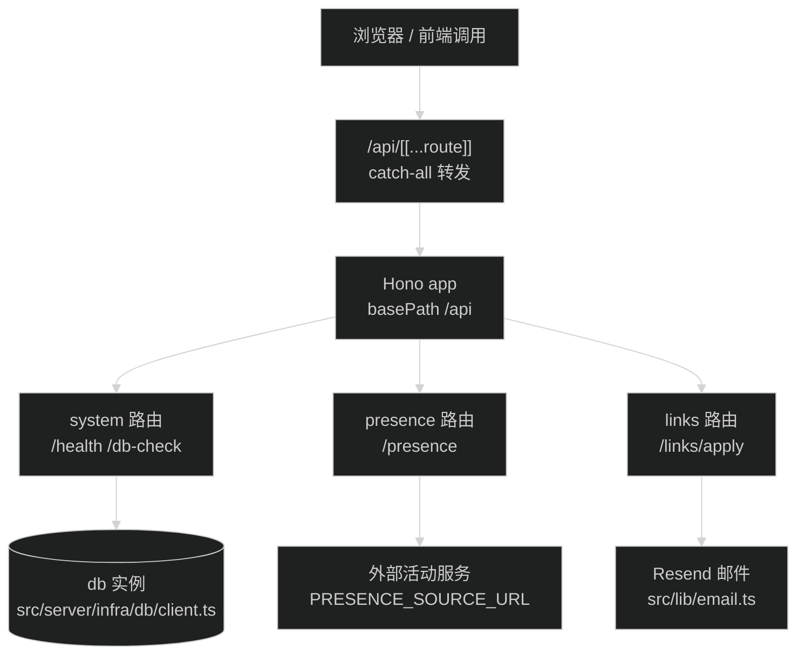

# API 设计规范

Hono 应用在 `src/server/app.ts`，端点响应统一走 `ApiResponse<T>` 封装。当前应用没有挂载到 Next.js，`/api/system/health` 和 `/api/system/db-check` 从外部访问不到；接入方式见本文「Hono 挂载现状与接入」。

## 响应封装

Hono 端点的响应体用 `src/server/shared/response.ts` 的类型和工厂函数，签名如下：

```ts
export interface ApiResponse<T> {
  success: boolean
  data?: T
  error?: string
  meta: {
    timestamp: number
    requestId?: string
  }
}

export function createSuccessResponse<T>(data: T, requestId?: string): ApiResponse<T>

export function createFailureResponse(error: string, requestId?: string): ApiResponse<never>
```

`meta.timestamp` 是 `Date.now()` 的毫秒时间戳，两个工厂函数都会填。`meta.requestId` 当前没有调用方传，字段留给以后做日志追踪，不强制。

`GET /api/system/health` 的真实响应结构（来自 `src/server/routes/system.ts`）：

```json
{
  "success": true,
  "data": {
    "status": "ok",
    "uptime": 1234.5
  },
  "meta": {
    "timestamp": 1757328000000
  }
}
```

注意边界：`ApiResponse` 约束基础系统与业务 Hono 端点。为维持前端调用兼容，`src/server/routes/presence.ts` 返回活动对象（结构见 `src/lib/presence.ts` 的 `PublicPresence`），`src/server/routes/links.ts` 返回 `{ success, message }` 或 `{ success: false, error }`。维护这两个端点时维持各自现有格式，不包装外层结构。

## 路由命名与注册

URL 到代码是三层结构：

| URL 片段               | 定义位置                                                         |
| ---------------------- | ---------------------------------------------------------------- |
| `/api`                 | `src/server/app.ts` 的 `basePath('/api')`                        |
| `/system`、`/presence`、`/links` | `src/server/routes/index.ts` 的 `.route('/<域>', <域>Route)` |
| `/health`、`/apply` 等 | 各域路由文件中的具体端点定义                                     |

新增一个域路由的步骤：

1. 新建 `src/server/routes/<域>.ts`，导出 `new Hono()` 实例并定义端点。
2. 在 `src/server/routes/index.ts` 挂上：`.route('/<域>', <域>Route)`。
3. 完整 URL 就是 `/api/<域>/<端点>`，不需要动 `app.ts`。

命名规则：域名和端点全小写，端点多词用 kebab-case（现有写法是 `db-check`），URL 不用下划线、不用大写。

## Hono 挂载与接入

应用通过 `src/app/api/[[...route]]/route.ts` 挂载到 Next.js App Router，使用 Hono 自带的 Vercel 适配器（`hono/vercel`）转发：

```ts
import { handle } from 'hono/vercel'
import { app } from '@/server/app'

export const runtime = 'nodejs'

const handler = handle(app)

export {
  handler as DELETE,
  handler as GET,
  handler as OPTIONS,
  handler as PATCH,
  handler as POST,
  handler as PUT,
}
```

请求流转路径：



## 错误响应

失败响应用 `createFailureResponse(error)` 包装，HTTP 状态码通过 `c.json()` 的第二个参数传。`src/server/routes/system.ts` 的 `db-check` 是现有案例：

```ts
catch (error) {
  const message = error instanceof Error ? error.message : 'Unknown database error'
  return c.json(
    createFailureResponse(`Database check failed (${Date.now() - start}ms): ${message}`),
    500,
  )
}
```

状态码语义沿用现有约定：请求参数错 400，频控拦下 429，上游或内部失败 500。`error` 字段写具体报错信息，说清哪里错了，不写空泛错误提示。

## 边界决策：端点选型

全站 HTTP API（即 `/api/*` 下的所有接口）统一收敛在 Hono 应用内承载，放置于 `src/server/routes/`。

非 `/api` 的特殊协议端点（如全站 RSS 生成 `src/app/rss.xml/route.ts`）保留 Next Route Handler 原生导出。

