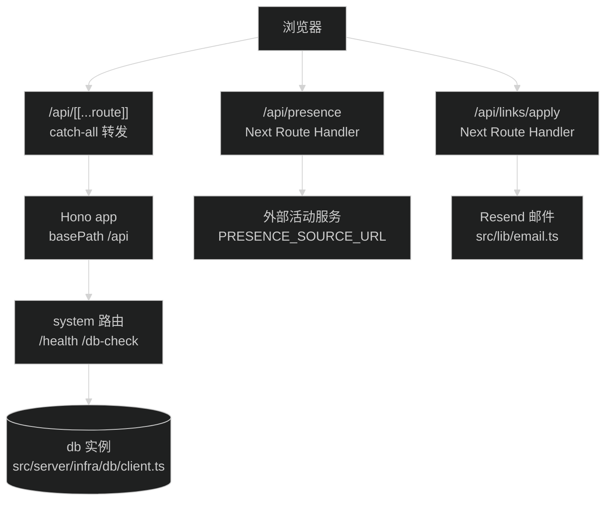

# API 设计规范

Hono 应用在 `src/server/app.ts`，端点响应统一走 `ApiResponse<T>` 封装。当前应用没有挂载到 Next.js，`/api/system/health` 和 `/api/system/db-check` 从外部访问不到；接入方式见本文「Hono 挂载现状与接入」。

## 响应封装

Hono 端点的响应体用 `src/server/shared/response.ts` 的类型和工厂函数，签名如下：

```ts
export interface ApiResponse<T> {
  success: boolean
  data?: T
  error?: string
  meta: {
    timestamp: number
    requestId?: string
  }
}

export function createSuccessResponse<T>(data: T, requestId?: string): ApiResponse<T>

export function createFailureResponse(error: string, requestId?: string): ApiResponse<never>
```

`meta.timestamp` 是 `Date.now()` 的毫秒时间戳，两个工厂函数都会填。`meta.requestId` 当前没有调用方传，字段留给以后做日志追踪，不强制。

`GET /api/system/health` 的真实响应结构（来自 `src/server/routes/system.ts`）：

```json
{
  "success": true,
  "data": {
    "status": "ok",
    "uptime": 1234.5
  },
  "meta": {
    "timestamp": 1757328000000
  }
}
```

注意边界：`ApiResponse` 只约束 Hono 端点。`src/app/api/` 下的 Next Route Handler 不用它——`src/app/api/presence/route.ts` 返回活动对象（结构见 `src/lib/presence.ts` 的 `PublicPresence`），`src/app/api/links/apply/route.ts` 返回 `{ success, message }` 或 `{ success: false, error }`。改这两个端点时维持各自现有格式，不要混用。

## 路由命名与注册

URL 到代码是三层结构：

| URL 片段               | 定义位置                                                         |
| ---------------------- | ---------------------------------------------------------------- |
| `/api`                 | `src/server/app.ts` 的 `basePath('/api')`                        |
| `/system`              | `src/server/routes/index.ts` 的 `.route('/system', systemRoute)` |
| `/health`、`/db-check` | `src/server/routes/system.ts` 的 `.get('/health', ...)` 等       |

新增一个域路由的步骤：

1. 新建 `src/server/routes/<域>.ts`，导出 `new Hono()` 实例并定义端点，写法照抄 `src/server/routes/system.ts`。
2. 在 `src/server/routes/index.ts` 挂上：`.route('/<域>', <域>Route)`。
3. 完整 URL 就是 `/api/<域>/<端点>`，不需要动 `app.ts`。

命名规则：域名和端点全小写，端点多词用 kebab-case（现有写法是 `db-check`），URL 不用下划线、不用大写。

## Hono 挂载现状与接入

现状：`src/server/app.ts` 导出的 `app` 没有任何文件引用，`src/app/api/` 下没有 catch-all 路由，Hono 端点当前从外部访问不到。部署后想访问 `/api/system/health`，必须先完成接入。

接入方式：新建 `src/app/api/[[...route]]/route.ts`，用 Hono 自带的 Vercel 适配器（`hono/vercel`）转发，无需额外依赖：

```ts
import { handle } from 'hono/vercel'
import app from '@/server/app'

export const runtime = 'nodejs'

export const GET = handle(app)
export const POST = handle(app)
```

两个要点：

- `src/app/api/presence/route.ts` 和 `src/app/api/links/apply/route.ts` 不受影响。Next.js 静态路由优先于 catch-all，`/api/presence`、`/api/links/apply` 仍走原 Route Handler，其余路径才转给 Hono。
- `[[...route]]` 是 optional catch-all，连 `/api` 本身也会转给 Hono；只想匹配子路径就用 `[...route]`。

接入后的请求路径：



接入属于代码改动，本文只记录方式。做的时候同步更新本节的「现状」描述。

## 错误响应

失败响应用 `createFailureResponse(error)` 包装，HTTP 状态码通过 `c.json()` 的第二个参数传。`src/server/routes/system.ts` 的 `db-check` 是现有案例：

```ts
catch (error) {
  const message = error instanceof Error ? error.message : 'Unknown database error'
  return c.json(
    createFailureResponse(`Database check failed (${Date.now() - start}ms): ${message}`),
    500,
  )
}
```

状态码语义沿用 `src/app/api/links/apply/route.ts` 的用法：请求参数错 400，频控拦下 429，上游或内部失败 500。`error` 字段写给人看的中文信息时，说清哪里错了，不写「系统异常请稍后重试」这类没有出口的话。

## 边界决策：新端点选 Hono 还是 Next Route Handler

按顺序判断，命中即停：

1. 端点要读写数据库吗？要 → 放 Hono。数据库访问层在 `src/server/infra/db/`，Hono 路由引用 `db` 是现有模式（`src/server/routes/system.ts`）。注意 Hono 未挂载，新增数据库端点上线前要先完成上面的接入。
2. 端点是某个已有 Hono 域的新方法吗（比如 system 域加一个 `/system/metrics`）？是 → 加到对应域文件，不另起 Route Handler。
3. 不碰数据库、也不属于已有 Hono 域的轻量单端点（代理外部服务、提交表单、发通知）？→ 用 Next Route Handler，放 `src/app/api/<路径>/route.ts`，写法参考 `src/app/api/presence/route.ts`（GET 代理）和 `src/app/api/links/apply/route.ts`（POST 校验加频控）。

一句话版：碰数据库或挂进已有域走 Hono；presence、links/apply 这类独立轻量端点走 Next Route Handler。
