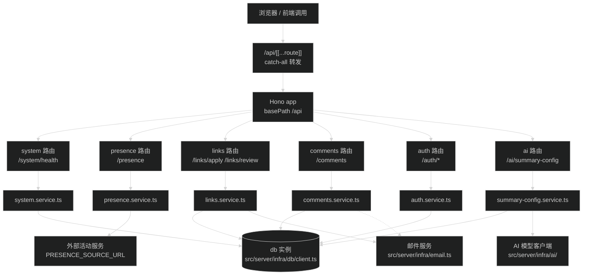

# API 设计规范

Hono 应用在 `src/server/app.ts`，全站 `/api/*` 请求通过 `src/app/api/[[...route]]/route.ts` 由 Hono 统一承载。各领域端点由 `src/server/modules/<域>/<域>.route.ts` 提供并链式组装。

## 响应封装

基础系统端点与通用接口使用 `src/server/shared/response.ts` 的类型与工厂函数：

```ts
export interface ApiResponse<T> {
  success: boolean
  data?: T
  error?: string
  meta: {
    timestamp: number
    requestId?: string
  }
}

export function createSuccessResponse<T>(data: T, requestId?: string): ApiResponse<T>

export function createFailureResponse(error: string, requestId?: string): ApiResponse<never>
```

`meta.timestamp` 是 `Date.now()` 的毫秒时间戳。

注意边界：`ApiResponse` 用于系统与通用接口。为维持前端调用协议兼容：
- `src/server/modules/presence/presence.route.ts` 直接返回 `PublicPresence` 活动对象。
- `src/server/modules/links/links.route.ts` 返回 `{ success: true, message: string }` 或 `{ success: false, error: string }`。
- `src/server/modules/auth/auth.route.ts` 承载 Better Auth 原生 API Handler。

## 路由命名与注册

URL 到模块代码的映射关系：

| URL 前缀 | 模块定义文件 | 挂载方式 (`src/server/app.ts`) |
| --- | --- | --- |
| `/api/auth` | `src/server/modules/auth/auth.route.ts` | `.route('/auth', authRoute)` |
| `/api/config/auth` | `src/server/modules/auth/auth-config.route.ts` | `.route('/config/auth', authConfigRoute)` |
| `/api/comments` | `src/server/modules/comments/comments.route.ts` | `.route('/comments', commentsRoute)` |
| `/api/links` | `src/server/modules/links/links.route.ts` | `.route('/links', linksRoute)` |
| `/api/ai` | `src/server/modules/ai/summary-config.route.ts` | `.route('/ai', summaryConfigRoute)` |
| `/api/presence` | `src/server/modules/presence/presence.route.ts` | `.route('/presence', presenceRoute)` |
| `/api/system` | `src/server/modules/system/system.route.ts` | `.route('/system', systemRoute)` |

新增端点步骤：

1. 在对应的 `src/server/modules/<域>/` 中，向 `<域>.service.ts` 补充领域逻辑，向 `<域>.route.ts` 补充端点。
2. 若新增独立领域模块，在 `src/server/app.ts` 中链式挂载：`.route('/<域>', <域>Route)`。
3. 命名规则：路径全小写，多词使用 kebab-case，不用下划线与大写。

## Hono 挂载与接入

应用通过 `src/app/api/[[...route]]/route.ts` 挂载到 Next.js App Router，使用 Hono 自带的 Vercel 适配器（`hono/vercel`）转发：

```ts
import { handle } from 'hono/vercel'
import { app } from '@/server/app'

export const runtime = 'nodejs'

const handler = handle(app)

export {
  handler as DELETE,
  handler as GET,
  handler as OPTIONS,
  handler as PATCH,
  handler as POST,
  handler as PUT,
}
```

请求流转路径：



## 错误响应与领域错误映射

路由层不直接操作底层数据库错误，而是捕获 service 层抛出的领域错误并转换为对应 HTTP 状态码：

- `CommentServiceError` -> `comments.route.ts` 映射为对应状态码（400/401/403/404/500）与错误响应。
- `LinksServiceError` -> `links.route.ts` 映射为对应状态码（400/401/403/404/410/429/500）。
- `AiSummaryConfigError` -> `summary-config.route.ts` 映射为对应状态码并保留安全错误信息。
- 上游与内部未捕获异常统一记日志并返回 500。

## 边界决策：端点选型

全站 HTTP API（即 `/api/*` 下的所有接口）统一收敛在 Hono 应用内承载，模块代码放置于 `src/server/modules/`。

非 `/api` 的特殊协议端点（如全站 RSS 生成 `src/app/rss.xml/route.ts`）保留 Next Route Handler 原生导出。

