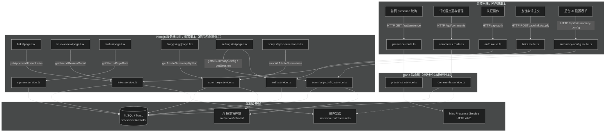

# 服务调用规范

前端页面、脚本与端点拿数据统一遵循进程内 Service 直调与客户端 HTTP 调用的分工规则。

## 现状调用路径



## 服务端页面调用：进程内直调 Service

Next.js 服务端组件（RSC）、Server Actions 和离线脚本（如 `scripts/sync-summaries.ts`）在服务端进程中运行。取数据时必须直接 import 对应模块的 `*.service.ts` 函数：

```ts
// 正确：服务端组件直接调用 service 函数
import { getApprovedFriendLinks } from '@/server/modules/links/links.service'

export default async function LinksPage() {
  const links = await getApprovedFriendLinks()
  return <LinksView links={links} />
}
```

禁止反模式：
- 禁止在服务端组件中调用 `fetch('http://localhost:4400/api/...')` 自发 HTTP 请求，这会引入不必要的网络往返、自死锁风险和额外请求头处理。
- 禁止在服务端组件中绕过 service 层直接手写复杂 SQL；业务逻辑与数据拼装必须收敛在 `*.service.ts` 中。

## 客户端交互调用：走 Hono HTTP 端点

浏览器端组件（标有 `'use client'` 的组件，如评论区、友链申请弹窗、AI 设置表单）需要读取或提交动态数据时，统一通过 `/api/*` 发起 HTTP 请求，由 Hono 路由接入处理。

## 外部服务调用

### 1. Presence 代理（`src/server/modules/presence/presence.service.ts`）

- 上游地址来自 `PRESENCE_SOURCE_URL`，默认 `http://127.0.0.1:4401/api/presence`。
- 地址先过安全校验：`new URL()` 解析后协议必须是 `http:` 或 `https:`，禁止包含用户名或密码。
- 数据读取超时 1.5 秒，健康探测超时 0.8 秒。
- 上游异常或格式不合法时不抛出异常给用户，静默降级为 `createOfflinePresence()` 离线结构。
- 路由端点设置 `Cache-Control: no-store, max-age=0`。

### 2. 邮件发送（`src/server/infra/email.ts`）

- 核心函数：`sendFriendApplyEmail`（友链申请与审批链接）、`sendCommentNotificationEmail`（新评论提醒与一次性软删除链接）。
- 环境变量 `RESEND_API_KEY` 未配置或缺少目标邮箱时，自动降级为日志 Mock 模式，返回 `{ mocked: true }`，保证本地离线开发和测试不受阻。

### 3. AI 摘要模型调用（`src/server/infra/ai/summary-model.ts`）

- 协议支持：`openai-completions`、`openai-responses`、`anthropic-messages`。
- Base URL 校验：必须通过 `validateAiBaseUrlAsync` 安全检查，禁止包含查询参数、哈希和账号凭据；生产环境下阻断内网 IP、私有网段与云元数据地址（SSRF 防御）。
- HTTP 请求约束：全局使用 `redirect: 'manual'` 禁用重定向。
- 错误隔离：模型错误在 infra 层封装为 `SummaryModelError`（错误码如 `AUTH_FAILED`、`UPSTREAM_TIMEOUT`、`UPSTREAM_UNAVAILABLE` 等），严禁向下游泄漏 API Key、Prompt 或上游原始敏感数据。service 层（`summary-config.service.ts`）负责将其映射为面向用户的安全提示。

### 外部调用通用约束

- 必须设定明确超时（使用 `AbortController` 或客户端 timeout 选项），不得无限制悬挂。
- 敏感凭证和上游 URL 统一从环境变量或加密存储中解密获取，日志中不得打印原始 Key 或请求正文。
