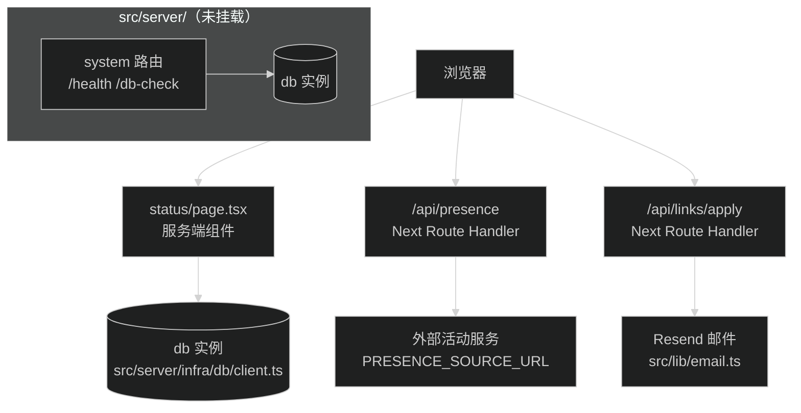

# 服务调用规范

页面和端点拿数据有三条路：服务端组件直连 `db`、走 API 端点、调外部服务。本文件定这三条路的选择规则，以及什么时候才需要拆 service 层。

## 现状请求路径

Hono 应用（`src/server/app.ts`）未挂载，`/api/system/health`、`/api/system/db-check` 当前访问不到；实际在跑的路径如下：

## 直连 db 还是走 API

服务端组件取数据时按顺序判断：

1. 数据只在本页服务端渲染时用、不需要给浏览器脚本用？→ 直连 `db`：`import { db } from '@/server/infra/db/client'`，在页面文件或其私有函数里查询。现有案例是 `src/app/(site)/status/page.tsx` 的 `checkDatabase()`，它用 `db.run(sql`SELECT 1 as ping`)` 测连通性后直接渲染结果。
2. 数据要给浏览器脚本用（轮询、交互后刷新），或给第三方系统调用？→ 走 API 端点，页面或脚本发 fetch。现有案例是 `src/app/api/presence/route.ts`：首页活动组件在浏览器轮询它，所以活动数据走 HTTP 而不是直连。

判断信号：数据离开服务端组件渲染后还有谁用？只进本页 HTML 就直连；浏览器 JS 或外部系统要用就走 API。直连省一次自调用的 HTTP 往返，能用就用。

## 何时拆 service 层

当前没有 service 层，`src/server/` 下也没有对应目录，这是现状而不是欠账：现在唯一的数据库访问是 `SELECT 1` 健康检查，抽层没有收益。

满足任一条件再拆：

- 同一段查询或数据组装逻辑被两个以上调用方需要。现成的潜在例子：status 页和 `/api/system/db-check` 各写了一份 `SELECT 1` 测延迟，将来若都改成写 `system_health_checks` 表的完整健康检查，就该合并成一个共用函数。
- 数据访问逻辑超过大约二十行，混在路由文件或页面文件里已经读不动。

拆的时候目录放哪、叫什么，等真实场景出现再定，本规范不预设。拆完必须回来更新[目录结构](./directory-structure.md)的反模式一节和本节。

## 外部服务调用

两个现有案例，新写外部调用时照这两个模式来。

### presence 代理（`src/app/api/presence/route.ts`）

- 上游地址来自 `PRESENCE_SOURCE_URL`，默认 `http://127.0.0.1:4401/api/presence`。
- 地址先过校验：`new URL()` 解析后协议必须是 http 或 https，且不能带账号密码，不合法直接抛错。
- 请求带 `AbortController`，超时 1.5 秒。
- 上游失败不报错给用户，静默回退 `createOfflinePresence()`（定义在 `src/lib/presence.ts`），页面拿到固定离线数据。
- `export const dynamic = 'force-dynamic'` 加响应头 `Cache-Control: no-store, max-age=0`，活动状态不进缓存。

### 邮件发送（`src/lib/email.ts`）

- 入口是 `sendFriendApplyEmail(payload)`，返回 `EmailSendResult`；`mocked: true` 表示没走真实发送，只打印模拟日志。
- `RESEND_API_KEY` 或 `FRIEND_APPLY_NOTIFY_EMAIL` 任一未配置就自动降级，本地开发不需要真实密钥。
- 调用方 `src/app/api/links/apply/route.ts` 拿 `result.mocked` 区分提示文案（「申请已模拟记录」和「申请已送达」）。

### AI 摘要模型调用（`src/server/infra/ai/summary-model.ts`）

- 协议与地址：支持 `openai-completions`、`openai-responses`、`anthropic-messages`；Base URL 必须经过安全校验（禁止包含凭据、query、hash，生产环境拒绝私网与云 metadata）。
- 受限 fetch：统一使用 `redirect: 'manual'` 拒绝跟随重定向，防止 SSRF 漏洞。
- 超时与重试：非流式连接测试与生成设置 `timeout: { totalMs: 20_000 }`，`maxRetries: 0`，关闭 telemetry。
- 错误边界：统一归类为安全类型错误（`AUTH_FAILED`、`UPSTREAM_TIMEOUT`、`UPSTREAM_UNAVAILABLE`、`UPSTREAM_ERROR`、`UPSTREAM_INVALID_RESPONSE`），绝不向下游泄漏 API key、Prompt 或原始上游响应内容。

外部调用公共规则：

- 超时必设，用 `AbortController` 或框架内置超时配置，不让请求挂着。
- 上游失败时的行为先想清楚：静默回退（presence）还是把失败报给用户（邮件、AI 连通性测试），两种都合法，但不能不处理。
- 密钥和上游地址只从环境变量或安全凭据库来，占位与注释维护在 `.env.example`。
