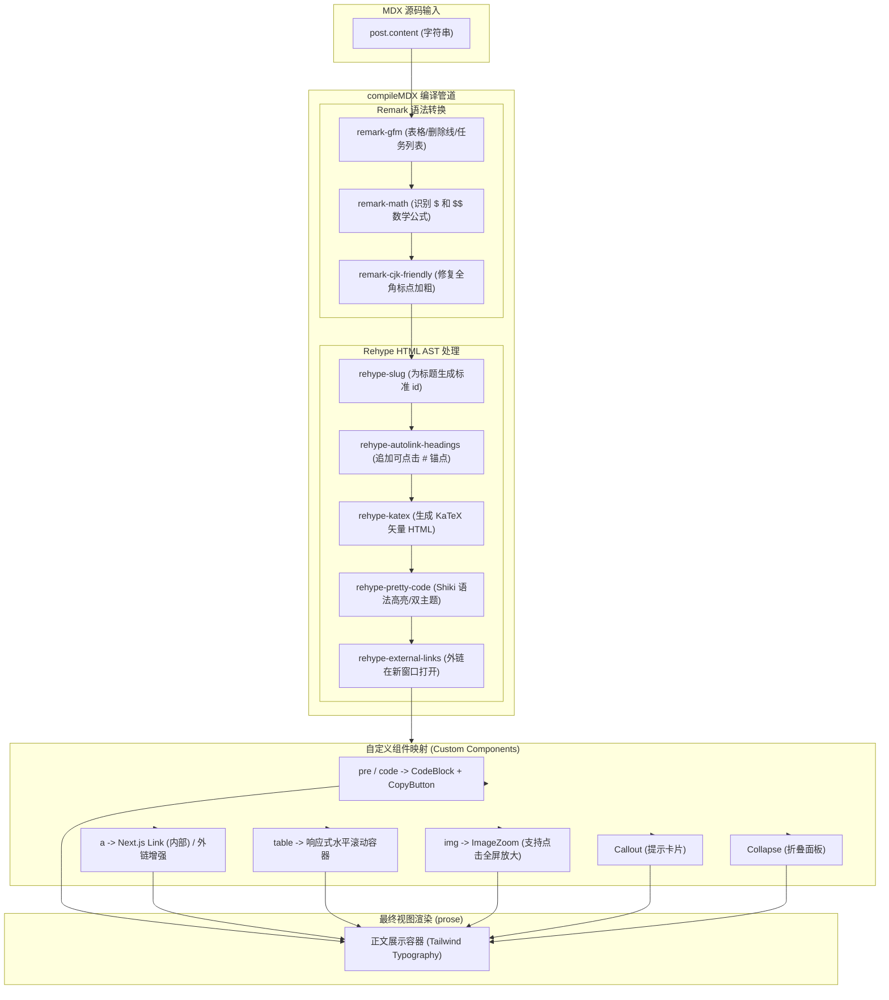
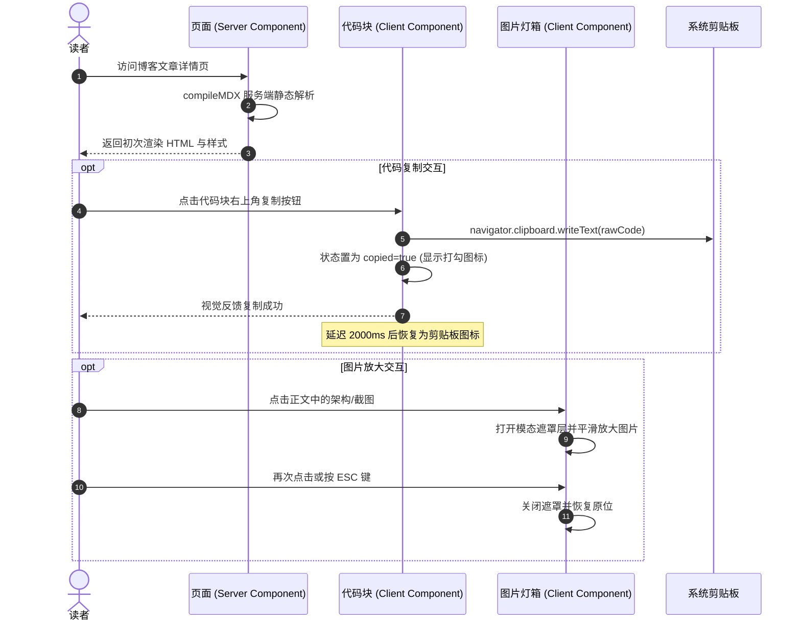

# 技术设计：增强 MDX 渲染能力与排版交互

## 架构边界与职责划分

遵循单应用博客的 App Router 规范：MDX 编译仍在服务端 RSC 阶段完成；富交互组件（如代码复制、图片灯箱放大）以下沉的客户端叶子节点形式注入。

### 文件变动清单

| 文件路径 | 类型 | 职责 |
| --- | --- | --- |
| `src/app/(site)/_components/blog/mdx-content.tsx` | 重构 (Server) | 扩展 `compileMDX` 的插件链（remark/rehype）与自定义标签组件映射 |
| `src/app/(site)/_components/blog/code-block.tsx` | 新增 (Server/Client) | 增强代码块容器，渲染代码标题、语言标签与右上角复制按钮 |
| `src/app/(site)/_components/blog/copy-button.tsx` | 新增 (Client) | 复制代码到剪贴板，提供 2 秒成功反馈动效 |
| `src/app/(site)/_components/blog/callout.tsx` | 新增 (Server) | 提供 Note / Tip / Warning / Important 语义警示块 |
| `src/app/(site)/_components/blog/collapse.tsx` | 新增 (Client) | 提供折叠手风琴面板，支持在 MDX 中收纳大段内容 |
| `src/app/(site)/_components/blog/image-zoom.tsx` | 新增 (Client) | 正文图片平滑放大灯箱预览容器 |
| `src/lib/content.ts` | 优化 | 将 `extractHeadings` 的 slugify 算法与 `github-slugger` 对齐 |
| `src/app/(site)/blog/[slug]/page.tsx` | 优化 (Server) | 详情页头部接入 `calculateReadingTime`，呈现阅读用时与字数 |
| `src/app/globals.css` | 扩展 | 引入 KaTeX CSS 导入及代码块高亮暗色/亮色变量样式 |

## 整体编译与渲染管道



## 交互时序与客户端边界



## 核心设计契约

### 1. 代码块与双主题配置

使用 `rehype-pretty-code` 搭配 Catppuccin 双主题（`catppuccin-latte` 浅色，`catppuccin-mocha` 深色），与整站现有 Catppuccin 主题系统完全匹配：

```ts
// 插件配置契约
const prettyCodeOptions = {
  theme: {
    light: 'catppuccin-latte',
    dark: 'catppuccin-mocha',
  },
  keepBackground: false,
}
```

在 `globals.css` 中通过 `html.dark` 或 `[data-theme="dark"]` 切换代码块着色。

### 2. 数学公式排版

- 依赖库：`remark-math@^6.0.0`、`rehype-katex@^7.0.1`、`katex@^0.16.22`。
- 样式引入：在详情页顶部或布局中 `import 'katex/dist/katex.min.css'`。
- 支持语法：行内公式 `$x^2 + y^2 = z^2$` 与块级多行公式 `$$\int_0^\infty e^{-x} dx = 1$$`。

### 3. 组件映射 (Custom Components)

`MdxContent` 传入的组件映射字典包含：
- `table`: `({ children, ...props }) => <div className="my-6 w-full overflow-x-auto"><table {...props}>{children}</table></div>`
- `a`: 区分相对路径与绝对域名，相对路径使用 Next.js `<Link>`，外链增加 `target="_blank" rel="noopener noreferrer"`。
- `Callout`: 接受 `type?: 'note' | 'tip' | 'warning' | 'important'`，渲染带左边框与轻量底色的提示容器。
- `Collapse`: 接受 `title: string` 与 `defaultOpen?: boolean`，基于 `<details><summary>` 或状态切换渲染。
- `img`: 配合 `ImageZoom` 实现点击平滑放大。
