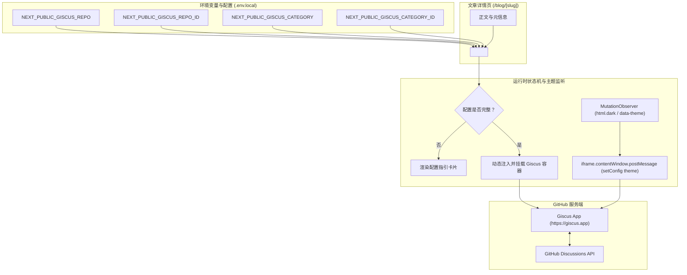
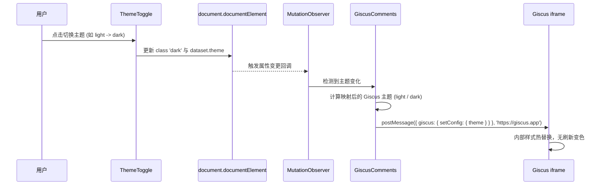

# Giscus 评论系统接入技术设计

## 1. 架构与边界

Giscus 评论系统基于 GitHub Discussions，前端以客户端只读/可交互 iframe 形式嵌入文章详情页底端。

## 2. 主题联动数据流

当用户点击页头的 `ThemeToggle` 组件切换主题时，全站根节点 `document.documentElement` 会更新 `data-theme` 属性并切换 `dark` class。评论组件无需销毁并重新初始化 iframe，直接通过 `postMessage` 向 Giscus 发送主题更新指令。

## 3. 配置解析与降级

### 3.1 核心字段清单

| 环境变量名 | 作用 | 缺省值 / 示例 | 必填 |
| --- | --- | --- | --- |
| `NEXT_PUBLIC_GISCUS_REPO` | GitHub 仓库路径 | 无（例如 `owner/repo`） | 是 |
| `NEXT_PUBLIC_GISCUS_REPO_ID` | GitHub GraphQL 仓库 ID | 无（从 giscus.app 生成） | 是 |
| `NEXT_PUBLIC_GISCUS_CATEGORY` | Discussion 讨论分类名 | `Announcements` | 是 |
| `NEXT_PUBLIC_GISCUS_CATEGORY_ID` | Discussion 讨论分类 ID | 无（从 giscus.app 生成） | 是 |
| `NEXT_PUBLIC_GISCUS_MAPPING` | 文章与讨论映射规则 | `pathname` | 否 |
| `NEXT_PUBLIC_GISCUS_REACTIONS_ENABLED` | 是否开启表情反馈 | `1` | 否 |
| `NEXT_PUBLIC_GISCUS_INPUT_POSITION` | 输入框置顶或置底 | `top` | 否 |
| `NEXT_PUBLIC_GISCUS_LANG` | 界面语言 | `zh-CN` | 否 |

### 3.2 降级机制

若 `NEXT_PUBLIC_GISCUS_REPO`、`NEXT_PUBLIC_GISCUS_REPO_ID` 或 `NEXT_PUBLIC_GISCUS_CATEGORY_ID` 中任一缺失：
- 渲染配置引导面板（提示用户当前未检测到 Giscus 环境变量，并列出 `.env.example` 对应字段）。
- 面板采用灰色半透明卡片样式，符合 Catppuccin / Tailwind 配色规范。
- 绝不抛出运行时异常，避免页面崩溃。

## 4. 安全性与性能

1. **按需与懒加载**：使用 `loading="lazy"` 属性，并且通过 `IntersectionObserver` 或视口按需初始化，避免在首屏阻塞正文阅读。
2. **通信跨域安全**：`postMessage` 通信时，目标源严格限制为 `'https://giscus.app'`，拒绝使用 `'*'`。
3. **零外部 npm 依赖**：使用原生动态脚本加载或封装为客户端 React 组件，不额外引入外部库，降低构建体积与维护成本。
