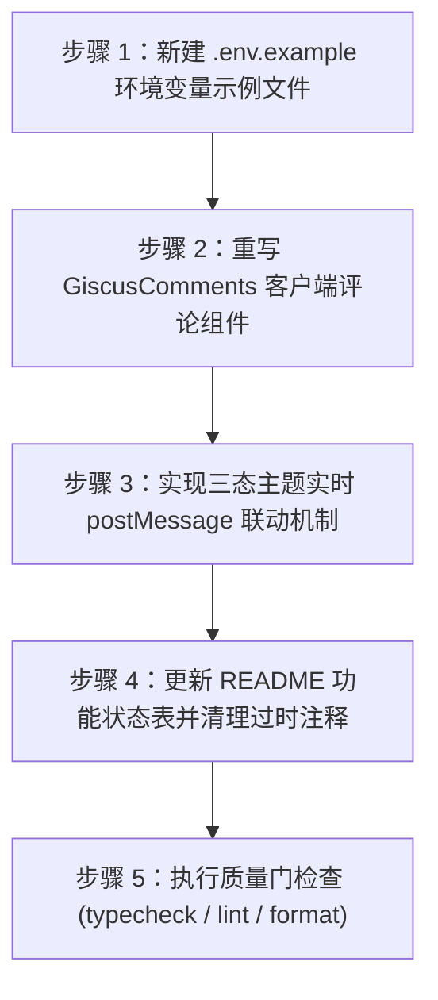

# Giscus 评论系统接入实施计划

## 1. 实施流程概览



## 2. 详细执行清单

### 步骤 1：环境变量模板与读取支持
- 目标文件：`.env.example`
- 动作：在仓库根目录提供环境变量示例，标明字段含义与从 giscus.app 获取的步骤。

### 步骤 2：重写 GiscusComments 客户端评论组件
- 目标文件：`src/app/(site)/_components/comment/giscus-comments.tsx`
- 动作：
  1. 标明 `'use client'`。
  2. 读取环境变量 `process.env.NEXT_PUBLIC_GISCUS_*`。
  3. 若缺失核心变量，渲染样式合规的配置指引提示。
  4. 若变量完备，挂载 `<giscus-widget>` 或动态插入 Giscus 官方 `script` 标签加载评论。

### 步骤 3：实现主题双向联动
- 目标文件：`src/app/(site)/_components/comment/giscus-comments.tsx`
- 动作：
  1. 初始挂载时根据 `document.documentElement.classList.contains('dark')` 判断当前主题。
  2. 注册 `MutationObserver` 监听 `document.documentElement` 的 `class` 变动。
  3. 当主题切换时，向 `iframe.giscus-frame` 发送 postMessage 更新消息：`{ giscus: { setConfig: { theme: isDark ? 'dark' : 'light' } } }`。
  4. 组件卸载时断开 observer 监听。

### 步骤 4：更新文档与清理占位
- 目标文件：`README.md`
- 动作：将「功能状态」表中 Giscus 评论的状态从 `占位组件，接入步骤见注释` 更新为 `已实现`。

### 步骤 5：项目质量门检查与验证
- 执行命令：
  ```bash
  pnpm typecheck
  pnpm lint
  pnpm format:check
  pnpm build
  ```

## 3. 风险与回滚点

- 风险：Giscus iframe 在首次加载时可能存在网络波动或延迟。
  - 对策：容器预设最小高度与懒加载骨架，防止布局跳动（CLS）。
- 风险：若用户未配置环境变量，页面可能出现不可控报错。
  - 对策：做严格的前置有效性校验，未配置时显示友好指引卡片，不调用外部脚本。
