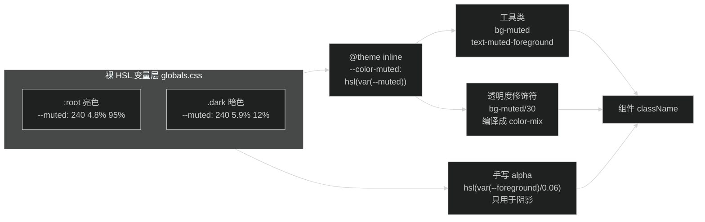
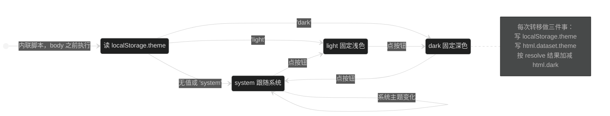
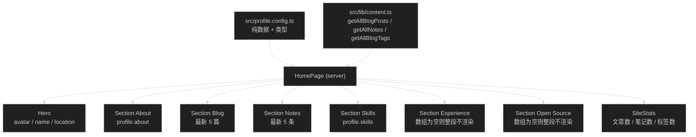

# 技术设计

## 架构边界

改动集中在三层，互不交叉：

1. 设计 token 层：`src/app/globals.css`。定义裸 HSL 变量、`@theme inline` 映射、keyframes 和自定义变体。不含任何组件样式类。
2. 数据层：`src/profile.config.ts` 新增。纯数据加类型，无渲染逻辑。`src/lib/content.ts` 一行不动。
3. 组件层：`src/app/(site)/_components/` 下新增 home 分组，改现有 site / blog / notes / placeholder 分组的配色。

### 文件清单

新增：

| 文件                                                    | 类型   | 职责                                                |
| ------------------------------------------------------- | ------ | --------------------------------------------------- |
| `src/profile.config.ts`                               | 数据   | 首页个人信息和类型定义                              |
| `src/app/fonts.ts`                                    | 配置   | `next/font/local` 加载 Satoshi，导出 CSS 变量类名 |
| `src/app/(site)/_components/home/hero.tsx`            | server | 头像、名字、图标标签行、Connect Me 徽章             |
| `src/app/(site)/_components/home/section.tsx`         | server | 双列 Section 容器                                   |
| `src/app/(site)/_components/home/entry-list-item.tsx` | server | 紧凑列表项：左 meta、右标题、hover 箭头             |
| `src/app/(site)/_components/home/link-card.tsx`       | server | 经历和开源仓库卡片                                  |
| `src/app/(site)/_components/home/skill-list.tsx`      | server | 一组 pill，交错淡入                                 |
| `src/app/(site)/_components/home/site-stats.tsx`      | server | 文章数、笔记数、标签数统计卡                        |
| `src/app/fonts/Satoshi-Variable.woff2`                 | 资产   | 从参照项目复制 ttf 转换而来                         |

改动：

| 文件                                                                                        | 改什么                                                               |
| ------------------------------------------------------------------------------------------- | -------------------------------------------------------------------- |
| `src/app/globals.css`                                                                     | token 从 2 个扩到 21 个，加 keyframes、`--animate-*`、三个主题变体 |
| `src/app/layout.tsx`                                                                      | 挂字体类名，防闪烁脚本改成三态并写`data-theme`                     |
| `src/app/(site)/layout.tsx`                                                               | 页头改 sticky 后的容器结构，首页宽度放宽                             |
| `src/app/(site)/page.tsx`                                                                 | 整页重写成简历式结构                                                 |
| `src/app/(site)/_components/site/site-header.tsx`                                         | 加滚动状态和移动端菜单                                               |
| `src/app/(site)/_components/site/theme-toggle.tsx`                                        | 两态改三态，图标模糊切换                                             |
| `site-footer.tsx`、`post-card.tsx`、`note-card.tsx`、`empty-state.tsx`、`toc.tsx` | 只换配色，结构不动                                                   |

### RSC / client 划分

只有两个 client 组件，和现有约定一致：

- `site-header.tsx`：已经因为 `usePathname` 是 client，加滚动监听和菜单开合状态。
- `theme-toggle.tsx`：需要 `localStorage` 和 `matchMedia`。

首页所有新组件都是 server。`profile.config.ts` 是纯数据，在 server 端读，不进客户端 bundle。

## 数据流

### 颜色 token 分层



关键点：`@theme inline` 是必须的。不加 `inline` 时 Tailwind 会生成 `--color-muted` 变量并在 `:root` 解析，而 `--muted` 在 `.dark` 下才被覆盖，工具类会拿到定义处的值。官方文档「Referencing other variables」明确要求引用其他变量时用 `inline`。

裸三元组（不带 `hsl()` 包装）保留下来是为了写阴影时能插 alpha。这是参照项目的做法，直接沿用。

### 主题三态状态流



`html` 上同时挂两个东西，职责分开：

- `class="dark"`：只表示最终渲染是深色还是浅色，驱动全部 `dark:` 变体。
- `data-theme="system|light|dark"`：表示用户选了什么，驱动按钮图标显示哪一个。

图标可见性走 CSS 而不是 React state，这样服务端渲染和客户端首帧一致，不存在 hydration mismatch，也不会出现图标闪一下再修正。做法是在 `globals.css` 加三个自定义变体：

```css
@custom-variant theme-system (&:where(html[data-theme='system'] *));
@custom-variant theme-light (&:where(html[data-theme='light'] *));
@custom-variant theme-dark (&:where(html[data-theme='dark'] *));
```

三个图标叠在同一位置，默认全部 `opacity-0 blur-[4px] scale-[0.6]`，各自用对应变体翻成 `opacity-100 blur-0 scale-100`，`transition` 走 `duration-250` 加 `motion-reduce:transition-none`。

React 只负责点击时算下一个状态并写属性，不参与图标显示。

### profile 数据流



空段判断放在 `HomePage` 里做（`profile.experience.length > 0 && <Section .../>`），不在 Section 组件里判空。理由：Section 是通用容器，不该知道调用方数据结构。

## 契约

### `src/profile.config.ts`

```ts
export interface SkillGroup {
  /** 分组名，如 Frontend */
  title: string
  items: string[]
}

export interface ExperienceItem {
  /** 公司或组织名 */
  heading: string
  /** 职位 */
  subheading: string
  /** 外链，没有就传 null */
  href: string | null
  /** 一到两条职责描述 */
  points: string[]
}

export interface EducationItem {
  heading: string
  subheading: string
  /** 起止时间，自由格式，如 2024 年 2 月 - 2027 年 6 月 */
  period: string
}

export interface OpenSourceItem {
  name: string
  description: string
  href: string
}

export interface Profile {
  /** hero 头像路径，放 public/ 下；为 null 时渲染首字占位块 */
  avatar: string | null
  /** 所在城市 */
  location: string
  /** 一段自我介绍，渲染在 About 段 */
  about: string[]
  skills: SkillGroup[]
  experience: ExperienceItem[]
  education: EducationItem[]
  openSource: OpenSourceItem[]
}
```

名字不进 `profile.config.ts`，继续从 `src/site.config.ts` 的 `author` 读，避免两处维护同一个值。

两个选型要说清楚：

- 文件放 `src/profile.config.ts` 而不是 `src/data/profile.ts`。`directory-structure.md` 的反模式一节写着不建新的顶层源码目录，而 `src/site.config.ts` 已经立了「站点级配置平铺在 `src/` 下」的先例。命名对称、关注点分开，不新建目录。
- 类型用显式 `interface` 标注而不是 `as const` 推导。`type-safety.md` 对 `site.config.ts` 的做法是从值推导，但这里 `experience` 首稿是空数组，`as const` 会推成 `readonly never[]`，`.map()` 里访问字段直接报类型错。显式标注才能让空数组和填了数据的数组共用一套类型。

### 页头滚动状态

`site-header.tsx` 在容器上写两个 data 属性，样式全部走 Tailwind data 变体，不新增 CSS 类：

- `data-scrolled="true|false"`：`window.scrollY > 20`。
- `data-visible="true|false"`：`scrollY < 350 || scrollY < 上一次 scrollY`。

滚动监听用 `{ passive: true }`，在 `useEffect` 里注册并 cleanup。上一次滚动位置存 `useRef`，不进 state，避免每次滚动触发重渲染。状态只在跨过阈值时 `setState`。

## 取舍

### 不写自定义 CSS 类，改用 data 变体和 @theme

参照项目大量用 Astro 的 scoped `<style>`。当前项目 frontend spec 写着「不写自定义 CSS 类」，而 Tailwind 4 的能力足够覆盖：

| 参照项目做法                                      | 本项目做法                                                              |
| ------------------------------------------------- | ----------------------------------------------------------------------- |
| `.not-top` 类 + scoped CSS                      | `data-scrolled` 属性 + `data-[scrolled=true]:` 变体                 |
| `#toggleDarkMode[data-theme=dark] .dark` 选择器 | `@custom-variant theme-dark` + 工具类                                 |
| `@media (prefers-reduced-motion: reduce)`       | `motion-reduce:` 变体                                                 |
| scoped`@keyframes skill-fade-in`                | `globals.css` 里 `@keyframes` + `@theme` 的 `--animate-*`       |
| 四层 rgba 阴影硬编码                              | `shadow-[...]` arbitrary value，颜色用 `hsl(var(--foreground)/...)` |

结果是 spec 的「不写自定义 CSS 类」这条能保住，`globals.css` 只多了 token、keyframes 和变体定义，属于设计 token 层不是组件样式层。要改的 spec 条目只剩「色系统一用 stone」。

### 笔记状态徽章不引新颜色

参照项目没有对应元素。四个状态现在用 blue / amber / green / stone 原色，换成 token 后可用的语义色只有 primary、destructive、muted、accent。方案：`ready` 用 primary、`in-progress` 用 accent 加 primary 文字、`incomplete` 用 destructive 的低透明度底、`archived` 用 muted。不为这一个组件新增自定义色 token。

### 字体只引正体

Satoshi 有 Variable 和 VariableItalic 两个文件。斜体在博客正文里出现频率极低，浏览器合成斜体够用，省 130KB。

字体文件放 `src/app/fonts/` 不放 `public/`。`next/font/local` 的 `src` 是相对引用文件的路径，Next 自己加 hash 并生成 preload 标签；放 `public/` 会变成同一个文件既进 next/font 的处理流程又被静态目录对外提供，多一份重复产物。

### 首页宽度和详情页宽度分开

现在 `max-w-3xl` 写在 `(site)/layout.tsx` 的 `<main>` 上，所有页面共享。首页要放宽到 `md:w-4/5 lg:w-5/6`，详情页要保持窄栏便于阅读。做法：`<main>` 只留外层 padding 和居中，宽度下移到各页面自己控制。首页用宽容器，其余页面用 `max-w-3xl`。

代价是每个页面要自己写一次宽度类。收益是首页不用和详情页抢同一个约束，后续加宽页面也不用改布局。

## 兼容和迁移

- 纯前端改动，没有数据迁移，没有 API 变更，内容文件一个不动。
- URL 结构不变，`generateStaticParams` 不动，构建产物页面数量不变。
- `localStorage.theme` 从两态扩到三态。旧值 `'light'` / `'dark'` 继续有效，`null` 按 `'system'` 处理，不需要迁移脚本。

## 回滚

改动全在 git 里，一条 `git revert` 回到当前状态。字体是新增文件，revert 后残留 `src/app/fonts/`，手动删。

分步实现时每一步都能独立跑通：token 层落地后旧组件仍能渲染（`stone-*` 类还在，Tailwind 默认调色板没被关掉），首页重写和页头改造互不依赖。任何一步失败可以只回滚那一步。

## 待验证项

这三条在实现第一步用命令确认，不靠推断：

1. `bg-muted/30` 在 `--color-muted: hsl(var(--muted))` 下是否正确编译成 `color-mix`。验证方式：改完 token 后 `pnpm build`，在 `.next/static/css/` 里搜 `color-mix`，再在浏览器 DevTools 看统计卡的 computed background-color。
2. `@custom-variant theme-dark (&:where(html[data-theme='dark'] *))` 这种基于祖先属性的变体在 Tailwind 4.2 能否生成。验证方式：写一个用了该变体的类，build 后在产物 CSS 里搜对应选择器。
3. Satoshi Variable 的 weight 轴范围。先按 `300 900` 声明，在浏览器里逐个试 300 / 400 / 500 / 700 / 900 看字重是否真的变化；不变则说明范围声明错了，改成实际范围。
