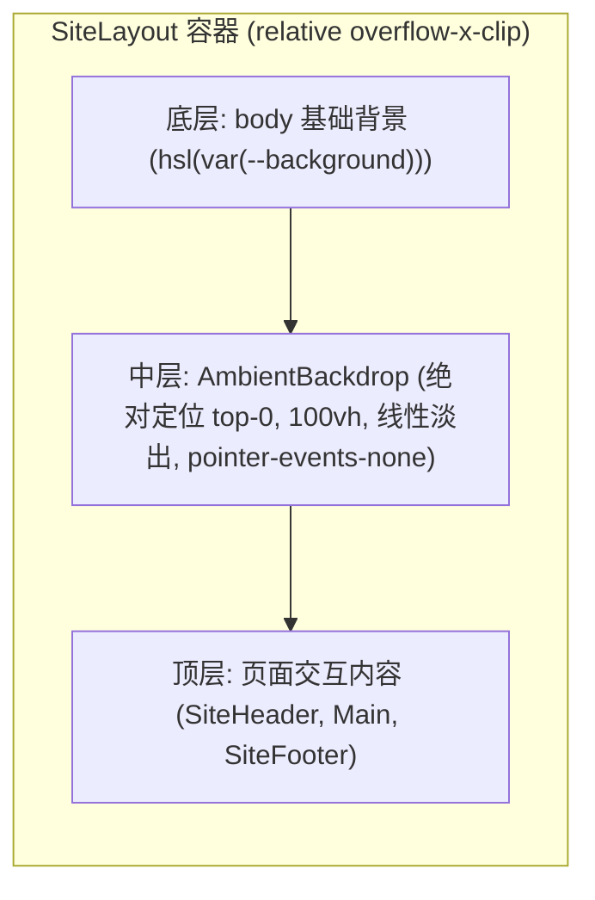
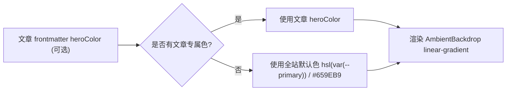

# 添加页面顶部氛围高光背景

## Goal

在博客全站与文章页实现页面首屏顶光渐变氛围底座（Ambient Backdrop），页面在上方呈现柔和环境色光晕，向下滑动到底部自然融入深黑背景，并支持每篇文章单独定制专属主题色。

## Architecture & Data Flow

### 1. 视觉层叠堆叠结构

### 2. 氛围高光色决策流

## Confirmed Facts

- 当前项目采用 Next.js 16 App Router + Tailwind CSS 4。
- 全站基础背景色在暗色模式下为 `--background: 240 20.54% 5.2%`（深黑底色）。
- 公开页面统一通过 `src/app/(site)/layout.tsx` 渲染页头、主体和页脚。
- 文章内容数据由 `src/lib/content.ts` 集中解析。

## Requirements

### R1. 氛围底座组件 (AmbientBackdrop)
- 在 `src/app/(site)/_components/site/ambient-backdrop.tsx` 创建纯样式无障碍组件。
- 尺寸覆盖首屏：宽度 100%，高度 `100vh`。
- 定位：`absolute inset-x-0 top-0 z-0 pointer-events-none`，不遮挡任何用户交互。
- 渐变：自上而下从指定颜色过渡到 `transparent`。
- 透明度：暗色模式下柔和半透明（`opacity-25`），浅色模式下适度降低（`opacity-15`）。

### R2. 全站站点布局接入
- 在 `src/app/(site)/layout.tsx` 引入 `AmbientBackdrop`。
- 外层包裹容器补充 `relative overflow-x-clip`，主内容区保持 `relative z-10`。

### R3. 文章数据层支持专属氛围色
- 在 `src/lib/content.ts` 的 `BlogPost` 接口中增加可选属性 `heroColor?: string`。
- `readBlogPost` 解析 frontmatter 时，若存在有效的字符串 `heroColor` 则解析并返回。

### R4. 文章详情页动态适配
- 在 `src/app/(site)/blog/[slug]/page.tsx` 中，当文章定义了 `heroColor` 时，在页面渲染带定制颜色的 `AmbientBackdrop`。

## Acceptance Criteria

- [x] AC1: 访问各公开页面（如 `/`、`/blog`、`/notes` 等），首屏顶部均能看到柔和的高光渐变氛围，页面向下滑动过首屏后完全显露底层深色。
- [x] AC2: 氛围底座不干扰任何鼠标悬停、点击与文字划选操作（`pointer-events-none` 生效）。
- [x] AC3: 在 `content/blog/` 文章 frontmatter 中配置 `heroColor`（如 `#659EB9`），详情页顶部光晕颜色正确匹配所配颜色。
- [x] AC4: 浅色与深色模式下均呈现正常视觉对比度，无色块割裂。
- [x] AC5: 代码质量门禁全部通过：`pnpm typecheck`、`pnpm lint`、`pnpm format:check` 零报错。

## Out of Scope

- 复杂 Canvas 粒子或 WebGL 动态光效渲染。
- 自动提取图片主色的算法依赖。
