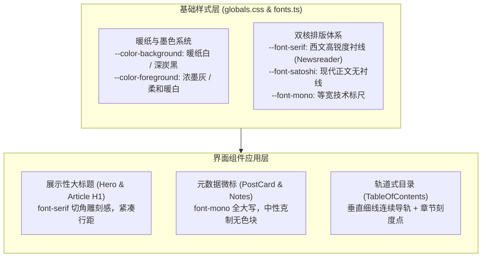

# 博客排版、纸本暖色与轨道式目录质感重塑 (Design)

## 架构与视觉系统设计

系统设计围绕去 AI 模板化、提升真实出版物阅读质感展开，主要分为三层：

---

## 模块技术方案

### 1. 色彩与材质系统 (Warm Paper Palette)

修改 `src/app/globals.css` 中的 HSL 色彩变量，消除数码冷蓝光和塑料渐变：

- **亮色模式 (Light)**：
  - `--background`: 改为 `40 20% 97.5%`（温和低反射的暖纸白 `#F7F6F2`）。
  - `--foreground`: 改为 `30 8% 14%`（深墨炭色 `#242220`）。
  - `--muted`: 改为 `40 12% 93%`。
  - `--muted-foreground`: 改为 `30 6% 45%`。
  - `--border`: 改为 `40 10% 88%`（低对比度浅纸缝线）。
  - `--card`: 与页面背景呼应的微透纯净底色。
- **暗色模式 (Dark)**：
  - `--background`: 改为 `30 6% 8%`（炭黑石板底色 `#141312`，消除偏紫/偏蓝的科技模板感）。
  - `--foreground`: 改为 `40 15% 90%`（自然柔光白）。
  - `--border`: 改为 `30 5% 18%`。

### 2. 字体与排版体系 (Editorial Typography)

在 `src/app/fonts.ts` 与 `src/app/layout.tsx` 中集成字体：

- **西文展示衬线体**：使用 `next/font/google` 引入 `Newsreader`（或 `Source Serif 4`），注入 CSS 变量 `--font-serif`。
- **应用范围**：
  - 首页 Hero 中的英文主标题：`Building with TypeScript, AI Agents and the Web.` 应用 `font-serif tracking-tight`。
  - 博客文章详情页的 `h1`：`font-serif font-normal tracking-tight`，赋予类似纽约客或学术专刊的高端人文排版质感。
- **技术等宽眉标 (Mono Kicker)**：
  - 将 `PostCard`、`NoteCard` 的顶层元信息由圆角胶囊药丸重构为打字机风格微型眉标：
    格式如 `[ NOTE // 2026.09 ]` 或 `// DEVLOG`，字号 `text-xs font-mono uppercase tracking-wider`。

### 3. 文章轨道式目录 (Rail Wayfinding TOC)

重构 `src/app/(site)/_components/blog/toc.tsx` 的视觉结构：

- **布局结构**：
  - 移除原有的厚重背景与分离式的进度粗条。
  - 左侧常驻一条极细垂直参考线：`w-px bg-border/60` 贯穿整个目录高度。
  - 每个章节链接左侧带有刻度锚点（直角刻度或微小菱形）。
  - 当滚动进入当前章节视口时，导轨上对应的刻度标记点高亮为 `bg-foreground` 或 `text-primary`，并随进度向下平滑拉伸。
- **交互边界与性能**：
  - 保留现有的 `ResizeObserver` 与 `requestAnimationFrame` 防抖机制。
  - 保留用户主动手势打断与平滑滚动锁，避免点击跳转时的界面闪烁。

---

## 影响面与回滚策略

- **影响文件**：
  - `src/app/globals.css`
  - `src/app/fonts.ts`
  - `src/app/layout.tsx`
  - `src/app/(site)/_components/home/hero.tsx`
  - `src/app/(site)/_components/blog/toc.tsx`
  - `src/app/(site)/_components/blog/post-card.tsx`
- **回滚方式**：各文件改动高度独立，可通过 git 单独还原或通过变量切回。
