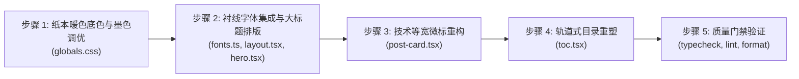

# 博客排版、纸本暖色与轨道式目录质感重塑 (Implement)

## 执行步骤流向



---

## 详细实施计划

### 步骤 1：纸本暖色与墨色色彩变量调优
- 文件：`src/app/globals.css`
- 内容：
  - 更新 `:root` 下的 `--background` 为微暖纸白（如 `40 20% 97.5%`），`--foreground` 为深炭黑（如 `30 8% 14%`），调整边框、次级文本和卡片色。
  - 更新 `.dark` 下的 `--background` 为深邃炭黑（如 `30 6% 8%`），调整正文和次级文本对比度。
  - 检查并适配 `.prose` 排版下的正文与标题色值。

### 步骤 2：西文展示衬线字体集成与标题应用
- 文件：`src/app/fonts.ts`、`src/app/layout.tsx`、`src/app/(site)/_components/home/hero.tsx`、`src/app/(site)/blog/[slug]/page.tsx`
- 内容：
  - 在 `fonts.ts` 中通过 `next/font/google` 导入 `Newsreader` 字体，导出 CSS 变量 `--font-serif`。
  - 在 `layout.tsx` 中将字体变量挂载到根节点 `<html>`。
  - 在 `hero.tsx` 和文章详情页 H1 标题上应用 `font-serif`。

### 3. 技术等宽微型眉标升级
- 文件：`src/app/(site)/_components/blog/post-card.tsx`
- 内容：
  - 将原本分散或泛滥的圆角药丸标签，重构为全大写、宽字距的技术微标格式（例如：`[ 2026.09 // POST ]`）。
  - 弱化背景色块，保留文字清晰度与层次感。

### 4. 文章目录轨道化重塑 (Rail Wayfinding)
- 文件：`src/app/(site)/_components/blog/toc.tsx`
- 内容：
  - 将目录左侧重构为贯穿式的细垂直轨道（1px 导轨线）。
  - 各章节项左侧对应导轨刻度点；当前视口所在章节点亮刻度点并呈现平滑微动态。
  - 保持原有的平滑定位与防手势打断逻辑不变。

### 5. 质量检查与构建门禁
- 运行：
  ```bash
  pnpm typecheck
  pnpm lint
  pnpm format:check
  ```
- 确保所有检查零错误通过。
