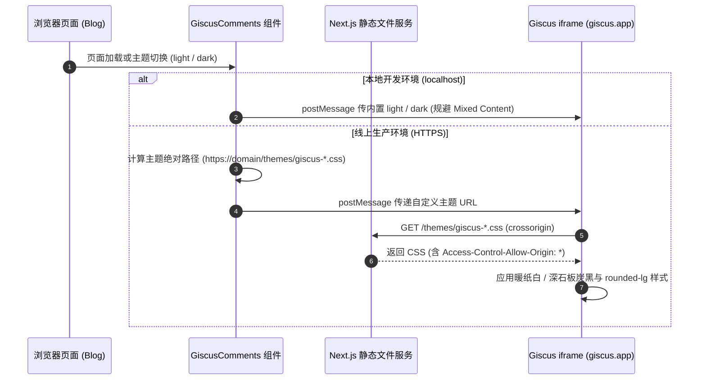

# Giscus 评论区适配博客纸本与深炭主题 PRD

## 1. 背景与目标

当前博客已完成“暖纸白底色、深炭墨色文字、西文衬线与工业克制微标”的全局设计重塑。然而 Giscus 评论组件默认使用 GitHub 官方的 `light` 和 `dark` 主题：
- 默认 light 主题采用冷纯白背景（`#ffffff`）与偏蓝冷灰边框，破坏了本站的暖纸质感。
- 默认 dark 主题采用深灰黑，与本站的深石板炭黑存在色温断层。

本任务目标：
1. 制作专属于本站色彩与排版规范的 Giscus 自定义主题 CSS（`giscus-light.css` 与 `giscus-dark.css`），放置在 `public/themes/`。
2. 配置 Next.js 跨域响应头，满足 Giscus `crossorigin="anonymous"` 的加载要求。
3. 改造 `giscus-comments.tsx` 组件，在客户端动态构建指向当前域名的绝对主题链接，与本站三态主题切换无缝联动，并为本地开发环境提供安全降级。

## 2. 架构与数据流向

## 3. 需求清单与验收标准

### 3.1 需求清单
1. **静态主题样式**：
   - `public/themes/giscus-light.css`：暖纸白背景、深炭文本、克制边框与 `rounded-lg` 圆角。
   - `public/themes/giscus-dark.css`：深石板炭黑背景、暖白文本、深色边框与 `rounded-lg` 圆角。
2. **跨域头配置**：
   - 在 `next.config.ts` 的 `headers()` 配置中，为 `/themes/:path*` 注入 `Access-Control-Allow-Origin: *`。
3. **组件联动与降级**：
   - 在 `src/app/(site)/_components/comment/giscus-comments.tsx` 中动态计算绝对 URL。
   - 本地 `localhost` / `127.0.0.1` 安全降级为内置主题。
   - `MutationObserver` 监听主题变更时实时同步。

### 3.2 验收标准
1. `pnpm typecheck`、`pnpm lint`、`pnpm format:check` 全部通过。
2. `public/themes/giscus-light.css` 与 `giscus-dark.css` 可正常直接访问且包含完整变量定义。
3. 启动 `pnpm build` 构建成功。
