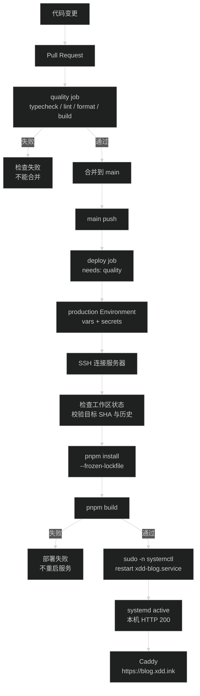

# 技术设计：GitHub Actions 自动部署博客

## 设计边界

本任务只增加 GitHub Actions 和发布说明，沿用服务器已有的 Git、pnpm、Next.js、systemd 与 Caddy。GitHub Actions 负责检查代码和发起远程部署；服务器负责从 GitHub 拉取代码、使用服务器上的 `.env.local` 构建并重启现有服务。

不引入 Docker、自托管 Runner、第三方 SSH 部署 Action、数据库或新的运行时服务。

## 发布流程

## Workflow 结构

文件：`.github/workflows/ci-cd.yml`。

### 触发条件

- `pull_request` 目标分支为 `main` 时运行质量检查。
- `push` 到 `main` 时运行同一套质量检查。
- 部署 job 只在 `push` 到 `main` 且 `quality` 成功时运行。
- 使用 `concurrency` 串行化同一分支的工作流，避免两个发布同时修改服务器工作区；不取消已经开始的生产部署。
- 工作流权限设为 `contents: read`。

### Quality job

运行在 GitHub 托管的 Ubuntu Runner 上，步骤固定为：

1. `actions/checkout` 检出触发本次工作流的提交。
2. `pnpm/action-setup` 配置 pnpm `11.5.0`。
3. `actions/setup-node` 配置 Node.js `24.16.0`，启用 pnpm 缓存。
4. 在 Runner 的 `quality` job 中临时写入只包含 `allowBuilds: sharp: true` 的 `pnpm-workspace.yaml`，贯穿依赖安装和质量检查，job 结束时清理；不提交到仓库。
5. `pnpm install --frozen-lockfile`。
6. 依次运行 `pnpm typecheck`、`pnpm lint`、`pnpm format:check`、`pnpm build`。

Node 和 pnpm 版本与当前服务器记录保持一致。构建检查不读取服务器上的 `.env.local`，不把生产环境文件复制进 Runner。

### Deploy job

- 使用 `needs: quality`，并通过 `if` 限制为 `main` 的 push 事件。
- 引用 `production` Environment。该 Environment 不配置 Required reviewers，以匹配已确认的“CI 成功后直接自动发布”；仍限制允许部署的分支为 `main`。
- 通过 Runner 自带的 OpenSSH 连接服务器，不引入第三方部署 Action。
- 将 `DEPLOY_SSH_KEY` 写入 Runner 临时目录并设置 `600` 权限，将人工核验过的 `DEPLOY_KNOWN_HOSTS` 写入 `~/.ssh/known_hosts`，使用 `StrictHostKeyChecking=yes` 和 `IdentitiesOnly=yes`。
- 远程命令使用 `bash -s`，只传入本次工作流的 `github.sha`。服务器部署目录固定为 `/home/deploy/code/xdd/blog`。

远程部署顺序：

1. 检查 Git 工作区状态。只有服务器 `pnpm approve-builds sharp` 生成且内容精确为 `allowBuilds:\n  sharp: true` 的单个未跟踪 `pnpm-workspace.yaml` 可以作为服务器专用配置保留；它不会被工作流修改。任何其他未提交或未跟踪改动都退出，不自动覆盖。
2. 切换到 `main`，执行 `git fetch --prune origin main`。
3. 检查 `origin/main` 的提交 SHA 等于本次工作流的 `github.sha`。如果 `main` 在 CI 期间继续前进，停止本次部署，避免部署未经过本次检查的提交。
4. 检查服务器当前 `main` 是 `origin/main` 的祖先；如果服务器有未推送的本地提交或历史分叉，停止部署。
5. 执行 `git merge --ff-only origin/main`，保持服务器分支历史为快进更新。
6. `source /home/deploy/.nvm/nvm.sh`，执行 `pnpm install --frozen-lockfile`。
7. 执行 `pnpm build`。
8. 构建成功后执行 `sudo -n systemctl restart xdd-blog.service`。
9. 检查 `systemctl is-active --quiet xdd-blog.service`，再请求 `http://127.0.0.1:4400/`。

重启放在构建之后，因此拉取、安装或构建失败时不会主动停止或重启当前服务。构建过程仍然使用现有的 `.next` 目录，不能把它当成原子发布；这是沿用当前服务器结构的明确取舍。

## GitHub 配置契约

在仓库的 `production` Environment 中配置：

| 类型 | 名称 | 内容 |
| --- | --- | --- |
| Variable | `DEPLOY_HOST` | 服务器地址 |
| Variable | `DEPLOY_PORT` | SSH 端口，当前为 `22` |
| Variable | `DEPLOY_USER` | 当前为 `deploy` |
| Secret | `DEPLOY_SSH_KEY` | 专用于 GitHub Actions 登录服务器的 Ed25519 私钥 |
| Secret | `DEPLOY_KNOWN_HOSTS` | 已核对指纹的服务器 known_hosts 行 |

服务器项目路径写入工作流，因为它不是凭据且当前部署结构固定。`DEPLOY_SSH_KEY` 不应复用服务器访问 GitHub 的私钥；服务器继续使用自己现有的 GitHub 拉取权限。

仓库设置还需要：

- `production` Environment 的部署分支限制为 `main`。
- `main` 分支要求通过 Pull Request 和质量检查后才能合并，具体检查名以第一次工作流运行结果为准。
- 服务器的 `.env.local` 继续留在 `/home/deploy/code/xdd/blog/.env.local`，不上传到 GitHub。

## 服务器前置条件

实施或第一次发布前必须人工确认：

- `/home/deploy/code/xdd/blog` 的正式域名改动已提交到 GitHub，服务器工作区不再保留未提交的 `src/site.config.ts` 或其他代码改动。
- 服务器可以保留由 `pnpm approve-builds sharp` 生成的 `pnpm-workspace.yaml`，但内容必须精确匹配 `allowBuilds:\n  sharp: true`；工作流会校验并原样保留它。
- 服务器 `deploy` 用户能从 `origin` 拉取 `main`。
- `source /home/deploy/.nvm/nvm.sh` 后的 Node.js 和 pnpm 版本可用。
- `deploy` 用户能无交互执行 `sudo -n systemctl restart xdd-blog.service`。
- `sharp` 的构建脚本已经按现有维护记录单独批准；自动工作流不使用 `pnpm approve-builds --all`。
- Actions 使用的公钥已经写入服务器 `deploy` 用户的 `~/.ssh/authorized_keys`。

## 回滚与故障处理

正常回滚优先在 GitHub 上对导致问题的提交执行 `git revert` 并合并到 `main`，让同一套 CI/CD 流程部署可审计的回滚提交。

构建失败或 SSH 前置检查失败时，工作流直接失败并不重启服务；根据 Actions 日志、`journalctl -u xdd-blog` 和本机 curl 检查失败步骤。若服务已经重启但健康检查失败，先在服务器确认日志和监听端口，再通过 GitHub revert 发布上一版。

服务器工作区出现本地改动时，自动部署必须停止。不能在工作流中使用 `git reset --hard`、`git clean` 或覆盖 `.env.local`，因为这些操作会丢失服务器专有配置。

## 文档与规范同步

- 仓库 `README.md` 改为记录自有服务器和 GitHub Actions 的发布方式，保留本地开发和内容约定。
- `/Users/wuwanzhu/Projects/code-server-frp-maintenance/docs/services/blog.md` 增加 GitHub Environment、变量与 secrets、服务器首次准备、第一次触发、验证、失败和回滚步骤。
- `.trellis/spec/frontend/index.md` 的部署事实改为当前自托管服务器与 GitHub Actions，避免后续任务继续以 Vercel 为准。
- `.trellis/spec/frontend/deployment-guidelines.md` 记录 GitHub Actions、SSH、服务器和 systemd 的可执行契约。
