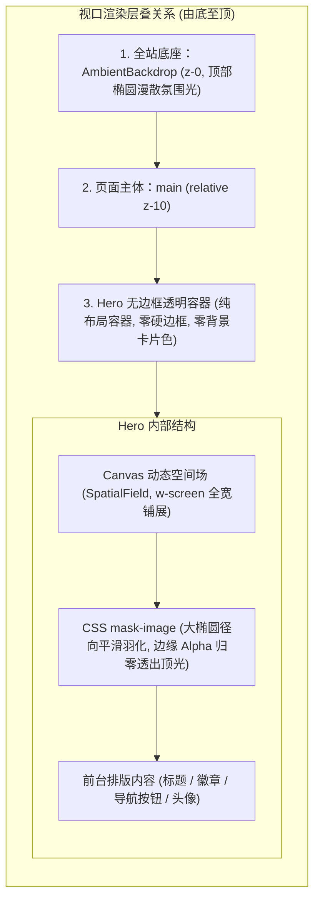

# Hero 无边框全宽融入全站氛围背景改造

## Goal

重构 Hero 区域的遮罩与容器样式，彻底移除容器边框、卡片阴影与背景底板，使 Canvas 动态场全宽无界铺展并改用 CSS `mask-image` 边缘柔和羽化至纯透明，实现与全站顶部氛围光（`AmbientBackdrop`）完全无框自然融合。

## Background & Confirmed Facts

1. 全站顶光背景组件位于 `src/app/(site)/_components/site/ambient-backdrop.tsx`，在 `src/app/(site)/layout.tsx` 的 `z-0` 层渲染全视口淡紫色（`#b4befe`）椭圆漫散光。
2. 现存 Hero 组件位于 `src/app/(site)/_components/home/hero.tsx`。
3. 割裂原因：原遮罩使用 `--background` 纯色/半透色向内抹涂，把下层 `AmbientBackdrop` 透出的光感直接覆盖遮蔽；同时带有边框或受父容器宽度限制，在宽屏下呈现方形切块。

## Visual & Layer Architecture

## Requirements

### 1. 彻底无边框与去容器化（Borderless Integration）
- 移除 Hero 容器上的任何 `border`、`bg-*`、`shadow-*` 和卡片圆角，使 Hero 区域完全透出底层页面与氛围光。
- 移除顶部分割线等硬边元素，让内容如技术出版物排版般自然漂浮于环境光中。

### 2. Canvas 背景全宽铺展与透明通道羽化
- Canvas 容器突破父容器限制横向全宽铺展（`w-screen left-1/2 -translate-x-1/2`），不再局限于局部的方框中。
- 应用大椭圆径向遮罩（`[mask-image:radial-gradient(ellipse_65%_55%_at_50%_45%,black_15%,transparent_85%)]`），由内而外平滑消隐，杜绝任何可见的矩形切边。

### 3. 内容结构稳定与前台交互完好
- 前台核心内容（徽章、大标题、简介、操作按钮、头像）保持在页面栅格宽度内对齐。
- 保留所有按钮跳转、微交互动效和深浅色自适应。

## Acceptance Criteria

- [x] Hero 区域不再有任何纯色 `--background` 遮罩层，没有可见的方形边界或色块截断。
- [x] 顶部 `AmbientBackdrop` 氛围光自然透过 Hero 玻璃台背景透射出来。
- [x] 浅色与深色模式切换时，玻璃台背景与顶光无缝联动，视觉平滑。
- [x] 文本、头像及操作按钮的对比度满足可读性要求。
- [x] 通过代码质量检查：`pnpm typecheck`、`pnpm lint`、`pnpm format:check`。

## Out of Scope

- 修改 `AmbientBackdrop` 的颜色与定位逻辑。
- 修改 `SpatialField` 的着色器算法数学模型。
- 修改 Hero 内部的文案、头像或链接目标。
