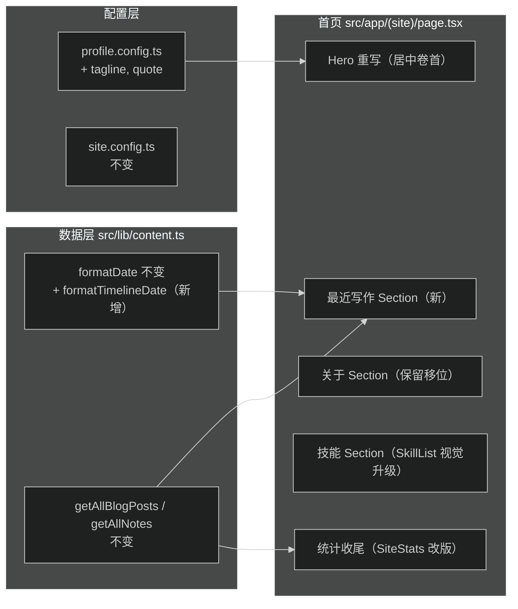
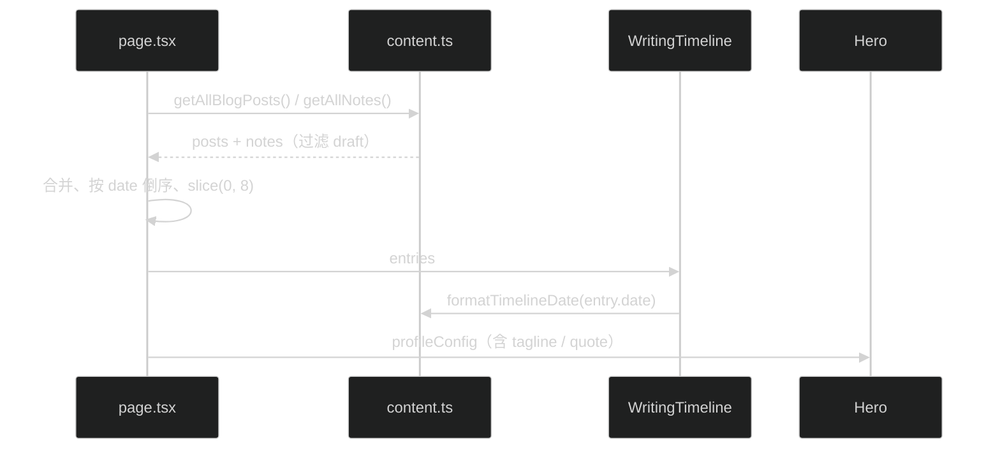

# 首页风格重设计 · 技术设计

## 架构与边界

改动集中在首页自身边界内，不触碰全局布局、配色、字体与数据层基础：

## 组件契约

### Hero（重写 `src/app/(site)/_components/home/hero.tsx`）

- 布局：`min-h-[85vh]` 居中单列（`items-center text-center`），自上而下：徽章排 → 圆形头像（`size-20`，圆角 `rounded-full`，微边框 `ring-1 ring-border/60`）→ 中文衬线巨标题 → 中文站点定位 → 斜体金句（`profile.quote`）→ CTA 排 → 滚动提示。
- 巨标题：`font-serif text-5xl sm:text-6xl lg:text-7xl`，第一行「用 TypeScript 构建」常规体，第二行「*AI 智能体与 Web 产品。*」斜体 + `text-primary`。
- 站点定位：`font-mono text-xs sm:text-sm tracking-[0.2em] text-muted-foreground`，内容来自 `profileConfig.tagline`，使用中文文案。
- 金句：`font-serif italic text-muted-foreground`，前后加「」引号，内容来自 `profileConfig.quote`。
- CTA 排：阅读文章 = `bg-foreground text-background rounded-full px-6 py-2.5`（pear 式黑胶囊）；关于我 = `border border-border rounded-full` 描边胶囊；GitHub = 图标链接（圆形、hover 高亮）。
- 滚动提示：Hero 底部居中，细竖线（`h-8 w-px bg-border`）+ 下三角，`animate-pulse` + `motion-reduce:animate-none`。
- SpatialField 背景保留，mask 中心从 `50% 45%` 微调至 `50% 50%` 适配居中构图。
- 徽章排全部保留（方向徽章、位置、联系我），改为 `justify-center`。

### WritingTimeline（新增 `src/app/(site)/_components/home/writing-timeline.tsx`）

- 输入：`entries: Array<{ kind: 'article' | 'note'; slug: string; title: string; date: string }>`，由 page.tsx 合并文章与笔记、按日期倒序、取前 8 条后传入。
- 行结构：`Link` 整行可点，`group` hover。左侧衬线大日期 `font-serif text-lg tabular-nums`（格式 `MM / DD`，用新增的 `formatTimelineDate`），中间标题 `truncate`，右侧类型徽章（文章 / 笔记，`font-mono text-[0.65rem] uppercase rounded-full border px-2 py-0.5`）+ 箭头 SVG（复用现有 EntryListItem 的箭头滑出动效）。
- 行间分隔：`divide-y divide-border/60`，不再用卡片边框底色。
- 底部右下「全部文章 →」链接沿用现有 mono uppercase 小字样式。

### Section（保留）

- 现有双列 Section 容器不变。「最近写作」「关于」「技能」继续用它，标题分别为「最近写作」「关于」「技能」。

### SkillList（视觉升级 `src/app/(site)/_components/home/skill-list.tsx`）

- 分组标题：`font-mono text-xs uppercase tracking-wider text-muted-foreground`。
- 徽章：保留交错淡入，hover 时 `border-foreground/30 bg-muted/40 text-foreground`（与现有 EntryListItem 的 hover 语言一致）。

### SiteStats（改版 `src/app/(site)/_components/home/site-stats.tsx`）

- 从 3 列卡片改为一行居中：`font-serif text-2xl sm:text-3xl` 数字 + muted 小字标签，形如「**12** 篇文章 · **8** 篇笔记 · **24** 个标签」，分隔符用 `·`。
- 去掉卡片边框、底色、grid。

### profile.config.ts

- `Profile` 接口新增 `tagline: string`（中文站点定位）、`quote: string`（中文金句）。
- `profileConfig` 补充实际值。

### content.ts

- 新增 `formatTimelineDate(iso: string): string`，输出 `MM / DD`（如 `07 / 25`），供时间线使用。`formatDate` 保持不动。

## 数据流

## 兼容与取舍

- EntryListItem 组件：时间线改版后仅「全部文章 →」链接样式复用其箭头语言；若 EntryListItem 不再被引用则删除文件（避免死代码）。blog/notes 列表页是否复用 EntryListItem 需实现时确认——若复用则保留该组件仅改造首页调用方。
- 取舍：合并时间线放弃了「文章」「笔记」分开展示的清晰度，换取首屏信息密度与杂志目录感；类型徽章承担区分职责。
- 取舍：Hero 加头像会重复页头头像，但居中卷首需要视觉锚点；头像取 `profileConfig.avatar`，无头像时渲染首字圆形占位块。
- 暗色主题：巨标题斜体词用 `text-primary`，暗色下 primary 为浅蓝（215 75% 72%），对比度足够；金句、副标题用 `text-muted-foreground`，两主题均已验证可读。
- 移动端：巨标题 `text-5xl`（3rem）在 375px 下不溢出；时间线日期与标题在小屏上下堆叠（`flex-col sm:flex-row`）。

## 回滚

所有改动集中在 `src/app/(site)/page.tsx`、`_components/home/`、`profile.config.ts`、`content.ts`，`git checkout --` 即可整体回滚，无数据库或配置迁移。
