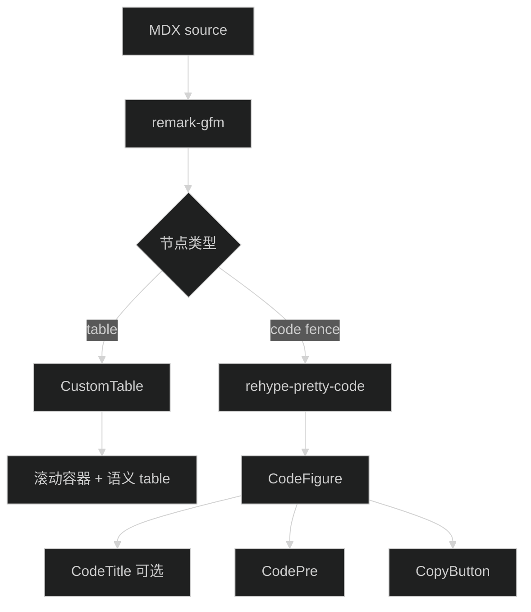

# 技术设计

## 范围

本次只调整 MDX 表格与代码块的渲染组件和相关样式。`compileMDX` 插件顺序、Shiki 主题、文章内容和其他 MDX 组件保持不变。

## 渲染路径

## 表格

### 结构

`CustomTable` 继续输出一个局部横向滚动容器和原生 `<table>`。不添加客户端状态，不改变 GFM 生成的 `thead`、`tbody`、`tr`、`th` 与 `td`。

### 样式职责

- 外层容器负责正文间距、边框、圆角、背景和横向滚动。
- `table` 清除 Typography 默认上下外边距，使用 `w-full` 与约 `40rem` 的最小宽度。正文宽度足够时铺满，窄屏时保留列宽并触发局部滚动。
- `thead` 使用轻量语义背景；`th` 左对齐并提高字重，列名尽量保持单行。
- `td` 顶部对齐，行间使用细分隔线；最后一行不保留下边框。
- 数据行 hover 只增加很弱的背景变化，帮助桌面端横向追踪，不依赖 hover 承载信息。
- 单元格允许描述文本自然换行；内联代码和长英文使用现有正文规则，不裁切内容。

### 响应式行为

390px 视口下，滚动容器保持正文宽度，表格宽度大于容器并可独立滚动。页面根节点的 `scrollWidth` 不得超过视口宽度。

## 代码块

### 容器

- `CodeFigure` 使用单一代码背景、`rounded-lg`、细边框和无阴影静止状态，与当前出版物设计规范一致。
- 带标题和不带标题的代码块共享同一正文内边距与水平滚动行为。

### 文件名

- `CodeTitle` 不再使用独立 `muted` 色块，改为与代码正文同背景的紧凑头部。
- 文件名前显示装饰前缀 `//`，并用 `aria-hidden` 避免屏幕阅读器重复朗读；视觉上沿用站内等宽元数据语言。
- 头部只用一条低对比分隔线建立层级；长文件名可截断，不能挤压复制按钮。

### 复制与语言标识

- `CopyButton` 保持客户端叶子组件和现有复制逻辑。
- 按钮改为透明的轻量图标按钮，始终可见；hover、focus-visible 和复制成功状态提高对比度。
- `CodePre` 为右上角复制按钮和右下角语言标识预留空间，避免覆盖首行或末行代码。
- 语言标识、Shiki 双主题、行高亮与 Diff 选择器继续使用现有 `data-*` 属性。

## 可访问性

- 表格保留原生表头与单元格关系。
- 滚动容器可获得键盘焦点，并提供简短 `aria-label`，键盘用户可水平滚动。
- 复制按钮保留动态 `aria-label` 与 `title`。
- focus-visible 样式使用现有 `ring` / `primary` token，不只依靠颜色很弱的 hover 状态。

## 修改范围

- `src/app/(site)/_components/blog/mdx-content.tsx`
- `src/app/(site)/_components/blog/code-block.tsx`
- `src/app/(site)/_components/blog/copy-button.tsx`
- `src/app/globals.css`

如果组件工具类足以完成表格样式，优先把规则放在组件内；`globals.css` 只保留必须作用于 `rehype-pretty-code` 生成节点和 Typography 后代的规则。

## 回退方式

改动不涉及内容格式或数据迁移。出现视觉回归时，可逐文件恢复上述四个文件的本次改动；原有 MDX 内容无需处理。
