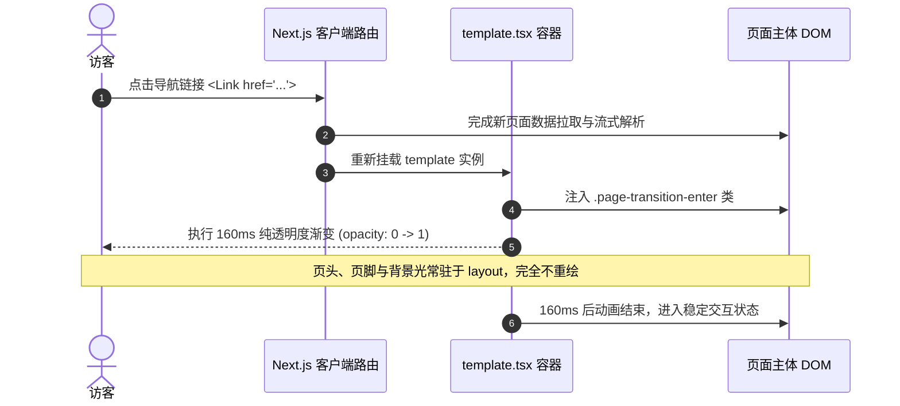

# 页面切换纯交叉溶解技术设计 (Design)

## 架构与技术选型

### 极简主义设计：Pure Cross-Dissolve

| 维度 | 方案 1 (Subtle Drift & Blur) | 方案 3 (Pure Cross-Dissolve) |
| --- | --- | --- |
| **位移** | translateY(14px) 垂直微浮 | 零位移 (0px) |
| **滤镜** | blur(1.5px) 高斯虚化 | 零滤镜 (none) |
| **属性** | opacity + transform + filter | 单一 opacity 属性 |
| **时长** | 进场 200ms | 进场 160ms (更快更脆) |
| **视觉感受** | 柔和微浮 | 纯净极简，仅抹平白闪 |

### 驱动机制选择：Next.js `template.tsx`

Next.js App Router 中，`src/app/(site)/layout.tsx` 保持常驻状态，而 `src/app/(site)/template.tsx` 会在每次路由变动时重新挂载。这为页面内容提供了天然的切页入场触发点，不受 React 稳定版缺失 Canary 组件的影响，100% 跨浏览器原生可用。

## 动效参数规范

- **`--vt-duration-enter: 160ms`**：进场耗时 160ms，采用减速曲线 `cubic-bezier(0.16, 1, 0.3, 1)`，起势迅速，落点自然。
- **`--vt-duration-exit: 120ms`**：退场耗时 120ms，`cubic-bezier(0.7, 0, 0.84, 0)`。
- **`will-change: opacity`**：仅提示浏览器对透明度进行硬件加速，完全跳过几何变换与重绘。
- **无障碍适配**：在 `@media (prefers-reduced-motion: reduce)` 下将动画重置为 `none !important`。
