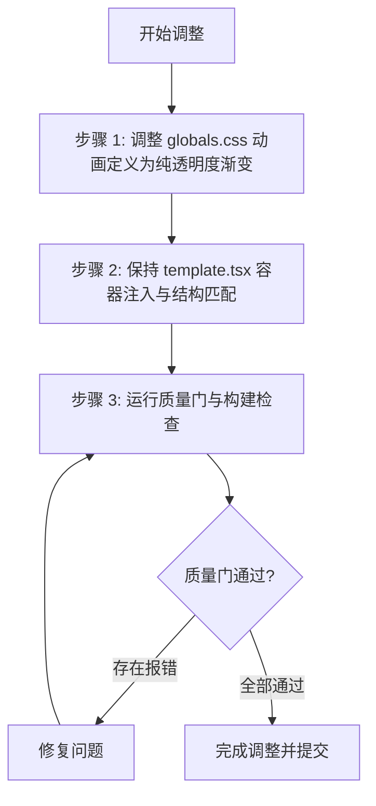

# 页面切换纯交叉溶解实现设计 (Implementation Plan)

## 实施流程



## 执行清单

### 步骤 1: 调整全局样式 `src/app/globals.css`

**目标文件：** [src/app/globals.css](file:///Users/wuwanzhu/Code/xdd/blog/src/app/globals.css)

**变更动作：**
去除 `translateY` 与 `filter: blur`，纯保留 `opacity` 渐变，并将进场时间压缩至 160ms：

```css
/* 页面路由切换动效 (方案 3: Pure Cross-Dissolve 纯交叉溶解) */
:root {
  --vt-duration-exit: 120ms;
  --vt-duration-enter: 160ms;
  --vt-ease-out: cubic-bezier(0.16, 1, 0.3, 1);
  --vt-ease-in: cubic-bezier(0.7, 0, 0.84, 0);
}

::view-transition-old(root) {
  animation: var(--vt-duration-exit) var(--vt-ease-in) both page-exit;
}

::view-transition-new(root) {
  animation: var(--vt-duration-enter) var(--vt-ease-out) both page-enter;
}

@keyframes page-exit {
  from {
    opacity: 1;
  }
  to {
    opacity: 0;
  }
}

@keyframes page-enter {
  from {
    opacity: 0;
  }
  to {
    opacity: 1;
  }
}

/* 路由模板重新挂载驱动的入场动效 */
.page-transition-enter {
  animation: page-enter var(--vt-duration-enter) var(--vt-ease-out) both;
  will-change: opacity;
}

/* 常驻组件隔离：页头、页脚与背景光在切换时保持静止 */
header,
footer,
#global-ambient-backdrop {
  view-transition-name: persistent-site-chrome;
}

::view-transition-group(persistent-site-chrome) {
  animation: none;
}

/* 减弱动态效果偏好适配 */
@media (prefers-reduced-motion: reduce) {
  .page-transition-enter {
    animation: none !important;
  }

  ::view-transition-old(root),
  ::view-transition-new(root),
  ::view-transition-group(*) {
    animation-duration: 0.01ms !important;
    animation-delay: 0s !important;
  }
}
```

---

### 步骤 2: 保持 `src/app/(site)/template.tsx` 挂载

**目标文件：** [src/app/(site)/template.tsx](file:///Users/wuwanzhu/Code/xdd/blog/src/app/%28site%29/template.tsx)

```tsx
export default function SiteTemplate({ children }: { children: React.ReactNode }) {
  return <div className="page-transition-enter">{children}</div>
}
```

---

### 步骤 3: 质量门验证

```bash
pnpm typecheck
pnpm lint
pnpm format:check
pnpm build
```
