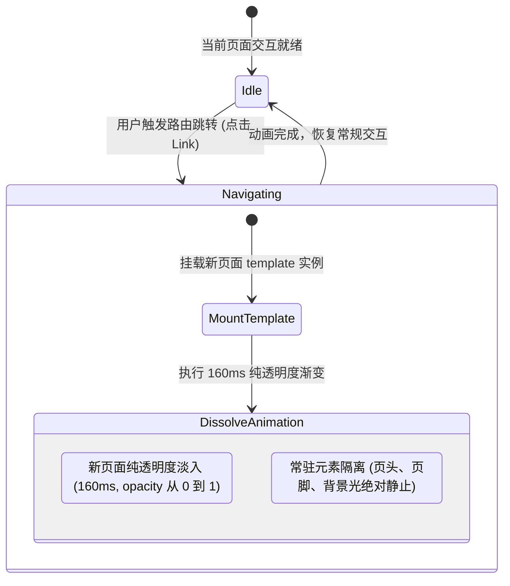

# 页面切换纯交叉溶解动效需求设计 (PRD)

## 目标

接入 Next.js 路由模板与轻量过渡机制，实现纯交叉溶解（Pure Cross-Dissolve）切页动效。在路由导航时消除浏览器瞬时硬切的白闪，零空间位移、零多余模糊滤镜，仅做 160ms 极简平滑透明度淡入淡出，同时保持页头、页脚与环境光背景常驻静止。

## 背景与现状

当前项目使用 Next.js 16 (App Router) + React 19 + Tailwind CSS 4。
页面跳转时采用默认的客户端局部替换机制。由于大面积 DOM 节点突变，容易产生生硬的白闪跳跃。用户偏好纯粹的极简主义，不需要上下浮动或横向平移，只需消除生硬切页闪烁感。

## 页面切换状态机

## 需求范围

### 包含在内 (In Scope)

1. **路由模版驱动入场**：
   - 依赖 `src/app/(site)/template.tsx` 重新挂载机制，注入 `.page-transition-enter` 类。
   - 在 `next.config.ts` 保留原生 View Transition 配置支持。
2. **Pure Cross-Dissolve 极简动效**：
   - 零空间位移：不设置任何 `transform: translateY`。
   - 零多余滤镜：不使用任何 `blur` 高斯模糊。
   - 进场时长：160ms，`opacity: 0 -> 1`，减速曲线 `cubic-bezier(0.16, 1, 0.3, 1)`。
   - 退场时长：120ms，`opacity: 1 -> 0`。
3. **常驻组件静止隔离**：
   - `SiteHeader`、`SiteFooter` 与 `AmbientBackdrop` 常驻于 `src/app/(site)/layout.tsx`，在页面切换时不重新渲染、不产生任何闪烁。
4. **无障碍与硬件加速**：
   - 适配 `prefers-reduced-motion: reduce`，在减弱动态偏好下将动画置为 `none`。
   - 动效仅触碰 `opacity` 单一属性，合成开销降至最低。

### 不包含在内 (Out of Scope)

1. 任何空间位移（上下/左右推拉滑动）。
2. 引入第三方重型动画运行时（如 Framer Motion）。

## 验收标准

- [ ] 点击任意内部导航链接（如首页与博客列表之间切换），新内容在 160ms 内轻快平滑淡入，彻底消除硬切白闪。
- [ ] 切换过程没有任何上下或左右位移晃动。
- [ ] 顶部导航栏、底部版权栏及背景渐变球在切页过程中位置完全保持静止。
- [ ] 在系统开启减少动态效果（Reduce Motion）设置时，页面切换即时完成。
- [ ] 项目通过质量门验证：`pnpm typecheck`、`pnpm lint`、`pnpm format:check` 零错误。
