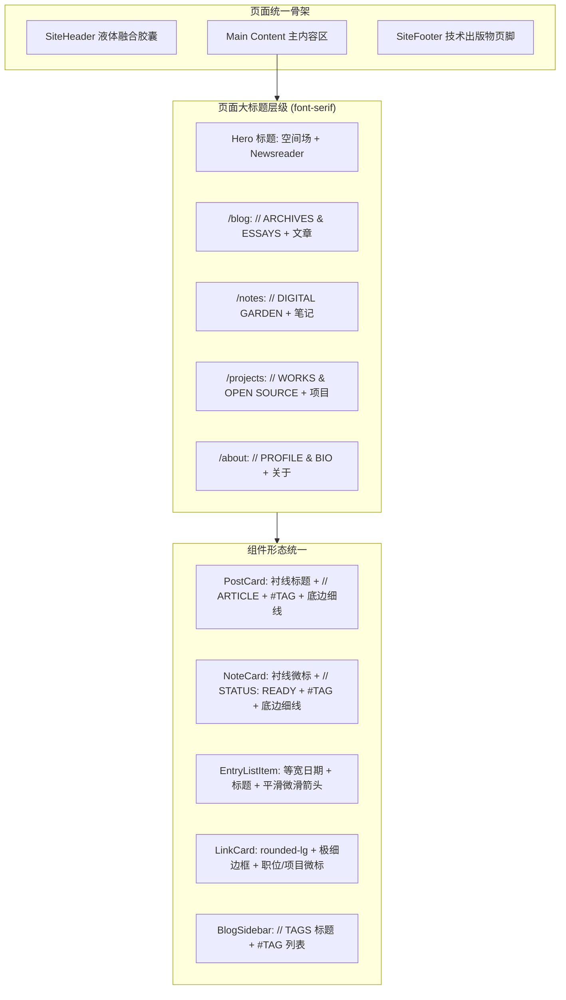

# 全站设计语言统一与出版物排版重塑设计方案

## 1. 设计 Token 收敛矩阵

| Token 类别 | 现有混乱状态 | 收敛后统一规范 | Tailwind 类名 |
|------------|-------------|----------------|--------------|
| 外层卡片圆角 | `rounded-2xl`（首页项、LinkCard）、`rounded-xl`、`rounded-lg` | 工业克制小圆角或纯线分割 | `rounded-lg`（卡片）或 `rounded-none`（列表流） |
| 标签形式 | `rounded px-1.5 py-0.5`（Note 状态）、`Button style="pill"`（侧栏） | 全大写技术等宽无外框标签 | `font-mono text-xs uppercase text-muted-foreground hover:text-foreground` |
| 元数据前缀 | 混用普通文本、小药丸 | 出版物双斜杠技术微标 | `// ARTICLE / DATE / READ_TIME`、`// STATUS: READY` |
| 一级标题 (H1) | 部分 sans-serif `font-bold`，部分 serif | 西文衬线体 + 中文黑体混合 | `font-serif text-3xl font-medium tracking-tight sm:text-4xl` |
| 模块标题 (H2) | sans-serif `font-semibold` | 西文衬线体 + 等宽小序号 | `font-serif text-2xl font-medium tracking-tight text-foreground` |
| 列表分割方式 | 实体卡片包裹 + 边框 + 背景灰色块 | 极细分割线 Hairline Divider | `border-b border-border/50 py-4 transition-colors hover:bg-muted/30` |

## 2. 视觉层级与组件结构拓扑

## 3. 核心组件重构规范

### 3.1 `NoteCard`（笔记卡片）
- **改动前**：
  - 标题为常规 sans-serif 粗体。
  - 状态为彩色小方块（`bg-accent text-primary rounded px-1.5`）。
  - 独立卡片间缺乏明确流式分割。
- **改动后**：
  - 头部元信息：`// NOTE / 2026-06-15 / STATUS: READY`（等宽字体、无外框背景、不同状态仅以文字色彩区分：Ready 采用 Primary 色，In-Progress 采用 Amber 色，Incomplete 采用 Rose 色）。
  - 标题：`font-serif text-lg font-medium tracking-tight hover:text-primary`。
  - 描述正文：`text-sm text-muted-foreground leading-relaxed`。
  - 底部标签：`#TAG` 列表。
  - 容器：`border-b border-border/50 pb-6 pt-2`。

### 3.2 `EntryListItem`（首页文章/笔记紧凑列表项）
- **改动前**：
  - `rounded-2xl border border-border bg-background px-5 py-2.5 hover:bg-muted/50`（突兀的药丸大圆角与外框嵌套）。
- **改动后**：
  - 改为出版物目录清单行：去除 `rounded-2xl`，保留 `rounded-lg` 或采用底边分割线。
  - 左侧：`font-mono text-xs text-muted-foreground tabular-nums`。
  - 中间：文章标题，悬浮时平滑高亮。
  - 右侧：SVG 细线箭头，悬浮时 `translate-x-1` 平滑移出。

### 3.3 `LinkCard`（经历与项目卡片）
- **改动前**：`rounded-2xl border border-border bg-muted/30`。
- **改动后**：收敛为 `rounded-lg border border-border/70 bg-card/40 p-4 transition-all hover:border-foreground/30 hover:bg-muted/30`，内部标题与时间采用等宽微标规范。

### 3.4 `BlogSidebar`（侧边栏与标签云）
- **改动前**：使用彩色胶囊按钮 `Button style="pill"`。
- **改动后**：标题改为 `// TAGS`（等宽小标），标签项改为与文章卡片一致的 `#TAG` 悬浮微标，形成整体连贯感。

### 3.5 占位页面出版物化结构设计
- **`ProjectsPage`**：
  - 从硬编码或配置读取核心项目清单（项目名、技术栈标签、简介、GitHub 链接、Live Demo 链接、阶段状态微标 `// ACTIVE / ARCHIVED`）。
  - 双列卡片网格布局，采用 `rounded-lg` 与极细边框。
- **`AboutPage`**：
  - 基于 `profile.config.ts` 结构化呈现：杂志式个人引言、当前关注技术领域、经历时间线与设备清单。
