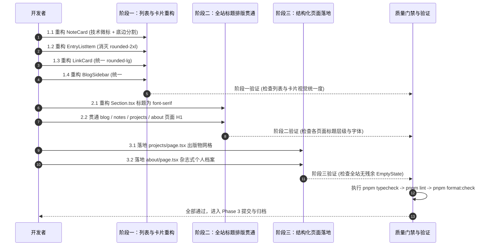

# 全站设计语言统一与出版物排版重塑实现计划

## 1. 实施流程全景图

## 2. 具体实施步骤与改动清单

### 步骤 1：列表与卡片组件规范收敛（阶段一）

#### 1.1 重构 `NoteCard`
- **文件**：`src/app/(site)/_components/notes/note-card.tsx`
- **动作**：
  - 废除 `STATUS_STYLES` 中的背景底色（`bg-accent`、`bg-destructive/15` 等）。
  - 引入等宽状态微标格式：`// NOTE / {DATE} / STATUS: {STATUS_LABEL}`。
  - 标题采用 `font-serif text-lg font-medium hover:text-primary transition-colors`。
  - 底部添加极细分割线 `border-b border-border/50 pb-6`。
- **验证**：访问 `/notes` 页面，确认笔记卡片风格与博客文章卡片高度一致。

#### 1.2 重构 `EntryListItem`
- **文件**：`src/app/(site)/_components/home/entry-list-item.tsx`
- **动作**：
  - 替换 `rounded-2xl border border-border bg-background` 为出版物克制形式（`rounded-lg border border-border/60 hover:bg-muted/30` 或极细底边行）。
  - 优化左侧日期与右侧动态箭头的悬浮微动体验。
- **验证**：访问首页 `/`，确认文章与笔记入口不再具有大圆角臃肿感。

#### 1.3 重构 `LinkCard`
- **文件**：`src/app/(site)/_components/home/link-card.tsx`
- **动作**：
  - 将外层 `rounded-2xl` 改为统一的 `rounded-lg`。
  - 强化标题与副标题之间的排版呼吸间距，边框调整为 `border-border/60`。
- **验证**：访问首页 `/` 查看经历与开源项目卡片。

#### 1.4 重构 `BlogSidebar`
- **文件**：`src/app/(site)/_components/blog/blog-sidebar.tsx`
- **动作**：
  - 侧边栏小标题改为全大写等宽微标 `// TAGS`。
  - 标签列表不再使用胶囊药丸按钮（`style="pill"`），统一使用 `#TAG` 悬浮样式。
- **验证**：访问 `/blog` 列表页，检查右侧标签云外观。

---

### 步骤 2：全站标题与排版系统贯通（阶段二）

#### 2.1 重构 `Section` 模块标题
- **文件**：`src/app/(site)/_components/home/section.tsx`
- **动作**：
  - H2 标题增加 `font-serif tracking-tight text-foreground`。
- **验证**：检查首页关于、文章、笔记、技术栈、经历各个 Section 标题。

#### 2.2 贯通各路由一级大标题（H1）
- **文件**：
  - `src/app/(site)/blog/page.tsx`
  - `src/app/(site)/notes/page.tsx`
  - `src/app/(site)/projects/page.tsx`
  - `src/app/(site)/about/page.tsx`
  - `src/app/(site)/links/page.tsx`
- **动作**：
  - 为所有一级标题增加统一的英文全大写等宽技术眉标与 `font-serif` 衬线大字。
- **验证**：逐一点击顶部导航（文章、笔记、项目、关于），确保转场时大标题视觉调性统一。

---

### 步骤 3：结构化页面落地（阶段三）

#### 3.1 落地 `ProjectsPage`
- **文件**：`src/app/(site)/projects/page.tsx`
- **动作**：
  - 替换现有 `EmptyState`。
  - 组织结构化开源项目数据（项目名称、定位描述、技术栈、GitHub 与 Demo 链接、活跃状态）。
  - 双列网格卡片排版。
- **验证**：访问 `/projects` 确认项目卡片渲染正常。

#### 3.2 落地 `AboutPage`
- **文件**：`src/app/(site)/about/page.tsx`
- **动作**：
  - 替换现有 `EmptyState`。
  - 整合 `profile.config.ts` 与个人介绍，呈现个人履历、关注领域与技术栈矩阵。
- **验证**：访问 `/about` 确认关于页内容充实且版面优美。

---

### 步骤 4：全局质量门禁检查与规范同步

1. **质量门禁**：
   - `pnpm typecheck`
   - `pnpm lint`
   - `pnpm format:check`
2. **规范同步**：
   - 在 `.trellis/spec/frontend/component-guidelines.md` 更新卡片、列表与大标题的规范要求。
