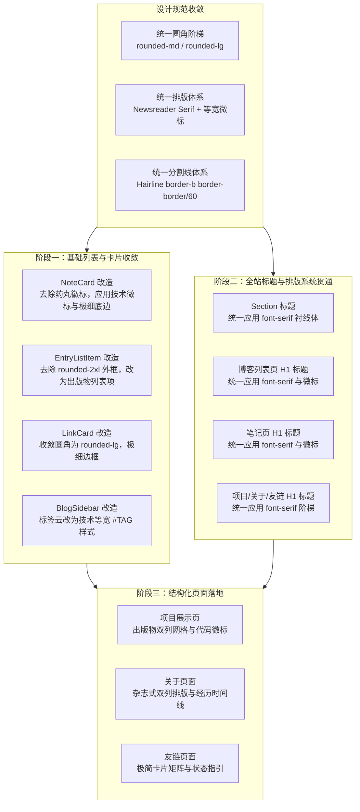

# 全站设计语言统一与出版物排版重塑 PRD

## 1. 背景与目标

当前博客在落地了纸本暖色调、西文衬线体与轨道式目录后，局部质感显著提升，但全局组件与页面存在视觉割裂：
- 首页列表项（`EntryListItem`）与外链卡片（`LinkCard`）保留了 `rounded-2xl` 大圆角与外层实心框线，与出版物克制无框排版冲突。
- 笔记卡片（`NoteCard`）与标签侧边栏（`BlogSidebar`）使用彩色实心药丸胶囊徽标，与文章卡片的全大写等宽技术微标（`// ARTICLE / 2026-06-15`、`#TAG`）不一致。
- 页面一级标题与 Section 标题在无衬线体（Sans-serif）与衬线体（Newsreader Serif）之间缺乏全域贯通。
- 项目页、关于页、友链页为通配 `EmptyState` 占位，缺乏内容排版结构。

本任务目标是将已验证的出版物美学（西文雕刻感衬线、全大写等宽微标、工业克制圆角、细线分割留白）全域覆盖至整站所有组件与子页面，消除 AI 模板痕迹与视觉断层。

## 2. 架构与设计流向

## 3. 详细阶段范围与功能规格

### 3.1 阶段一：基础列表、卡片与标签组件重构
- **`NoteCard`（`src/app/(site)/_components/notes/note-card.tsx`）**：
  - 去除 `rounded px-1.5 py-0.5` 实心彩色药丸标签。
  - 引入全大写等宽状态微标：`// STATUS: READY`、`// STATUS: IN-PROGRESS`、`// STATUS: INCOMPLETE`、`// STATUS: ARCHIVED`。
  - 标题应用清晰层级，标签统一以 `#TAG` 等宽无边框呈现。
  - 单条笔记底部应用极细分割线（`border-b border-border/50 pb-6`）。
- **`EntryListItem`（`src/app/(site)/_components/home/entry-list-item.tsx`）**：
  - 彻底去除 `rounded-2xl` 大圆角和外层包裹厚边框。
  - 改为刊物目录式极简列表行：左侧等宽日期、中间标题、右侧悬浮轻微滑出箭头，底部为轻量分割线或轻灰底悬浮。
- **`LinkCard`（`src/app/(site)/_components/home/link-card.tsx`）**：
  - 圆角收敛为 `rounded-lg`，去除厚重实心灰色块。
  - 强化头部项目/经历标题与时间区间的技术微标排版。
- **`BlogSidebar`（`src/app/(site)/_components/blog/blog-sidebar.tsx`）**：
  - 标签云由胶囊按钮（`Button style="pill"`）重构为统一的 `#TAG` 悬浮组件，与文章卡片标签形式一致。

### 3.2 阶段二：全站标题与排版系统贯通
- **`Section`（`src/app/(site)/_components/home/section.tsx`）**：
  - 二级标题（H2）引入 `font-serif tracking-tight text-foreground`，配合左侧等宽章节标号或技术小标。
- **所有一级页面主标题（H1）**：
  - `src/app/(site)/blog/page.tsx`：文章列表大标题应用 `font-serif` 与英文技术眉标 `// ARCHIVES & ESSAYS`。
  - `src/app/(site)/notes/page.tsx`：笔记大标题应用 `font-serif` 与英文技术眉标 `// DIGITAL GARDEN & NOTES`。
  - `src/app/(site)/projects/page.tsx`、`about/page.tsx`、`links/page.tsx`：统一步伐。

### 3.3 阶段三：占位页面结构化落地
- **项目页（`projects/page.tsx`）**：
  - 读取或展示个人代表作、开源库与核心工程，采用出版物多列排版，附带技术栈标签、GitHub 链接与状态标识，去除通配 EmptyState。
- **关于页（`about/page.tsx`）**：
  - 从 `profile.config.ts` 读取信息，排版呈现个人简介、工程哲学、技术栈徽标矩阵与教育经历。
- **友链页（`links/page.tsx`）**：
  - 规范化展示友链卡片、互换要求说明与联系方式。

## 4. 验收标准（Acceptance Criteria）

1. **圆角规范收敛**：全局代码中除纯圆形头像与刻度小圆点外，不存在 `rounded-2xl`，所有结构块统一为 `rounded-lg` 或直角细线。
2. **微标规范统一**：文章、笔记、侧边栏、项目卡片上的元数据均统一使用 `font-mono text-xs uppercase tracking-wider`，标签统一以 `#TAG` 样式呈现。
3. **排版规范贯通**：全站所有一级页面 H1 与首页各 Section H2 均使用西文衬线字体（`font-serif`），无样式断层。
4. **占位页面消除**：项目页、关于页具有实际排版内容，无泛用型 EmptyState。
5. **代码质量门禁**：`pnpm typecheck`、`pnpm lint`、`pnpm format:check`、`pnpm build` 全部零报错通过。
