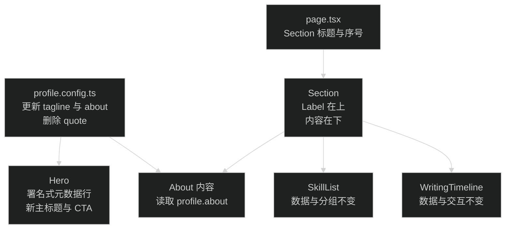

# 首页文案与内容编排优化：技术设计

## 改动边界

本次只调整首页配置和首页组件，不修改内容读取、路由、页头、页脚与全站 token。

## 文案契约

### Hero

- 元数据行：「上海 / 独立开发者 / 联系我 ↗」。地点从 `profile.location` 读取，联系入口仍指向 `/contact`。
- 主标题：「有些东西，写出来才算做完。」
- tagline：`Daylight’s burning.`，只显示英文。该句是《魔兽世界》联盟侏儒 NPC 原句，含义为「天光不等人」。
- 删除 quote 展示和 `Profile.quote`，不保留空占位。
- 主 CTA：「最近写了什么」，链接仍指向 `/blog`。
- 次 CTA：「关于我」，链接保持 `/about`。

### 关于

`profile.about` 更新为两段：

1. 「这里记着做 Web 产品时留下的问题、弯路和答案。」
2. 「有些来自代码，有些来自和 AI 一起工作的日常。想明白一点，就写下一点。」

三层文案各自承担不同作用：主标题表达写作动机，tagline 交代当前工作，关于段落补充身份与内容范围。

## Hero 信息设计

删除当前身份胶囊、定位图标、绿色状态点和循环动画，改成单行署名式元数据：

- 元数据容器无底色、无圆角轮廓。
- 左右用短水平线形成视觉锚点，中间用 `/` 分隔三项。
- 静态信息使用低对比度等宽小字。
- 「联系我 ↗」通过文字颜色和 hover 下划线表达可点击。
- 375px 下允许自然换行，但分隔符不能单独占一行；必要时缩短两侧水平线。

头像、`SpatialField`、标题、CTA、GitHub 图标入口和底部滚动提示保持现有结构。主标题只给「写出来」使用 `text-primary` 与斜体，避免整行蓝色造成宣传页感。

## Section 契约

`Section` 增加必填 `index` 属性，调用方式为：

- `index="01" title="最近写的"`
- `index="02" title="关于我"`
- `index="03" title="常用工具"`

组件固定使用纵向布局，不再在 `md` 断点切成左右两列。`h2` 同时包含序号、分隔符与标题，样式为等宽小字；下方内容占满可用宽度。Label 前增加短线或细规则，建立三个模块之间的一致节奏，不给 Section 增加卡片背景或外围边框。

## 保持不变

- `page.tsx` 合并文章和笔记、按 ISO 日期倒序、最多取 8 条的逻辑不变。
- `WritingTimeline` 的路由、日期格式、类型标签和箭头交互不变。
- `SkillList` 的分组与技能数据不变。
- `SiteStats` 继续作为无卡片的页面收尾。
- 亮暗主题、字体、色彩 token 与 `prefers-reduced-motion` 规则不变。

## 验证与回滚

- 运行类型、Lint、格式和构建检查。
- 用本地浏览器检查 1440px 与 375px，覆盖亮色、暗色和减弱动态效果。
- 检查 Hero 元数据没有绿色点、脉冲动画或胶囊底色。
- 检查三个 Section 的 Label 均在内容上方，时间线与技能项无横向溢出。
- 改动集中在 `profile.config.ts`、`page.tsx`、`hero.tsx` 和 `section.tsx`；没有数据迁移，出现问题可按文件恢复。
