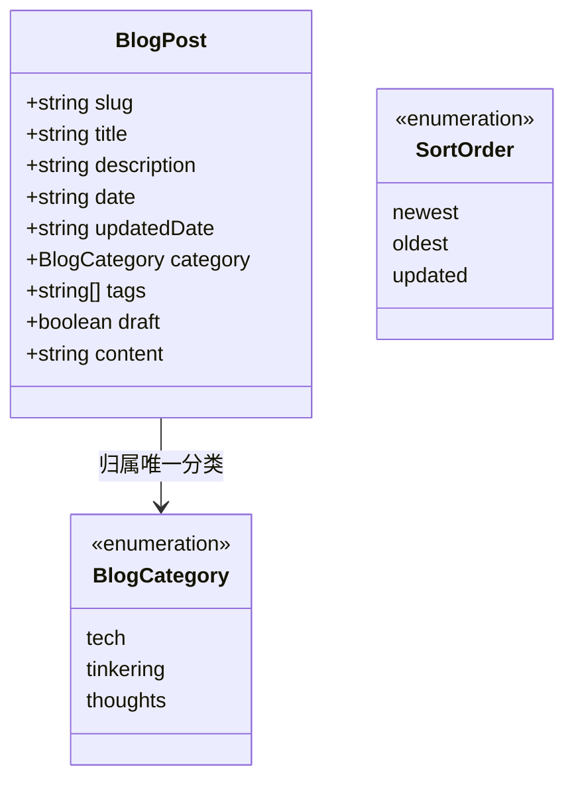
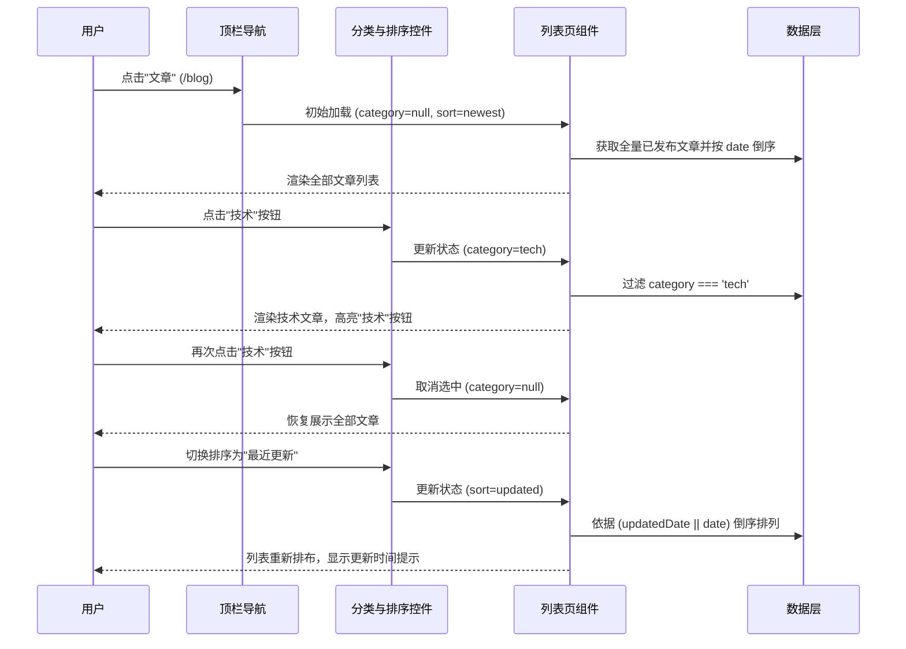

# 技术方案设计 (design.md)

## 1. 架构与边界

本次改动涉及三个层面：内容数据层、路由与状态控制层、UI 排版呈现层。



### 1.1 数据层契约 (`src/lib/content.ts`)

- 导出枚举与标签映射：
  ```ts
  export type BlogCategory = 'tech' | 'tinkering' | 'thoughts'
  export const BLOG_CATEGORY_LABELS: Record<BlogCategory, string> = {
    tech: '技术',
    tinkering: '捣鼓',
    thoughts: '随想',
  }
  ```
- `BlogPost` 结构增加 `category: BlogCategory` 必填字段。
- `requireCategory(data, filePath)` 函数：校验 `category` 必须存在且位于 `['tech', 'tinkering', 'thoughts']`，否则抛错阻断构建。
- 辅助函数：
  - `sortBlogPosts(posts: BlogPost[], sort: 'newest' | 'oldest' | 'updated'): BlogPost[]`
    - `newest`: `b.date.localeCompare(a.date)`
    - `oldest`: `a.date.localeCompare(b.date)`
    - `updated`: `(b.updatedDate || b.date).localeCompare(a.updatedDate || a.date)`

---

## 2. 交互与状态控制流



### 2.1 URL 状态与持久化

- 分类和排序参数反映在 URL 查询参数中：
  - `/blog`：默认展示全部，排序为最新。
  - `/blog?category=tech`：过滤技术分类。
  - `/blog?sort=updated`：全站最近更新。
  - `/blog?category=tinkering&sort=oldest`：捣鼓分类下最早发布。
- 使用客户端交互组件 `BlogFilterToolbar`（`'use client'`）维护查询参数或受控切换，避免全页刷新闪烁。

---

## 3. UI 视觉排版重构

### 3.1 去卡片化规范
- 废弃 `rounded-xl border border-border/70 bg-card/50` 容器。
- 单条文章采用 `article` 语义元素，使用与笔记页类似的一体化排版：
  - **上眉标**：等宽单色 `// [技术] / [2026-06-15] / [预计阅读 3 分钟]`。如果处于“最近更新”排序，且文章有 `updatedDate`，显示 `// [技术] / 更新于 [2026-07-02] / [预计阅读 3 分钟]`。
  - **标题**：大号衬线或无衬线标题，悬浮微动效与主题色渐变。
  - **摘要**：紧凑截断（2~3 行），低对比度正文字色。
  - **分割线**：使用浅色底部分割线 `border-b border-border/40 pb-7 pt-2`，列表项之间保持足够呼吸留白。

### 3.2 分类与排序工具栏
- 放置在页面头部与文章列表之间：
  - 左侧：分类按钮组 `[技术] [捣鼓] [随想]`（弱底色、活跃态边框/高亮；点击当前项反选回全部）。
  - 右侧：排序选择（极简下拉框或切换组：最新 / 最早 / 最近更新）。

---

## 4. 迁移与兼容性评估

- 现有 4 篇文章修改 frontmatter：
  - `20260615-hello-blog/post.mdx` -> `category: thoughts`
  - `20260620-typescript-tips/post.mdx` -> `category: tech`
  - `20260701-nextjs-app-router-deep-dive/post.mdx` -> `category: tech`
  - `20260815-web-performance-notes/post.mdx` -> `category: tech`
- 文章 URL 不变，仍为 `/blog/[slug]`，不会产生 404 或旧链接失效问题。
- 构建校验门槛：只要有任意一篇未填或填错 `category`，`pnpm build` 会直接报错并提示文件路径。
