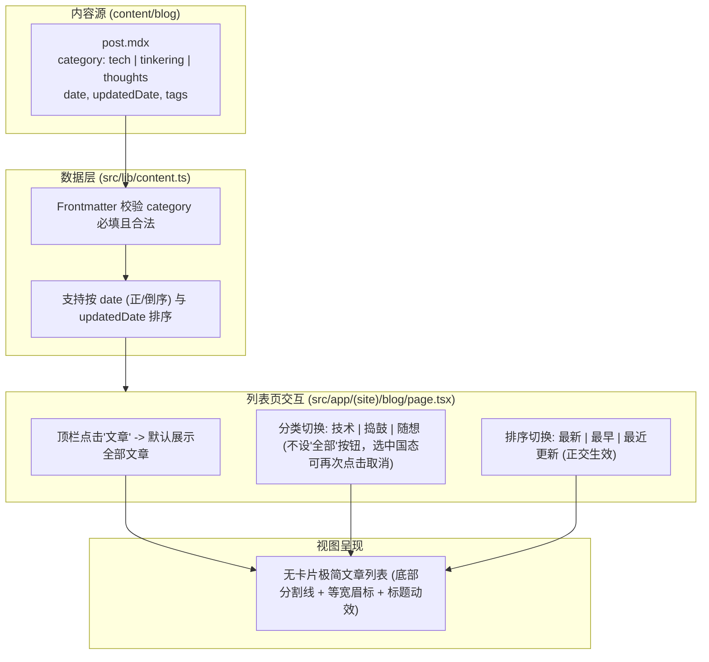

# 文章分类与列表重构

## Goal

为博客文章引入明确的主题分类（技术、捣鼓、随想）与多维度时间排序（最新、最早、最近更新），并重构文章列表界面，去掉现有卡片外框与背景，回归与全站风格统一的轻量无卡片极简排版。

## Background & Confirmed Facts

- 当前数据层 [src/lib/content.ts](file:///Users/wuwanzhu/Code/xdd/blog/src/lib/content.ts) 的 `BlogPost` 仅支持 `tags`，没有分类字段。
- 当前文章列表组件 [src/app/(site)/_components/blog/post-card.tsx](file:///Users/wuwanzhu/Code/xdd/blog/src/app/(site)/_components/blog/post-card.tsx) 使用了 `rounded-xl border border-border/70 bg-card/50` 卡片包裹，与首页极简时间线及笔记列表的留白分割风格不协调。
- 博客现有 4 篇文章，frontmatter 包含 `title`、`date`、`description`、`tags`、`draft`、`updatedDate` 等字段，其中 `updatedDate` 仅在文章详情页使用，未参与列表排序。
- 顶栏导航链接为 `/blog`，进入时直接呈现全量文章。

## Architecture & Data Flow

## Requirements

1. **分类体系（Category）**：
   - 文章 frontmatter 必填 `category`，合法值为：
     - `tech`：技术
     - `tinkering`：捣鼓
     - `thoughts`：随想
   - 数据层 `src/lib/content.ts` 严格校验字段，缺失或值非法时构建报错。
   - 分类筛选控件只展示三个具体分类按钮（`技术`、`捣鼓`、`随想`），不提供“全部”按钮。
   - 默认进入 `/blog` 即查看全部分类；点击某一分类后过滤该分类文章，再次点击已激活的分类按钮或点击标题可取消过滤并恢复查看全部。

2. **多维度排序（Sorting）**：
   - 排序提供三个选项：
     - 最新：按 `date` 倒序（默认）。
     - 最早：按 `date` 正序。
     - 最近更新：按有效更新时间倒序（优先 `updatedDate`，未填写的退回 `date`）。
   - 排序与分类正交生效：在未选分类（全量文章）时，按选定方式排序；在选中某一分类后，在该分类内部按选定方式排序。

3. **UI 去卡片化重构**：
   - 移除现有卡片式的外框（`border`）、背景底色（`bg-card`）及大圆角。
   - 采用类似笔记页面的无框分割线排版，保留呼吸感与层次感：
     - 顶部等宽眉标：`// [分类名] / [发布日期] / [预计阅读时长]`（若按最近更新排序，突出提示最近更新时间）。
     - 标题：排版大字号，悬浮平滑变色。
     - 摘要：单行或多行精炼文本截断。
     - 底部元数据：`[分类名] / #[标签名]`。

## Acceptance Criteria

- [x] [src/lib/content.ts](file:///Users/wuwanzhu/Code/xdd/blog/src/lib/content.ts) 定义 `BlogCategory` 类型及中英文映射字典，并在读取 frontmatter 时对 `category` 强制校验。
- [x] [content/blog/](file:///Users/wuwanzhu/Code/xdd/blog/content/blog) 现有 4 篇文章的 frontmatter 均补充 `category` 字段并通过解析。
- [x] 博客列表页顶部提供分类筛选控件，仅包含“技术、捣鼓、随想”三项；点击某项过滤该分类，重复点击取消过滤。
- [x] 博客列表页提供“最新、最早、最近更新”排序切换控件，排序逻辑与分类正交并实时生效。
- [x] 文章列表完全剥离卡片外框与背景色，呈现与整站统一的开阔极简风格。
- [x] 质量门检查无误：`pnpm typecheck`、`pnpm lint`、`pnpm format:check` 顺序通过。

## Out of Scope

- 文章详情页 URL 保持扁平 `/blog/[slug]`，不变更路由层级。
- 不影响短笔记（`notes`）系统。
- 站内全局搜索依然保留在 `/search` 独立页面。
