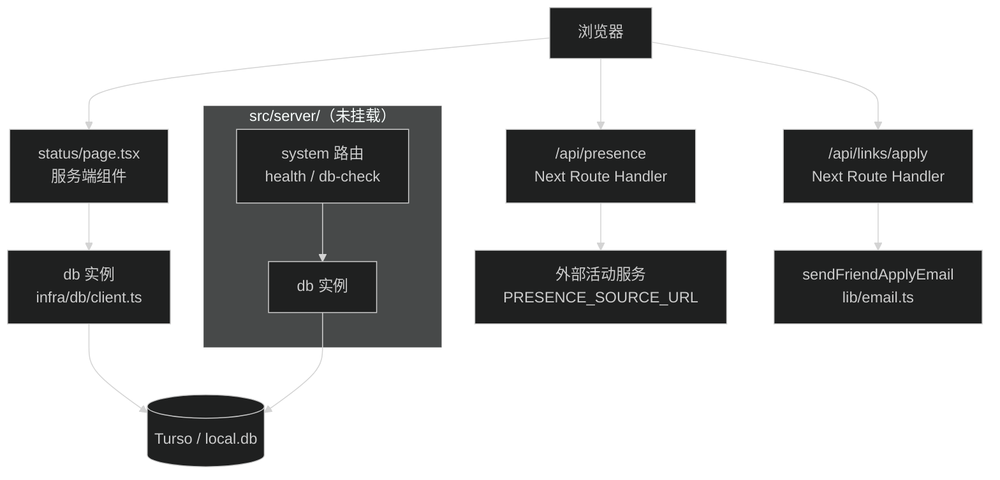

# 维护 server 端 Hono 与 Drizzle 规范及 API 设计、服务调用约定

## Goal

为 `src/server/` 已集成的 Hono 与 Drizzle ORM 建立后端 spec 层：API 设计规范、服务调用规范、数据库规范与目录结构。参考 `/Users/wuwanzhu/Code/xdd/starter/.trellis/spec/api/backend/` 的组织方式，按 blog 的实际体量裁剪。

## 背景与现状（2026-09-08 调研）

提交 `cbf62f8` 接入了 Hono + Drizzle ORM + Turso，`7b48875` 修了 CI 白名单。当前事实：

- `src/server/` 共 6 个文件：`app.ts`（Hono basePath `/api`）、`routes/{index,system}.ts`（health、db-check 两个端点）、`infra/db/client.ts`（libsql client + drizzle 实例）、`infra/db/schema/{index,system}.ts`（`system_health_checks` 表）、`shared/response.ts`（`ApiResponse<T>` 封装）。
- Hono 应用未挂载：没有任何文件引用 `@/server/app`，`src/app/api/` 下无 catch-all route。`/api/health`、`/api/system/db-check` 目前无法从外部访问。
- `src/app/(site)/status/page.tsx` 是服务端组件直连 `db`（`import { db } from '@/server/infra/db/client'`），不走 API。
- `src/app/api/presence/route.ts` 和 `src/app/api/links/apply/route.ts` 是传统 Next Route Handler，不经过 Hono，与 `src/server/` 并存。
- `system_health_checks` 表已定义但代码未使用。
- db 脚本齐备：`db:verify`、`db:generate`、`db:migrate`、`db:check`、`db:studio`；本地无环境变量时回退 `file:local.db`。
- `.trellis/spec/` 只有 frontend 层，server 端无任何规范。

### 现有请求路径

## Requirements

1. 新建 `.trellis/spec/backend/` spec 层，与 `frontend/` 平级（blog 是单应用，不需要 starter 那种 `api/backend` 两层目录）。
2. 交付文档（5 个文件）：
   - `index.md`：适用范围（`src/server/` + `src/app/api/` 下的 Route Handler）、开发前检查、质量检查、关键入口、文件索引。
   - `directory-structure.md`：`src/server/` 各目录职责，模块内文件组织方式。
   - `api-design-guidelines.md`：API 设计规范——`ApiResponse` 响应封装、路由命名、Hono 挂载约定（含当前未挂载的事实与接入方式）、错误响应格式。
   - `service-call-guidelines.md`：服务调用规范——页面直连 `db` 与走 API 的判断边界、何时拆 service 层、Next Route Handler 与 Hono 的分工。
   - `database-guidelines.md`：Drizzle + Turso——schema 组织、migration 命令与流程、时间戳列写法、环境变量、本地 sqlite 回退、`system_health_checks` 现状。
3. 三个边界决策必须在 spec 中给出明确判断规则：
   - 新增 API 端点时选 Hono 还是 Next Route Handler。
   - 页面取数据时直连 `db` 还是走 API。
   - schema 拆文件与表命名的约定。
4. 更新 spec 间的交叉引用：`frontend/` 相关文档如引用 server 路径需核对（只在确有引用错时改，不主动扩写）。

## 约束

- 只写 blog 实际存在的东西。starter 的 Better Auth、Pino、contracts 包、repository/presenter 分层在 blog 里不存在，不进 spec。
- 每条重要规范指向真实文件路径或真实代码片段，无占位文本、无模板残留。
- 如实记录现状：Hono 未挂载、`system_health_checks` 未使用这类事实写进规范，不写成"已支持"。
- 文案遵守 `xdd-plain-docs` 技能：第一句是结论，命令可粘贴执行，路径真实存在。
- 不改任何代码。发现代码问题（如 Hono 未挂载）只记录在 spec 和任务笔记里，不顺手修。

## Acceptance Criteria

- [ ] `.trellis/spec/backend/` 下 5 个文件齐全，`index.md` 的文件索引与实际文件一一对应。
- [ ] `python3 .trellis/scripts/get_context.py --mode packages` 输出包含 backend 层。
- [ ] 三个边界决策各有明确的判断规则（能回答"下次新增 X 该放哪"）。
- [ ] `database-guidelines.md` 覆盖 5 个 db 脚本的用途、schema 组织、环境变量、本地回退。
- [ ] 抽查 10 条规范引用的文件路径全部真实存在。
- [ ] `pnpm format:check` 通过（若 `.trellis` 在 prettier 检查范围内）。

## Notes

- spec 写作任务，无代码修改，不需要 design.md；执行清单见 `implement.md`。
- starter spec 结构参考价值在"入口 index + 分主题文件 + 开发前检查清单"的组织方式，不在具体内容。
