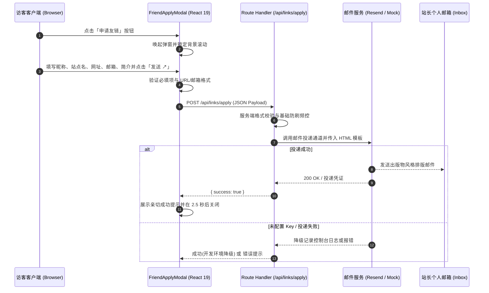
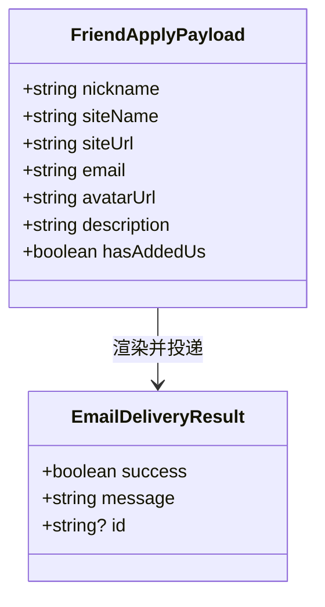

# 友链申请与邮件通知技术设计

## 1. 系统架构与数据流

本方案采用全站一致的出版物视觉风格与轻量 Serverless 邮件推送机制。前端使用 React 19 Client Component 处理表单输入、交互状态与无障碍支持，后端通过 Next.js App Router 的 Route Handler 处理数据校验并生成内联出版物风格 HTML 邮件推送到站长邮箱。



## 2. 模块与职责划分

```
src/
├── app/
│   ├── (site)/
│   │   ├── _components/
│   │   │   └── links/
│   │   │       ├── friend-apply-modal.tsx    # 弹窗客户端组件（表单状态、校验、复制）
│   │   │       └── friend-apply-button.tsx   # 唤起弹窗的轻量按钮组件
│   │   └── links/
│   │       └── page.tsx                      # 友链主页，接入触发按钮并展示说明
│   └── api/
│       └── links/
│           └── apply/
│               └── route.ts                  # POST 接口，参数校验、限流与邮件投递
└── lib/
    └── email.ts                              # 邮件模版生成与投递适配器
```

## 3. 邮件模板设计规范

邮件模板需严格兼容各类主流邮件客户端（Gmail、Apple Mail、Outlook、QQ 邮箱等），采用 Table 布局与完全内联样式（Inline CSS），同时忠实还原博客的出版物设计语言：

1. **色彩与质感**：
   - 画布底色：`#f7f7f5`（暖纸白体系）
   - 卡片主体：`#ffffff`，微边框 `1px solid #e5e5e0`，圆角 `8px`
   - 文本层次：主标题 `#18181b`、正文 `#3f3f46`、元数据与注释 `#71717a`
   - 重点强调：主色 `#09090b`
2. **排版层次**：
   - 顶部眉标：`font-family: ui-monospace, Menlo, Consolas, monospace; font-size: 11px; text-transform: uppercase; color: #71717a;`
   - 邮件标题：`font-family: 'Newsreader', Georgia, 'Times New Roman', serif; font-size: 24px; font-weight: 500; color: #18181b;`
   - 字段表格：两列栅格，左侧等宽标签（如 `// SITE_NAME`、`// SITE_URL`），右侧常规正文
   - 站点简介：独立浅灰框包裹，带有左右内边距与细分割线
   - 快捷动作条：提供【访问该博客 ↗】与【点击回复邮件 ✉】两个清晰按键
3. **技术预览**：
   邮件内直接包含对方头像预览图（若加载失败有优雅降级占位）。



## 4. 安全防护与优雅降级

1. **字段校验与长度限制**：
   - `nickname`：1 - 32 字符
   - `siteName`：1 - 50 字符
   - `siteUrl`：必须为以 `http://` 或 `https://` 开头的合法 URL
   - `email`：符合基础 RFC 5322 邮箱格式
   - `description`：1 - 150 字符
2. **简易频控机制**：
   - 在 Route Handler 内基于客户端 IP 进行滑动窗口限制（如同一 IP 每 10 分钟最多提交 3 次），防止恶意刷信。
3. **无环境配置降级**：
   - 邮件服务优先检测 `RESEND_API_KEY` 与 `FRIEND_APPLY_NOTIFY_EMAIL`。
   - 若未配置（如本地开发），控制台格式化打印邮件预览与字段，接口返回正常成功状态，防止开发环境由于缺少 API Key 阻断体验。
