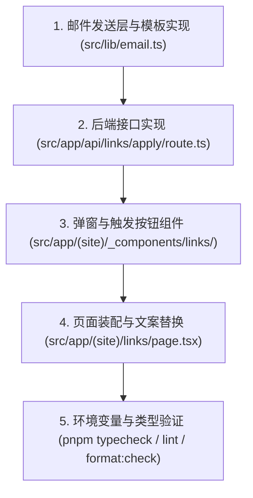

# 友链申请与邮件通知实现计划

## 1. 实施步骤



### 步骤 1：邮件发送层与模板生成 (`src/lib/email.ts`)
- 编写 `renderFriendApplyEmail(payload: FriendApplyPayload): string`，生成出版物排版的内联 HTML 邮件。
- 编写 `sendFriendApplyEmail(payload: FriendApplyPayload)`：
  - 检查环境变量 `RESEND_API_KEY` 和通知收件人 `FRIEND_APPLY_NOTIFY_EMAIL`。
  - 若配置了 Key，通过原生 `fetch` 调用 Resend API 发送信件（零额外 npm 依赖）。
  - 若未配置，以控制台打印进行开发模式降级模拟。

### 步骤 2：后端 API 路由 (`src/app/api/links/apply/route.ts`)
- 支持 `POST` 请求。
- 实施输入校验（类型、格式、字符串长度截断）。
- 实施简单的内存 IP 限频策略（每 10 分钟最多 3 次）。
- 返回标准 JSON 响应 `{ success: true }` 或 `{ success: false, error: string }`。

### 步骤 3：弹窗与触发组件 (`src/app/(site)/_components/links/`)
- `friend-apply-modal.tsx`：
  - 弹窗蒙层与出版物卡片容器。
  - 本站信息一键复制卡片（提供复制成功状态反馈）。
  - 亲切的输入表单与字段错误高亮。
  - 发送按钮交互（包含加载、成功反馈与自动关闭）。
  - 原生按键与无障碍绑定（ESC 关闭、遮罩点击、锁背景滚动）。
- `friend-apply-button.tsx`：
  - 提供轻量触发器，支持不同尺寸（如空状态卡片内的操作按钮、列表底部的申请按钮）。

### 步骤 4：页面装配与环境变量更新
- 修改 `src/app/(site)/links/page.tsx`，将旧的 `/contact` 链接替换为唤起弹窗的 `FriendApplyButton`。
- 更新 `.env.example`，补充 `RESEND_API_KEY` 和 `FRIEND_APPLY_NOTIFY_EMAIL` 说明。

## 2. 验证方式

1. **类型检查**：
   ```bash
   pnpm typecheck
   ```
2. **代码风格与代码质量**：
   ```bash
   pnpm lint
   pnpm format:check
   ```
3. **接口端到端验证**：
   - 使用 `curl` 模拟合法与非法 POST 请求到 `/api/links/apply`，验证校验错误响应与成功响应。
4. **浏览器交互测试**：
   - 检查打开弹窗、复制本站信息、输入各字段、发送申请的完整流程。

## 3. 回滚方案

若功能不符合预期或出现阻断性问题，回滚本次新建的文件（`src/lib/email.ts`、`src/app/api/links/apply/route.ts`、`src/app/(site)/_components/links/`），并将 `src/app/(site)/links/page.tsx` 恢复至此前提交。
