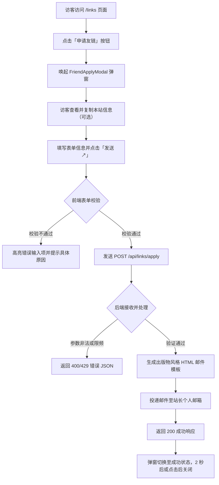

# 友链申请弹窗与邮件通知需求规范

## 1. 需求背景与目标

当前博客的友链页面（`/links`）暂无交互式申请流程，访客若想互换链接只能跳转至联系页。
参考主流独立博客的弹窗互换体验，设计一个轻量、沉浸且符合本站出版物风格的申请弹窗。

核心目标：
- 在友链页面提供亲切友善的弹窗录入体验，降低申请摩擦。
- 弹窗内直观展示本站信息并支持一键复制，方便对方先行添加。
- 访客点击发送后，通过后端接口渲染排版优雅的出版物风格邮件，实时通知站长，无需引入数据库或 GitHub Issue 依赖。

## 2. 交互与文案规范

文案风格遵循自然坦诚、亲切的技术交流风格，避免生硬说教、古风堆砌和客服套话，不使用 emoji。

### 2.1 弹窗文案设计

- 眉标：`// 交换友链 / CONNECT`
- 标题：`来交换友链吧`
- 引导语：`无论是写代码、做设计还是记录生活，都欢迎常来常往。留个信息，我会尽快查看。`
- 本站信息参考卡片：
  - 眉标：`// 本站信息（点击一键复制）`
  - 预填项：站点名称（`喜东东小站`）、网址（`https://xdd.ink`）、简介、头像地址。
  - 复制成功提示：`已复制到剪贴板`。
- 表单输入项：
  - 你的昵称（必填）：`称呼或站长名字`
  - 站点名称（必填）：`你的小站名字`
  - 博客网址（必填）：带 `https://` 前缀
  - 你的邮箱（必填）：`用于收到回信，不会公开展示`
  - 头像链接（选填）：`https://...（用于友链卡片图标）`
  - 站点简介（必填）：`一两句话介绍你的小站、平常写点什么...`
  - 互换确认（选填勾选）：`已在我的站点添加了喜东东小站`
- 操作按钮：
  - 取消：`取消`
  - 发送操作：`发送 ↗`（提交过程中为 `发送中...`，成功后展示 `已发送`）

### 2.2 反馈状态文案

- 提交成功：`信息已发送到喜东东的邮箱，收到后我会尽快回信。`
- 校验失败：明确指出对应字段问题（如`请填写正确的网址格式`、`请填写有效的邮箱地址`）。
- 接口异常：`发送失败，请稍后重试，或直接通过关于页邮箱联系我。`

## 3. 业务流程

## 4. 验收标准

1. 视觉一致性：弹窗遵循 `rounded-lg`、微边框、语义 HSL Token 与 Newsreader/Satoshi/Mono 字体规范，无违和设计。
2. 交互完整性：支持 ESC 键关闭、点击遮罩关闭、表单字段基础校验、按钮防重发与加载态切换。
3. 复制能力：一键复制本站信息功能可用，并在复制后给出明确视觉反馈。
4. 邮件直达：站长个人邮箱能收到排版优雅的 HTML 格式通知邮件，清晰呈现申请人各字段、一键访问站点链接和一键邮件回复。
5. 本地开发容错：在未配置邮件 API Key 或开发环境下，接口优雅降级并输出控制台预览，不导致服务报错或白屏。
