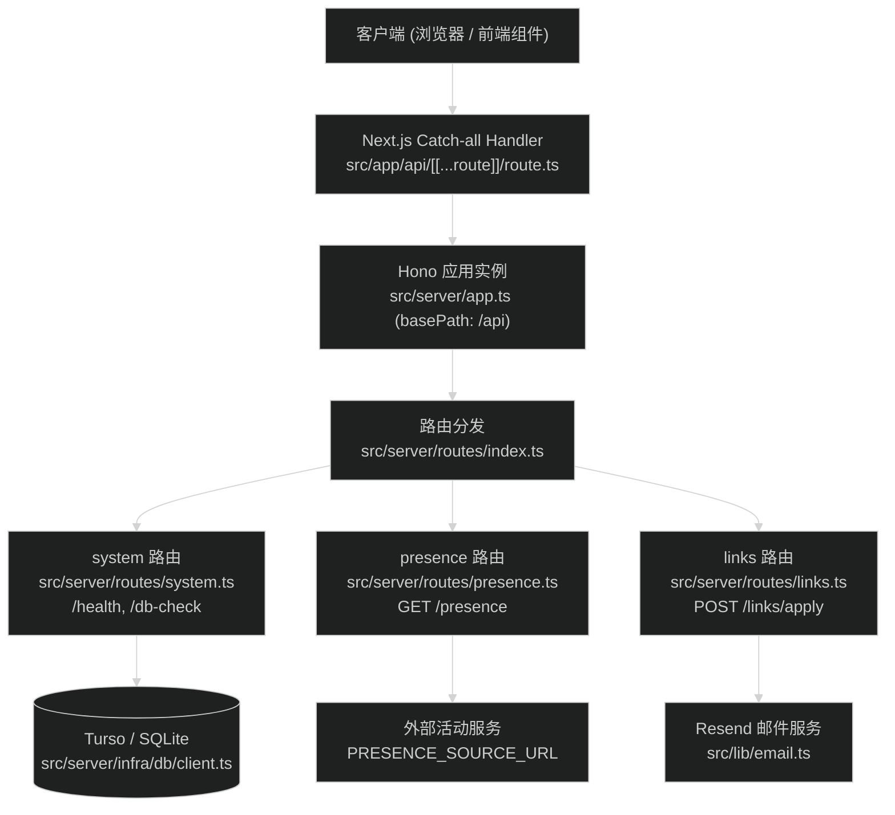

# HTTP API 路由迁移至 Hono 技术设计

## 1. 架构与路由映射

Next.js App Router 通过 `src/app/api/[[...route]]/route.ts` 将所有 `/api/*` 请求通过 `hono/vercel` 适配器的 `handle` 方法交给 Hono 处理。



## 2. 端点与合约细节

### 2.1 系统端点 (已有)
- `GET /api/system/health`: 返回 `ApiResponse<{ status: 'ok', uptime: number }>`
- `GET /api/system/db-check`: 返回 `ApiResponse<{ status: 'connected', latencyMs: number, provider: string, result: unknown }>`

### 2.2 活动端点 (迁移)
- 位置：`src/server/routes/presence.ts`
- 路径：`GET /api/presence`
- 行为：
  - 读取 `process.env.PRESENCE_SOURCE_URL`，默认 `http://127.0.0.1:4401/api/presence`。
  - 使用 `AbortController` 实施 1500ms 超时。
  - 超时或网络异常时，回退调用 `createOfflinePresence()`。
  - 响应标头强制写入 `Cache-Control: no-store, max-age=0`。
  - 直接返回 `PublicPresence` JSON（维持原有格式，保持与 `presence.tsx` 和 `status/page.tsx` 完全兼容）。

### 2.3 友链申请端点 (迁移)
- 位置：`src/server/routes/links.ts`
- 路径：`POST /api/links/apply`
- 行为：
  - 从 `c.req.header('x-forwarded-for')` 解析客户端 IP。
  - 内存频控校验：单个 IP 在 10 分钟窗口内最多 3 次请求；超限返回 HTTP 429 `{ success: false, error: '发送过于频繁，请等待几分钟后再试' }`。
  - 参数解析与校验：
    - `nickname`: 必填，不超过 32 字符。
    - `siteName`: 必填，不超过 50 字符。
    - `siteUrl`: 必填，合法 http/https 协议，不超过 200 字符。
    - `email`: 必填，有效邮箱正则，不超过 100 字符。
    - `avatarUrl`: 选填，若有需为合法 http/https 协议，不超过 300 字符。
    - `description`: 必填，不超过 150 字符。
    - 校验失败返回 HTTP 400 `{ success: false, error: string }`。
  - 邮件投递：调用 `sendFriendApplyEmail(payload)`。
    - 成功返回 HTTP 200 `{ success: true, message: string }`。
    - 失败返回 HTTP 500 `{ success: false, error: string }`。

## 3. 路由聚合与类型导出

在 `src/server/routes/index.ts` 中链式注册路由：

```ts
import { Hono } from 'hono'
import { linksRoute } from './links'
import { presenceRoute } from './presence'
import { systemRoute } from './system'

export const apiRoutes = new Hono()
  .route('/system', systemRoute)
  .route('/presence', presenceRoute)
  .route('/links', linksRoute)
```

通过链式调用，保持 `AppType = typeof apiRoutes` 具备完整的类型推导能力，后续需要 Hono RPC `hc<AppType>` 时可直接使用。

## 4. Next.js 挂载入口

在 `src/app/api/[[...route]]/route.ts` 中使用 `hono/vercel` 导出：

```ts
import { handle } from 'hono/vercel'
import { app } from '@/server/app'

export const runtime = 'nodejs'

const handler = handle(app)

export { handler as GET, handler as POST, handler as PUT, handler as DELETE, handler as PATCH, handler as OPTIONS }
```

使用 `[[...route]]` 可同时捕获 `/api` 根路径与所有子路径。原 `src/app/api/presence/` 和 `src/app/api/links/` 目录将直接删除。

## 5. 迁移与回滚策略

- **迁移顺序**：
  1. 编写 `src/server/routes/presence.ts` 与 `src/server/routes/links.ts`。
  2. 更新 `src/server/routes/index.ts`。
  3. 创建 `src/app/api/[[...route]]/route.ts`。
  4. 删除 `src/app/api/presence/route.ts` 与 `src/app/api/links/apply/route.ts`。
  5. 编写测试 `src/server/routes/routes.test.ts`。
  6. 更新 spec 文档。
- **回滚方式**：若 catch-all 发生异常，可恢复 `src/app/api/presence/route.ts` 和 `src/app/api/links/apply/route.ts`，并移除 `[[...route]]`。
