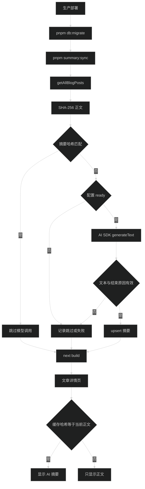

# AI 摘要同步与展示技术设计

## 1. 数据流

同步是非关键增强：单篇或全局失败都不阻止 `next build`。脚本必须汇总 generated、skipped、disabled、failed 数量，并避免输出正文、摘要全文或凭据。

## 2. 内容字段与哈希

`BlogPost` 增加 `disableAiSummary: boolean`，只有 frontmatter 严格等于 `true` 时关闭。摘要哈希直接使用 `BlogPost.content` 的 UTF-8 字节计算 SHA-256；frontmatter 不进入哈希，因此改标题、标签、日期或 hero 不触发生成。

不额外改写 MDX、移除代码块或规范化空白。任何正文字符变化都产生新哈希，规则简单且可复现。

## 3. 摘要缓存表

`site_article_summaries` 字段：

- `slug` 主键。
- `content_hash`。
- `summary`。
- `protocol` 与 `model`，记录生成时实际配置。
- `created_at` 与 `updated_at`。

模型调用成功、文本非空、`finishReason === 'stop'` 且文案通过边界检查后才执行 upsert。调用前不删除旧记录。首版不清理已删除文章或被关闭文章的缓存。

## 4. 提示词与结果

system instruction 固定要求：根据提供的中文技术文章生成准确摘要，只输出中文纯文本 2 至 3 句、约 120 至 180 字，不使用 Markdown、不添加“本文介绍”等空话，不编造正文没有的信息。

`maxOutputTokens` 使用能覆盖 180 个中文字符的保守上限；正式同步显式设置总超时和 `maxRetries: 2`，关闭 telemetry。输出去除首尾空白后检查：

- 非空。
- `finishReason === 'stop'`。
- 不含 Markdown 标题、列表或代码围栏。
- 长度明显偏离目标时视为失败，不写库；边界需允许模型标点产生的小幅浮动。

## 5. 脚本与部署

新增 `summary:sync` 命令，使用项目明确安装的 TypeScript runner 执行 `scripts/sync-summaries.ts`，从 `.env.local` 读取 Turso 与加密主密钥。脚本通过 service 读取并解密当前 ready 配置。

生产部署顺序改为：安装依赖、`pnpm db:migrate`、`pnpm summary:sync`、`pnpm build`、重启服务。`summary:sync` 捕获配置、数据库和模型错误并成功退出；migration 和 build 仍按原流程失败即停止。

首次上线时配置表为空，摘要同步只记录“未配置”并继续构建。站长在新版本登录设置页完成配置后，摘要会在下一次生产部署生成。

## 6. 页面读取与视觉

文章页在服务端按 slug 查询摘要，并计算当前正文哈希。只有两者相等时才把摘要传给 `AiSummary` Server Component；查询异常或哈希不匹配时不渲染。

摘要位于文章介绍与 MDX 正文之间。它是单层 `rounded-lg`、细边框、低对比 `bg-card/30` 的阅读辅助块，不嵌套卡片。顶部使用小型 sparkle 图标与 `AI 摘要` 等宽标签，正文使用常规 sans 字体和舒适行高。组件没有展开、复制或重新生成按钮。

窄屏保持与正文同宽，长文本自然换行；没有摘要时不保留高度。它不使用加载 spinner，因为内容在静态页面生成时已经确定。

## 7. 回滚

从部署脚本移除 `summary:sync` 即可停止外部调用。摘要组件可独立移除，缓存表保留。回滚不能把哈希不匹配的旧摘要恢复为可见。
