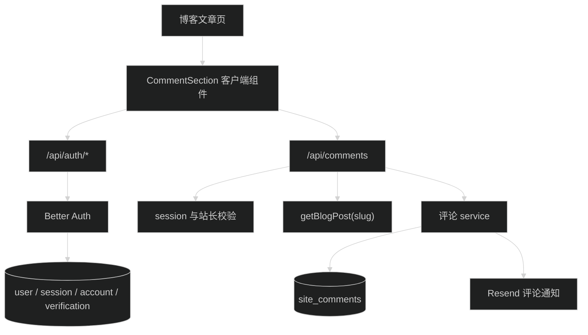
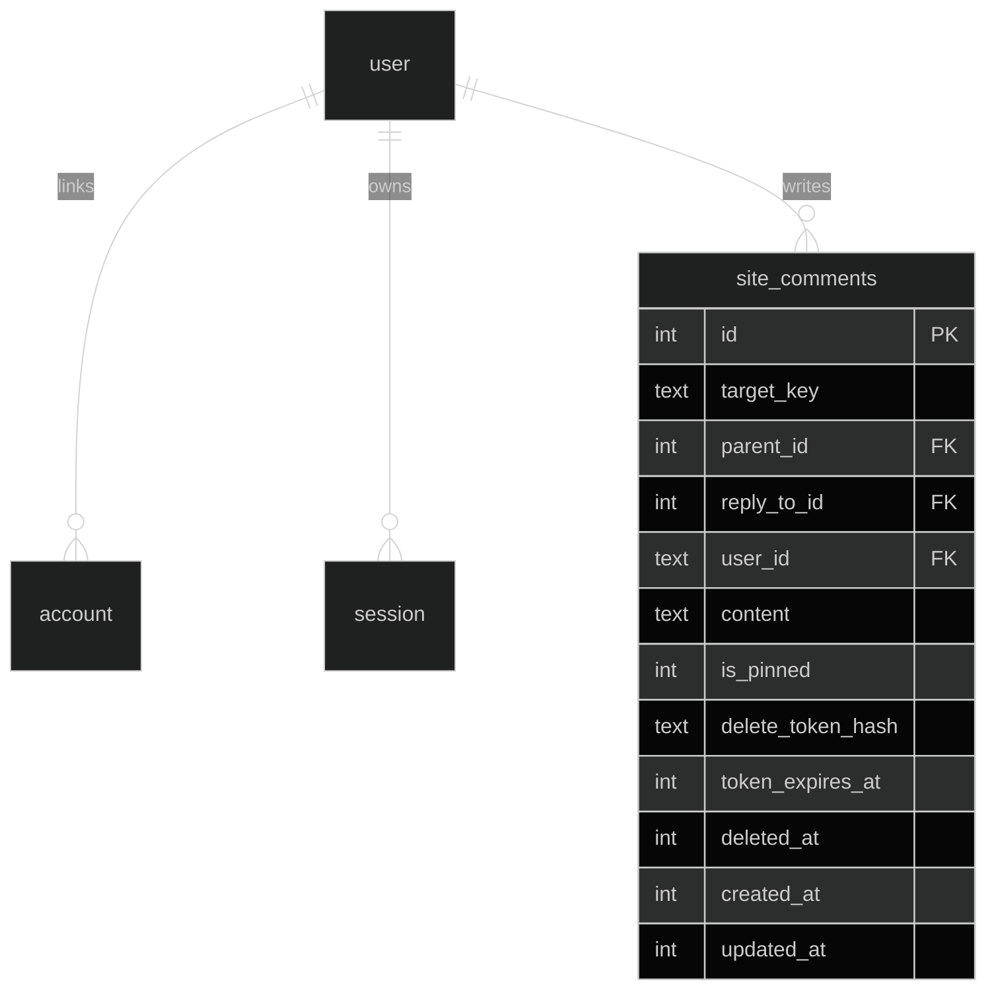

# Better Auth 社交评论系统技术设计

## 1. 模块与请求流

文件边界：

- `src/server/auth/`：Better Auth 配置、session 与站长判断。
- `src/server/routes/auth.ts`：provider 配置读取与 Better Auth handler。
- `src/server/routes/comments.ts`：HTTP 输入、状态码和响应。
- `src/server/services/comments.ts`：目标解析、回复关系、排序、软删除和通知。
- `src/server/infra/db/schema/auth.ts`、`comments.ts`：认证和评论表。
- `src/lib/auth-client.ts`：浏览器 Better Auth client。
- `src/app/(site)/_components/comment/`：评论 UI。

## 2. 认证设计

Better Auth 使用现有 libSQL Drizzle 实例和 SQLite adapter。只启用同时配置 ID 与 secret 的 GitHub、Google provider；配置接口只返回可用布尔值。账号关联允许同邮箱关联，但不允许不同邮箱，也不跳过 provider 邮箱验证。

认证端点最终路径为 `/api/auth/*`。评论写操作调用 `auth.api.getSession({ headers })`；站长操作再将 session 邮箱与 `ADMIN_EMAIL` 做 `trim().toLowerCase()` 比较。配置缺失时所有站长操作拒绝。

评论作者 provider 标记来自 `account.providerId` 去重列表。它表示已关联方式，不表示发布当次使用的登录方式。

## 3. 内容标识

`BlogPost` 增加可选 `commentKey`。`getBlogPost(slug)` 返回文章后，服务端使用 `post.commentKey || post.slug` 作为 `targetKey`。所有评论 API 接收当前文章 slug，不接受浏览器直接指定 `targetKey`，防止向不存在或其他文章写入。

文章改名后在 frontmatter 保留旧 `commentKey`，新 slug 会继续解析到同一评论集合。

## 4. 评论数据

顶级评论的 `parentId`、`replyToId` 都为空。回复的 `parentId` 始终指向顶级评论，`replyToId` 指向用户实际点击的评论。回复顶级评论时不显示“回复”；回复另一条回复时显示“回复 用户名：”。置顶只允许顶级评论。

软删除会清空正文、取消置顶、设置 `deletedAt` 并清除删除凭证；回复关系和作者显示名保留用于理解讨论。已删除内容不再提供管理操作。

## 5. API 合约

- `GET /api/config/auth`：返回 GitHub、Google 是否启用。
- `GET /api/comments?slug=<slug>&sort=default|newest|oldest`：公开读取评论树和计数。
- `POST /api/comments`：登录用户发布顶级评论或回复，正文 1 至 1000 字。
- `PATCH /api/comments/:id/pin`：站长切换顶级评论置顶。
- `DELETE /api/comments/:id`：站长 session 软删除。
- `GET /api/comments/delete?token=<token>`：读取邮件删除确认信息，不产生写操作。
- `POST /api/comments/delete`：使用一次性凭证确认软删除。

返回日期统一为 ISO 字符串。公开作者只包含 ID、名称、头像、provider ID 列表和服务端计算的作者标记。

## 6. 邮件删除凭证

发布成功后生成 32 字节随机 token，只把 SHA-256 哈希存入评论行，邮件发送明文 token。有效期 7 天。确认页先 GET 展示文章与评论摘要，用户点击后再 POST；邮件扫描器访问 GET 不会删除评论。成功、过期或评论已删除后 token 都不能再次使用。

邮件发送失败不回滚评论写入。接口仍返回评论成功，并在服务端记录不含评论全文和凭证的错误。

## 7. 评论 UI 设计

评论区位于版权信息后，以顶部分隔线与正文区分。标题行显示“评论”、数量和三段排序控件。

未登录时显示低对比度登录面板，GitHub、Google 使用品牌图标按钮；只显示已配置 provider。已登录时显示头像、名称、退出与站长专属设置入口，下方是固定高度 textarea、字符计数和发送按钮。

每个顶级评论是独立气泡条目，头像位于气泡外侧；全部已关联 provider 图标叠放在头像右下角。回复在同一讨论容器内平铺，以细分隔线区分，不嵌套第二张卡片。站长的置顶、删除使用图标按钮和 tooltip，仅在 hover、focus-within 或触屏操作区显示。

状态必须覆盖：评论加载骨架、空列表、读取失败与重试、登录跳转中、发送中、发送失败、删除确认、已删除占位和 1000 字超限。发送成功后保留当前排序并刷新讨论。

移动端不增加回复缩进，头像缩小，排序控件可横向容纳且不改变高度。所有按钮有可见 focus 状态，异步结果使用 `aria-live`，头像图片带尺寸约束和回退首字。

## 8. 风险与回滚

- 真实 OAuth 回调无法完全自动化，必须手工验证两种 provider。
- Better Auth CLI 生成 schema 必须与运行时版本一致。
- 自建评论验证前保留 Giscus；完成后删除组件、环境变量说明、主题 CSS 和相关 header 配置。
