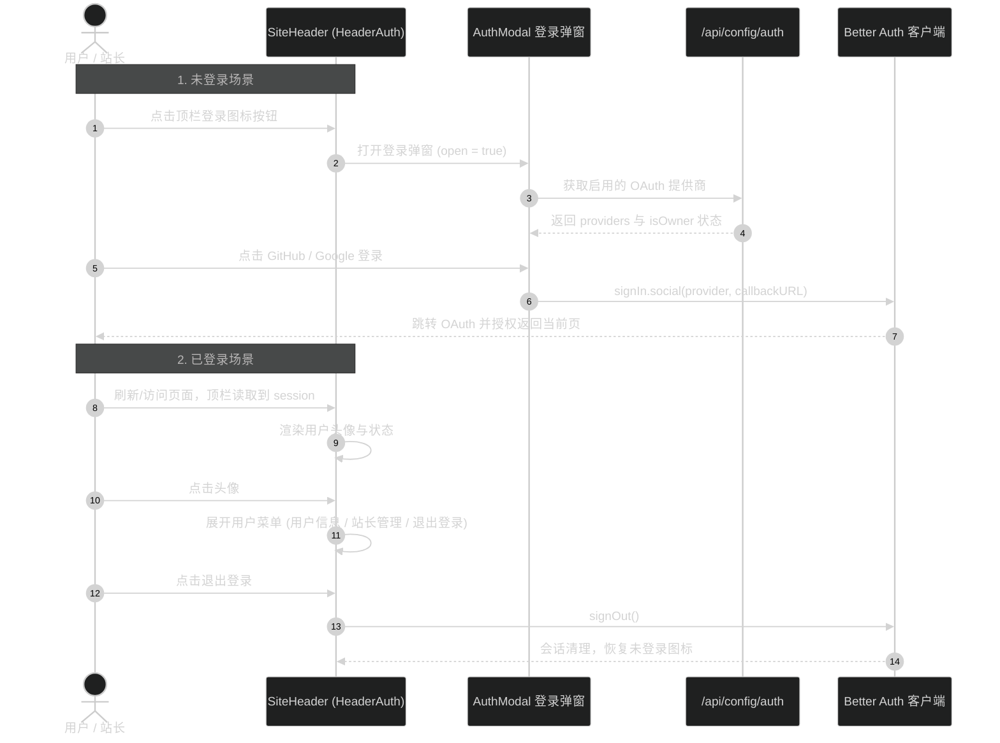

# 顶栏登录入口图标按钮与弹窗 技术设计

## 1. 架构与组件结构

```mermaid
%%{init: {"theme": "dark"}}%%
flowchart TD
    subgraph HeaderLayout [SiteHeader 顶栏]
        Presence[PresenceStatus 在线状态]
        NavLinks[桌面导航链接]
        HeaderAuth[HeaderAuth 认证入口]
        MobileToggle[移动端菜单按钮]
    end

    subgraph AuthComponent [HeaderAuth 认证组件]
        SessionState{useSession 状态}
        UnauthTrigger[未登录图标按钮]
        AuthAvatar[已登录头像按钮]
        UserDropdown[用户操作下拉浮层]
    end

    subgraph Modals [弹层与服务通信]
        AuthModal[AuthModal 登录弹窗]
        AuthConfigAPI[/api/config/auth 接口]
        BetterAuth[Better Auth 客户端 / 授权重定向]
    end

    HeaderAuth --> SessionState
    SessionState -- 未登录 --> UnauthTrigger
    SessionState -- 已登录 --> AuthAvatar

    UnauthTrigger -- 点击唤起 --> AuthModal
    AuthAvatar -- 点击展开 --> UserDropdown

    AuthModal -- 获取 Provider --> AuthConfigAPI
    AuthModal -- 发起第三方登录 --> BetterAuth
    UserDropdown -- 退出登录 --> BetterAuth
```

## 2. 交互与状态流转



## 3. 详细设计

### 3.1 顶栏布局集成（`src/app/(site)/_components/site/site-header.tsx`）
- 在 `SiteHeader` 右侧操作区域，将 `<HeaderAuth />` 放置在桌面导航 `<nav>` 右侧与移动端汉堡切换按钮左侧之间。
- 使用 `flex items-center gap-2` 对齐，在移动端和桌面端均保持可见与一致的外边距。

### 3.2 顶栏认证按钮与用户菜单（`src/app/(site)/_components/site/header-auth.tsx`）
- 使用 `useSession()` 监听 Better Auth 会话状态。
- 未登录状态：
  - 渲染圆形或轻圆角图标按钮（尺寸 32x32px，与页头比例匹配）。
  - 采用轻量用户/钥匙图标，悬停带边框高亮与柔和背景色。
  - 点击设置 `loginModalOpen = true`。
- 已登录状态：
  - 渲染用户头像（图片存在则使用 `img`，无图片则显示大写首字母）。
  - 若当前用户为站长（匹配 `ADMIN_EMAIL` 或服务端标记），头像边角带微型状态指示点或外环。
  - 点击切换展开浮层面板（Popover / Dropdown）。
- 浮层面板：
  - 包含用户基本信息（姓名、脱敏/完整邮箱）。
  - 站长标识标签与站长管理链接（如 `/settings/ai`）。
  - 退出登录按钮，点击调用 `signOut()`。
  - 监听外部点击（`pointerdown`）与 ESC 键，触发自动收起。

### 3.3 登录弹窗（`src/app/(site)/_components/site/auth-modal.tsx`）
- 基于 `createPortal` 挂载于 `document.body`，避免被页头层叠上下文或 overflow 裁剪。
- 背景半透明毛玻璃遮罩（`bg-background/80 backdrop-blur-sm`），点击遮罩或右上角关闭按钮关闭。
- 键盘无障碍支持：ESC 关闭，`role="dialog"`，`aria-modal="true"`。
- 动态获取 `/api/config/auth`，展示启用的登录方式（GitHub / Google）。
- 点击登录时：
  ```ts
  await signIn.social({
    provider,
    callbackURL: window.location.href,
  })
  ```
  保证站长在哪个页面点击登录，授权完毕后均能精准重定向回该页面。

## 4. 边界与异常处理

1. **OAuth 提供商未配置或拉取失败**：弹窗展示友好降级文案，说明未启用第三方登录配置。
2. **移动端适配**：在窄屏下，弹窗宽度自适应（最大宽度 `max-w-[360px]`），用户菜单浮层使用绝对定位对齐屏幕右边缘，防止横向溢出。
3. **滚动与过渡**：弹窗出现时锁定页面滚动（可选或轻量处理），避免弹窗背景内容跟随滚动。
