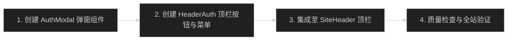

# 顶栏登录入口图标按钮与弹窗 实施计划

## 实施阶段与步骤



### 阶段 1：开发快捷登录弹窗（AuthModal）
- 文件：`src/app/(site)/_components/site/auth-modal.tsx`
- 目标：提供可复用的登录弹窗，挂载于 Portal。
- 检查点：
  - 动态从 `/api/config/auth` 读取 provider 配置。
  - 支持 GitHub 与 Google 登录发起，回调设为 `window.location.href`。
  - 支持 ESC 键与遮罩点击关闭。

### 阶段 2：开发顶栏认证与用户菜单（HeaderAuth）
- 文件：`src/app/(site)/_components/site/header-auth.tsx`
- 目标：管理顶栏图标、头像渲染以及展开的用户操作浮层。
- 检查点：
  - 未登录展示登录图标，点击打开 `AuthModal`。
  - 已登录展示用户头像，点击展开操作菜单（展示用户信息、`/settings/ai` 站长入口、退出登录）。
  - 退出登录调用 `signOut()` 并在完成后收起菜单。

### 阶段 3：集成至全站顶栏（SiteHeader）
- 文件：`src/app/(site)/_components/site/site-header.tsx`
- 目标：将 `HeaderAuth` 置于桌面导航链接右侧、移动端菜单按钮左侧。
- 检查点：
  - 桌面端与移动端排版均协调无挤压。
  - 滚动时透明胶囊动画与水膜层正常运作，不受新增组件影响。

### 阶段 4：质量门禁检查与文档更新
- 执行命令：
  ```bash
  pnpm typecheck
  pnpm lint
  pnpm format:check
  ```
- 更新 `.trellis/spec/frontend/feature-status.md` 中的状态。

## 回滚策略

若实现存在兼容性或交互异常，可直接在 `site-header.tsx` 移除 `<HeaderAuth />` 引用，回滚到原有仅含导航链接与汉堡按钮的页头状态。
