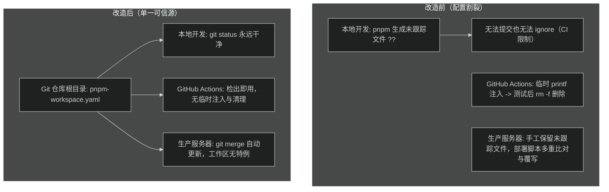

# 统一 pnpm 构建配置设计方案

## 架构模型对比



## 变更细节

### 1. 根目录 `pnpm-workspace.yaml`

保留当前生产环境和 CI 实际所需的白名单配置，消除多余的历史项（如 `@prisma/client` 与 `better-sqlite3`）：

```yaml
allowBuilds:
  esbuild: true
  sharp: true
```

将该文件执行 `git add pnpm-workspace.yaml` 纳入版本控制。

### 2. CI/CD 工作流 (`.github/workflows/ci-cd.yml`)

#### `quality` Job

- 删除 `Install dependencies` 步骤中的 `printf 'allowBuilds:\n ...' > pnpm-workspace.yaml`。
- 保留 `pnpm install --frozen-lockfile` 作为纯净的依赖安装命令。
- 删除 `Clean up pnpm build approval file`（`rm -f pnpm-workspace.yaml`）步骤。

#### `deploy` Job 远程脚本

**合并前旧文件平滑清理**：
生产服务器当前工作区存在未跟踪的 `pnpm-workspace.yaml`。在执行 `git merge --ff-only origin/main` 时，由于新提交包含了 `pnpm-workspace.yaml`，Git 会提示：
`error: The following untracked working tree files would be overwritten by merge: pnpm-workspace.yaml` 并终止合并。
因此在 `git switch main` 和 `git merge` 之前，添加如下平滑过渡逻辑：

```bash
if ! git ls-files --error-unmatch -- pnpm-workspace.yaml >/dev/null 2>&1; then
  rm -f pnpm-workspace.yaml
fi
```

**精简工作区检查**：
删除以下旧逻辑：
- `old_pnpm_config`、`legacy_pnpm_config`、`four_items_pnpm_config`、`broken_pnpm_config`、`expected_pnpm_config` 字符串定义。
- 动态覆写 `pnpm-workspace.yaml` 的 `cmp -s` 判断分支。
- `pnpm_config_status` 与 `pnpm-workspace.yaml must be an untracked server-only file` 拦截。
- `worktree_status` 对 `?? pnpm-workspace.yaml` 的放行特例。

恢复标准的工作区检查：
```bash
worktree_status="$(git status --porcelain --untracked-files=all)"
if [[ -n "$worktree_status" ]]; then
  echo "The server worktree has unexpected uncommitted or untracked changes; deployment stopped." >&2
  git status --short --branch >&2
  exit 1
fi
```

### 3. 部署规范文档 (`.trellis/spec/frontend/deployment-guidelines.md`)

- 将“CI 临时生成包含 ... 的 pnpm-workspace.yaml ... job 结束时清理，不提交仓库”修改为“仓库根目录提交 `pnpm-workspace.yaml`，统一本地、CI 与生产依赖构建白名单”。
- 将“工作区必须干净，唯一允许的例外是未跟踪的普通文件 pnpm-workspace.yaml”修改为“工作区必须完全干净，仅允许被忽略的 `.env.local` 存在”。
- 同步更新部署示例脚本，移除 `pnpm_config_status` 比对与特例处理。
