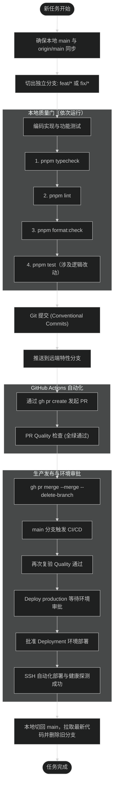

# Git 规范化工作流设计方案

## 流程架构图



## 规范落盘与文档架构

```
.
├── AGENTS.md                                   # 全局工作规则：增加 Git 分支开发与 PR 提交强制要求
└── .trellis/spec/frontend/
    ├── index.md                                # 前端规范索引：在索引表与开发前检查清单加入 Git 规范
    ├── quality-guidelines.md                   # 质量规范：Git 章节引用完整工作流
    └── git-workflow.md                         # 核心规范：记录 6 步标准操作指南与边界要求
```

### 1. 核心约定与命令规范

- **分支基线**：主分支名必须为 `main`。禁止直接向 `main` 提交或推送。
- **分支命名**：
  - 新功能：`feat/<slug>`
  - 问题修复：`fix/<slug>`
  - 架构或工具维护：`chore/<slug>`
- **本地质量门顺序**：
  1. `pnpm typecheck`
  2. `pnpm lint`
  3. `pnpm format:check`
  4. `pnpm test`
- **PR 与合并**：
  - 创建 PR：`gh pr create --base main --head <branch> --title "<title>" --body "<body>"`
  - 合并 PR：`gh pr merge <pr> --merge --delete-branch`
- **环境审批与本地收尾**：
  - 生产审批：在 GitHub Actions 页面点击“Review deployments”并批准；或调用 API `POST repos/xidongdong-153/blog/actions/runs/<RUN_ID>/pending_deployments`。
  - 本地同步：`git checkout main && git pull origin main && git branch -d <branch>`。

### 2. 对 AI Agent 的约束逻辑

- 在 `AGENTS.md` 中以硬性规则形式声明。Agent 在接手任何任务前，第一步必须检查当前分支；如果当前处于 `main` 分支，必须先创建分支再动手修改代码。
- 任务执行完毕后，未经用户明确授权不得擅自执行 `git commit` 或 `git push`；执行前需向用户展示摘要并说明下一步的分支推送与 PR 动作。
