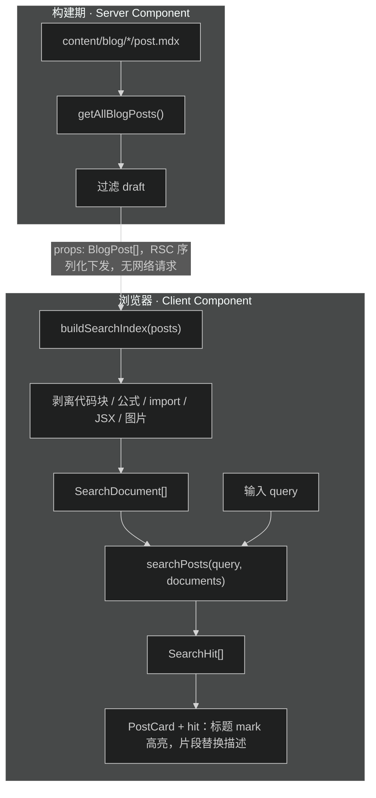

# 站内搜索技术设计

## 架构与边界

搜索全程不新增 API route、不新增构建脚本、不改部署流程。索引在浏览器内构建，文章数据由 RSC 序列化下发。

| 文件                                                     | 动作 | 说明                                         |
| -------------------------------------------------------- | ---- | -------------------------------------------- |
| `src/lib/blog-meta.ts`                                   | 新增 | 无 Node 依赖的分类常量和阅读时间估算         |
| `src/lib/search.ts`                                      | 新增 | 索引构建、匹配、打分、片段截取、高亮区间     |
| `src/lib/search.test.ts`                                 | 新增 | 纯函数测试，接入`pnpm test`                  |
| `src/app/(site)/_components/blog/blog-search.tsx`        | 新增 | client 组件：输入框 + 结果区                 |
| `src/app/(site)/_components/blog/post-card.tsx`          | 修改 | 加可选`hit` prop，支持标题高亮与片段替换描述 |
| `src/app/(site)/blog/page.tsx`                           | 修改 | 用`BlogSearch` 包住列表区，传入全量文章      |
| `src/app/(site)/search/page.tsx`                         | 删除 | 占位页下线                                   |
| `src/app/(site)/_components/placeholder/empty-state.tsx` | 删除 | 失去唯一调用方                               |
| `src/app/robots.ts`                                      | 修改 | `disallow` 去掉 `/search`                    |
| `.trellis/spec/frontend/feature-status.md`               | 修改 | 「站内搜索」状态改为已实现                   |

## 数据流



## 接口契约

### `src/lib/search.ts`

```ts
export interface TextRange {
  start: number
  end: number
}

/** 一篇参与搜索的文章：原文对象 + 剥离后的正文纯文字 */
export interface SearchDocument {
  post: BlogPost
  text: string
}

export interface SearchHit {
  post: BlogPost
  score: number
  /** 标题上的命中区间，相对原始 title 字符串 */
  titleRanges: TextRange[]
  /** 正文命中片段，仅在标题未命中时生成；含首尾省略号 */
  snippet: string | null
  /** 片段内的高亮区间 */
  snippetRanges: TextRange[]
}

/** 剥离非文字内容，为每篇文章建立索引条目 */
export function buildSearchIndex(posts: BlogPost[]): SearchDocument[]

/** 检索并排序，得分为 0 的条目不返回 */
export function searchPosts(query: string, documents: SearchDocument[]): SearchHit[]

/** 把文本按高亮区间切成片段，供渲染层插入 mark */
export function splitByRanges(text: string, ranges: TextRange[]): Array<{ text: string; hit: boolean }>
```

`BlogPost` 用 `import type` 引入，编译后擦除，不会把 `content.ts` 的 `node:fs` 带进浏览器包。三个函数都是纯函数，不碰 fs、不碰 DOM。

### `BlogSearch` props

```ts
{
  posts: BlogPost[]      // 已过滤 draft 的全量文章
  children: React.ReactNode // 搜索框未激活时渲染的原列表（由 RSC 传入）
}
```

`children` 是 Server Component 渲染好的列表元素，client 组件原样渲染它不违反 RSC 边界。用户输入非空时，`children` 整体被结果列表替换，分页器与工具栏随之隐藏。

### `PostCard` 新增 prop

```ts
export interface PostCardHit {
  titleRanges: TextRange[]
  snippet: string | null
  snippetRanges: TextRange[]
}

export interface PostCardProps {
  // ...原有字段
  hit?: PostCardHit
}
```

- 传了 `hit`：标题按 `titleRanges` 插入 `<mark>`；`snippet` 非空时替换描述位，否则仍渲染原描述。
- 没传 `hit`：行为与现在完全一致。

## 关键取舍

### 抽 `blog-meta.ts` 是为了让 PostCard 能进浏览器包

`PostCard` 目前从 `content.ts` 值导入 `BLOG_CATEGORY_LABELS` 和 `calculateReadingTime`。`content.ts` 顶层有 `import fs from 'node:fs'`，任何值导入都会把 Node 文件系统模块拖进浏览器包。

搜索结果必须由 client 状态驱动，所以 `PostCard` 得能在 client 组件里渲染。做法是把无 Node 依赖的部分移到 `blog-meta.ts`，`content.ts` 改为 re-export：

```ts
// content.ts 里的写法，与现有的 'export { formatDate } from "./date"' 同模式
export { BLOG_CATEGORIES, BLOG_CATEGORY_LABELS, calculateReadingTime } from './blog-meta'
export type { BlogCategory } from './blog-meta'
```

现有的消费方（`blog-toolbar.tsx`、`blog/[slug]/page.tsx`、`admin/admin-metrics.tsx`）继续从 `content.ts` 导入，不用改。只有 `post-card.tsx` 改成从 `blog-meta.ts` 导入。

`BlogSortOrder` 和 `BLOG_SORT_LABELS` 留在 `content.ts`：只有分类工具栏（Server Component）用得到，没有进浏览器包的需要。

没有采用「把 label 和阅读时间当 props 传进 PostCard」的替代方案：那要改所有调用方的传参，反而侵入更大。

### 索引在浏览器侧构建，不在 RSC 侧

`posts` 本身要传给 client 才能渲染 `PostCard`（含 `content` 原文），再传一份剥离后的 `text` 等于重复下发。所以剥离在 client 用 `useMemo` 做一次，输入 10 KB 文本是毫秒级开销。

### 中文用子串匹配，英文用词首匹配

中文没有词边界，直接 `indexOf` 子串匹配既准又省。英文查 `\b` 词首位置，让 `react` 能命中 `react-hooks`。大小写归一化只用 `toLowerCase()`，不用 `NFKC`——NFKC 会改变部分字符长度，导致归一化后的下标无法映射回原文本，高亮区间会错位。遇到 `toLowerCase()` 后长度变化的文档，退回大小写敏感匹配。

### 多词查询按 AND 处理

查询按空白切词，所有词都命中才计入结果（可分布在不同字段）。比 OR 更可预期，也避免「的的的的」这类无意义输入刷出结果。

## 打分与门槛

| 命中字段    | 权重 |
| ----------- | ---- |
| 标题        | 5    |
| 标签 / 分类 | 3    |
| 描述        | 3    |
| 正文        | 1    |

- 得分为 0 不返回。
- `query.trim().length < 2` 直接返回空结果，不触发匹配。
- 结果按得分倒序，同分按日期倒序。

## 兼容与回归边界

- `PostCard` 的 `hit` 是可选 prop，`blog/tags/[tag]/page.tsx` 和 `blog/page.tsx` 原列表调用不受影响。
- `ArticleViewerCount` 在 compact 模式下未连接或 0 人时返回 `null`，搜索结果里不会产生额外噪音；它依赖的 `VisitorPresenceProvider` 挂在 `(site)/layout.tsx`，`/blog` 页内可用。
- `content.ts` 的 re-export 保持所有既有导入路径有效，不破坏其他页面。
- 索引数据全部来自已过滤 draft 的 `allPosts`，草稿不会进搜索结果。

## 测试策略

`src/lib/search.test.ts` 用 Node 内置测试（`node --test`），覆盖：

- 剥离：围栏代码块内的标识符不出现在索引文本里；公式、JSX 标签、图片语法被去掉；行内代码和链接的可见文字保留。
- 匹配：中文子串命中；英文大小写不敏感；英文词首命中 `react-hooks`；单字符不触发；多词 AND。
- 打分：标题命中排在正文命中之前。
- 片段：命中位置周围截取，首尾带省略号，区间落点在片段内正确。
- `splitByRanges`：区间切分正确，无区间时返回单段。

测试文件加进 `package.json` 的 `test` 脚本列表，与现有测试一起跑。
