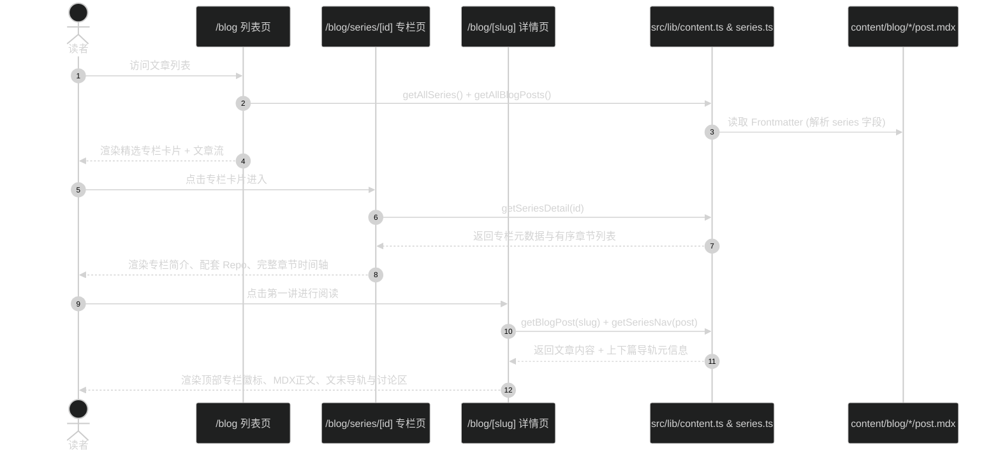

# 技术方案设计: 博客文章系列与专栏聚合 (方案B)

## 架构概览与数据流



## 数据模型设计

### 1. 专栏全局定义 (`src/lib/series.ts`)

在代码层集中管理专栏注册表，避免在每篇 MDX 重复定义专栏标题、简介、仓库地址等全局信息：

```typescript
export interface SeriesDefinition {
  id: string
  title: string
  description: string
  status: 'in-progress' | 'completed'
  /** 配套开源仓库，如 GitHub 链接 */
  repositoryUrl?: string
  /** 专栏标签，如 ['Pi SDK', 'Agent', 'TypeScript', 'Tauri'] */
  tags: string[]
  /** 专栏主题氛围高光色 */
  heroColor?: string
}

export const REGISTERED_SERIES: Record<string, SeriesDefinition> = {
  'pi-agent-desktop': {
    id: 'pi-agent-desktop',
    title: '从零使用 Pi SDK 构建个人 Agent Desktop',
    description:
      '深入剖析 Pi Agent Harness 架构，从 Headless SDK 核心、会话生命周期到跨平台桌面端集成，从零打造可扩展的个人专属 AI 工作台。',
    status: 'in-progress',
    repositoryUrl: 'https://github.com/xidongdong-153/blog',
    tags: ['Pi SDK', 'AI Agent', 'TypeScript', 'Desktop'],
    heroColor: '#659EB9',
  },
}
```

### 2. 文章 Frontmatter 扩展 (`src/lib/content.ts`)

扩展 MDX frontmatter 与 `BlogPost` 类型：

```typescript
export interface BlogPostSeriesRef {
  id: string
  order: number
}

export interface BlogPost {
  // 现有字段...
  series?: BlogPostSeriesRef
}
```

Frontmatter 书写示例：

```yaml
---
title: 'Pi Agent Harness 核心原理解析'
description: '探索 Pi SDK 的核心架构与多 Agent 协同循环...'
date: 2026-10-08
category: tech
tags: [Pi SDK, Agent, TypeScript]
heroImage: /images/blog/hero.jpg
series:
  id: pi-agent-desktop
  order: 1
---
```

### 3. 内容查询辅助 API (`src/lib/content.ts`)

- `getAllSeries(): Array<SeriesDefinition & { postsCount: number; lastUpdated: string }>`:
  汇总计算所有已注册专栏的实际发布状态、文章数量与最近更新日期。
- `getSeriesDetail(id: string): { series: SeriesDefinition; posts: BlogPost[] } | null`:
  获取专栏及其所有按 `series.order` 严格升序排列的文章列表。
- `getSeriesNav(currentPost: BlogPost): { series: SeriesDefinition; prev?: BlogPost; next?: BlogPost; currentIndex: number; totalCount: number } | null`:
  为当前文章计算在专栏中的前后篇链接与讲次序号。

---

## 组件体系设计

### 1. `/blog` 精选专栏卡片 (`src/app/(site)/_components/blog/series-banner.tsx`)

- 视觉形式：放置于文章列表页顶部，采用略带高光边框（符合现有纸本 + 水墨极简调性）的宽幅精选卡片。
- 内容元素：
  - 左侧：专栏标识 `// 精选系列`、大标题、简介摘要、标签 Pill、连载中/完结 Badge、已更新 N 篇。
  - 右侧/操作区：提供「浏览完整专栏大纲 →」及「从第一篇开始阅读」按钮。
- 无干扰设计：仅当有配置的 series 且其收录文章数 > 0 时渲染，无专栏内容时不占位。

### 2. 专栏专题主页 (`src/app/(site)/blog/series/[id]/page.tsx`)

- 路径与路由：`src/app/(site)/blog/series/[id]/page.tsx`。
- `generateStaticParams()`：基于 `REGISTERED_SERIES` 预生成静态路由。
- 页面区域划分：
  - **Hero Header**：返回文章列表面包屑、专栏大标题、简介、配套 GitHub Repo 链接卡片、统计指标（章节总数、状态）。
  - **章节大纲列表 (Chapter Timeline)**：垂直导轨列表，每一项展示章节序号（如 `01`、`02`）、文章标题、描述、发布日期、阅读用时。未发布的规划篇章可标为待更新或仅列出已有文章。

### 3. 详情页系列导轨组件 (`src/app/(site)/_components/blog/series-paginator.tsx`)

- 嵌入位置：`src/app/(site)/blog/[slug]/page.tsx`，位于文章内容 `MdxContent` 之后、`CopyrightCard` 之前。
- 内容布局：
  - 顶部栏：专栏标题与章节进度提示 `第 X / Y 讲`，附带「返回专栏目录」小链接。
  - 双栏卡片（网格）：
    - 左卡片：上一讲（若有）—— 显示序号、标题、← 图标。
    - 右卡片：下一讲（若有）—— 显示序号、标题、→ 图标。
- 若文章不属于任何专栏（`post.series === undefined`），组件返回 `null`，完全不影响现有普通文章。

### 4. 项目页联动 (`src/app/(site)/projects/page.tsx`)

- 在项目接口 `Project` 中增加可选字段 `seriesId?: string`。
- 若项目配置了 `seriesId`，在项目卡片操作区渲染「阅读配套系列教程 →」按钮，点击跳转至 `/blog/series/[id]`。

---

## 边界与兼容性考虑

1. **已有文章完全兼容**：所有现存文章无 `series` 字段，解析时设为 `undefined`，详情页和列表页行为维持 100% 现状。
2. **非法/未注册 series id 处理**：若文章声明了不存在的 `series.id`，在构建读取时优雅降级并打印警告，不中断构建。
3. **静态生成与 SEO**：
   - 专栏主页支持完整 `generateMetadata`，生成对应标题与描述。
   - `sitemap.ts` 自动收录 `/blog/series/[id]`。
