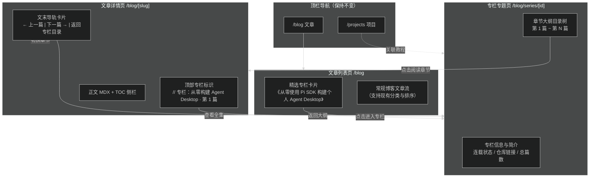

# 博客文章系列与专栏聚合（方案B）

## Goal

在保持现有顶栏导航结构不变（首页、文章、笔记、项目、友链、关于）的前提下，系统性支持《从零使用 Pi SDK 构建个人 Agent Desktop》等成体系的系列教程文。在文章列表页提供精选专栏入口，提供沉浸式专栏大纲主页（`/blog/series/[id]`），在单篇文章详情页提供章节导轨与前后篇跳转，并联动项目页。

## Architecture & Flow

## Requirements

### 1. 数据模型与内容层 (Content Layer)

- 在 `src/lib/series.ts` 集中注册专栏定义（如 `id`, `title`, `description`, `status`, `repositoryUrl` 等），统一管控专栏元信息。
- 扩展 `BlogPost` frontmatter 支持 `series?: { id: string; order: number }`，将文章与专栏声明式绑定。
- 在 `src/lib/content.ts` 导出专栏查询与章节计算函数：
  - `getAllSeries()`：获取所有专栏及其收录文章数量、更新时间等。
  - `getSeriesById(id)`：获取特定专栏定义与按 `order` 排序的所有章节列表。
  - `getSeriesNav(slug)`：针对当前文章，计算上一篇、下一篇、所属专栏元信息及当前讲次。

### 2. 文章列表页专栏入口 (`/blog`)

- 在 `/blog` 列表顶部（位于分类筛选与文章卡片流之间或顶部醒目位置）渲染 `SeriesFeaturedCard` 组件。
- 展示系列标题、专栏定位描述、状态标签（连载中/已完结）、已发布篇数，直达专栏主页。

### 3. 专栏专题主页 (`/blog/series/[id]`)

- 新增路由 `src/app/(site)/blog/series/[id]/page.tsx`。
- 展示专栏沉浸式 Hero：标题、简介、连载状态徽标、配套 GitHub 开源项目按钮、总篇数。
- 完整章节目录大纲（时间轴/序号导轨形式）：每个章节展示序号、标题、发布日期、阅读用时与直达链接。

### 4. 单篇详情页阅读导轨 (`/blog/[slug]`)

- **顶部徽标/面包屑**：在分类与发布时间上方，展示专栏归属（如 `// 专栏：从零构建 Agent Desktop · 第 1 篇`），点击可跳转回专栏大纲。
- **文末导轨组件 (`SeriesPaginator`)**：在正文与版权卡片之间，展示「上一篇」与「下一篇」章节卡片，并带有「查看系列完整大纲」按钮。

### 5. 项目页联动 (`/projects`)

- 在 `/projects` 中，若项目定义包含 `seriesUrl` 或关联 series ID，卡片内展示「配套系列教程 →」直达链接。

## Acceptance Criteria

- [x] 顶栏 6 个基础菜单项（首页、文章、笔记、项目、友链、关于）无任何新增与破坏，移动端抽屉正常。
- [x] MDX 文章配置 `series: { id: "pi-agent-desktop", order: 1 }` 能正确关联专栏并按 `order` 正确排序。
- [x] `/blog` 顶部渲染精选专栏卡片，视觉符合站点设计系统（纸本基调、单色描边、点缀色）。
- [x] `/blog/series/pi-agent-desktop` 路由正常静态生成与渲染，展示专栏信息与完整章节列表。
- [x] 系列文章详情页顶部显示专栏信息，文末显示上一篇/下一篇导轨，能平滑来回跳转。
- [x] 质量门检查全通过：`pnpm typecheck`、`pnpm lint`、`pnpm format:check` 零错误。
