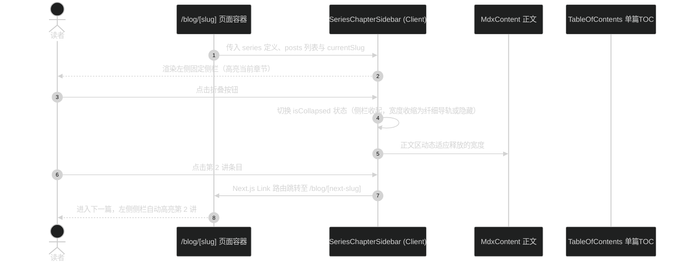

# 技术方案设计: 专栏文章左侧章节目录侧栏

## 架构概览与交互流



## 组件体系与响应式设计

### 1. 左侧章节侧栏组件 (`src/app/(site)/_components/blog/series-chapter-sidebar.tsx`)

- 属性定义：
  ```typescript
  export interface SeriesChapterSidebarProps {
    series: SeriesDefinition
    posts: BlogPost[]
    currentSlug: string
  }
  ```
- 布局契约：
  - 桌面端：`sticky top-20 hidden lg:block`。展开时宽度 `w-64` 或 `w-72`，折叠时可切换为仅显示悬浮呼出浮标。
  - 内部滚动：`max-h-[calc(100vh-6rem)] overflow-y-auto`，带精简半透明滚动条。
  - 头部：
    - 专栏名称：`font-serif font-medium text-foreground hover:text-primary`，链接回 `/blog/series/[id]`。
    - 折叠按钮：轻量 SVG 图标按钮，点击切换 `collapsed`。
  - 章节列表：
    - 统计微标：`// 大纲 · 共 N 讲`
    - 条目项：
      - 序号：`01`、`02`（`font-mono text-xs tabular-nums`）
      - 标题：`font-sans text-xs sm:text-sm leading-snug line-clamp-2`
      - 状态态样：当前篇（`bg-primary/10 text-primary font-medium border-l-2 border-primary` 或圆角卡片高光）；非当前篇（`text-muted-foreground hover:bg-muted/40 hover:text-foreground`）。

### 2. 页面容器自适应策略 (`src/app/(site)/blog/[slug]/page.tsx`)

- 条件容器布局：
  - 非专栏文章：保持现有 `max-w-5xl gap-x-10 lg:flex` 结构。
  - 专栏文章：外层容器扩展为 `max-w-7xl gap-x-8 lg:flex`。
    - 左列：`<SeriesChapterSidebar />`（`w-64 lg:block shrink-0`）。
    - 中列：`<article>`（`min-w-0 flex-1 max-w-3xl`）。
    - 右列：`<TableOfContents />`（在 `2xl:block` 或大屏展示，或在中大屏以折叠悬浮形式提供，避免三栏挤压）。

### 3. 移动端抽屉联动 (`src/app/(site)/_components/blog/floating-action-group.tsx`)

- 在移动端，文章浮动按钮组现已支持 TOC 抽屉。
- 若文章属于专栏，抽屉顶部提供「专栏目录 / 本篇大纲」双 Tab 切换，或者新增专栏大纲按钮，手机端也能一键在各讲次间切换。

---

## 边界与兼容性

1. **非专栏文章零副作用**：常规文章无 `seriesNav`，不加载也不渲染左侧侧栏，保持 100% 原始布局与间距。
2. **纯客户端折叠偏好**：用户折叠状态保存在 `localStorage`，重新进入同系列其他文章时保持其折叠偏好。
3. **无障碍与键盘导航**：侧栏列表具备完整 `aria-current="page"` 语义，支持键盘焦点导航。
