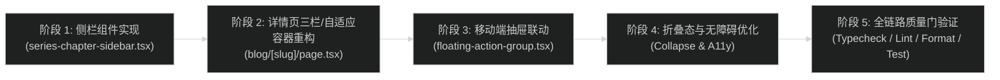

# 执行计划: 专栏文章左侧章节目录侧栏

## 实施顺序图



## 实施任务清单

### 阶段 1: 编写左侧章节侧栏组件

- [x] 1.1 创建客户端组件 `src/app/(site)/_components/blog/series-chapter-sidebar.tsx`：
  - 接收 `series`、`posts`（全章节）与 `currentSlug`。
  - 实现专栏标题头部与折叠展开 Toggle 状态（默认展开，可收起为左侧纤细浮标）。
  - 渲染章节列表：带两位对齐序号（`01`、`02`...）、标题、当前篇激活高亮。
  - 点击非当前篇通过 `next/link` 导航跳转。

### 阶段 2: 详情页容器与侧栏集成

- [x] 2.1 修改 `src/app/(site)/blog/[slug]/page.tsx`：
  - 在 `getSeriesNav(post)` 基础上，若存在系列，获取该系列的所有文章 `seriesDetail.posts`。
  - 在专栏模式下，自适应拓宽外层容器（`max-w-7xl`），左侧挂载 `<SeriesChapterSidebar />`。
  - 协调右侧 `<TableOfContents />` 显示策略（保证中间正文具备 `max-w-3xl` 舒适阅读宽度）。

### 阶段 3: 移动端目录抽屉支持

- [x] 3.1 改造 `src/app/(site)/_components/blog/floating-action-group.tsx`：
  - 支持接收可选的 `series` 与 `seriesPosts`。
  - 若为专栏文章，抽屉顶部支持在「本篇目录」与「专栏章节」之间 Tab 切换，手机端也可自由翻阅全部讲次。

### 阶段 4: 样式调优与细节打磨

- [x] 4.1 确保设计语言统一：严格遵守 HSL 语义 token、单色微边框、无 Emoji、西文衬线与等宽微标。
- [x] 4.2 适配折叠平滑过渡动效，保证展开/收起时主内容区不产生硬切跳动。

### 阶段 5: 质量门与文档核验

- [x] 5.1 运行全套质量门检查：
  - `pnpm typecheck`
  - `pnpm lint`
  - `pnpm format:check`
  - `pnpm test`
  - `pnpm build`
- [x] 5.2 更新相关规范文档与任务状态。

## 验证命令与标准

```bash
# 1. 类型检查
pnpm typecheck

# 2. 代码规范与 Lint
pnpm lint

# 3. 代码格式化校验
pnpm format:check

# 4. 单元测试
pnpm test

# 5. 全站构建验证
pnpm build
```
