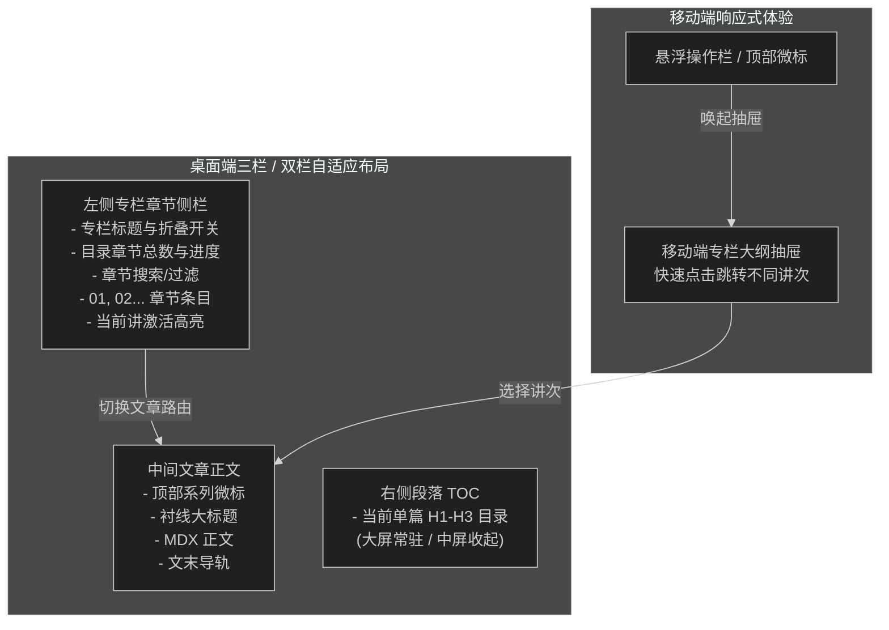

# 专栏文章左侧章节目录侧栏

## Goal

针对专栏系列文章，在详情阅读页新增左侧章节目录侧栏（Series Chapter Sidebar），参考主流教程站/课程阅读器布局（如用户提供的实战进阶专栏大纲界面），支持章节快速切换、当前讲高亮激活、侧栏折叠收起与移动端抽屉切换，极大提升成体系教程的沉浸式连贯阅读体验。

## Architecture & Layout

## Requirements

### 1. 左侧章节目录侧栏 (`SeriesChapterSidebar`)

- 仅当文章属于某一专栏时（`seriesNav !== null`）在阅读页左侧呈现。
- **侧栏头部**：
  - 专栏标题（如《从零使用 Pi SDK 构建个人 Agent Desktop》）与返回专栏主页链接。
  - 折叠/展开切换按键（Collapse Toggle），支持用户收起侧栏以获得最大正文阅读宽度，状态可保存在内存/会话。
- **侧栏章节列表**：
  - 顶部统计与进度：展示「大纲 · 共 N 讲」与连载状态。
  - 章节快速过滤（可选轻量搜索过滤）。
  - 按 `order` 升序列表排列：显示序号（`01`、`02`...）、篇名。
  - **当前阅读章节高亮**：背景高光、等宽序号强调色、圆角背景，一眼识别当前进度。
  - **点击跳转**：点击任意章节平滑导航至对应文章路由 `/blog/[slug]`。

### 2. 详情页排版自适应与协调

- 保持非专栏常规文章现有的单栏 + 右侧 TOC 结构不受任何影响。
- 专栏文章容器宽度适度扩充（如 `max-w-7xl`），使左侧专栏章节目录、中间正文与右侧段落 TOC（大屏）形成平衡优雅的比例。
- 在 `lg` 屏幕下左侧专栏侧栏优先展示，右侧 TOC 在超大屏（`xl:` 或 `2xl:`）展示，或支持灵活收起。

### 3. 移动端抽屉配套

- 在移动端或小屏幕下，支持通过悬浮操作栏或顶部专栏标签一键唤出「专栏章节大纲抽屉」，与现有右侧单篇 TOC 抽屉互通或做 Tab 切换。

## Acceptance Criteria

- [x] 专栏文章（如 Pi Agent 系列）进入后，左侧常驻显示专栏章节侧栏。
- [x] 支持大章节分类（Chapter Groups）手风琴折叠展开，展示各分类篇数与结构化大纲。
- [x] 侧栏列出本专栏全部章节，当前正在阅读的篇目呈高亮激活态。
- [x] 点击侧栏其他章节能直接无缝跳转并正确更新高亮。
- [x] 彻底修复折叠态 UI 溢出缺陷，采用水平微标按键 `[ ◨ 专栏大纲 01 / 03 ]` 优雅展开，零文字漏出与排版错位。
- [x] 普通非专栏文章依然维持原有布局，不显示专栏侧栏。
- [x] 移动端下可通过抽屉呼出专栏章节大纲（含大章节分类）并完成跳转。
- [x] 质量门检查全绿（`typecheck`、`lint`、`format:check`、`test`、`build`）。
