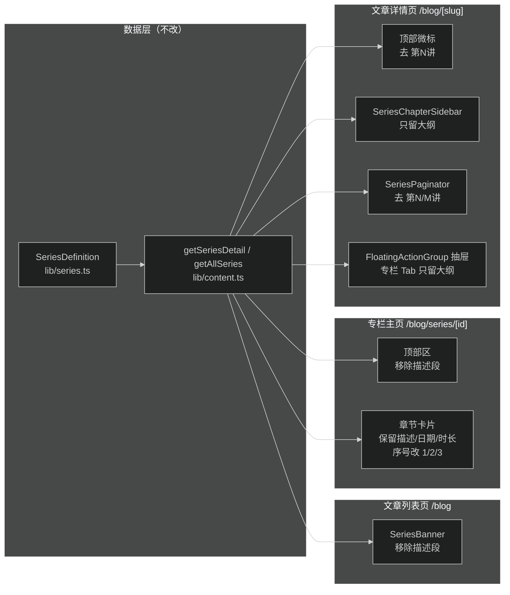
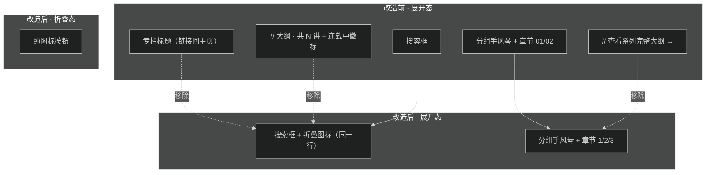
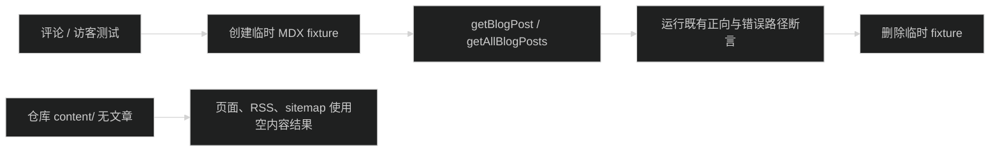

# 专栏渲染精简 UI 设计

## 设计目标

同一份专栏信息在四个渲染面出现，当前每面都重复专栏标题、统计、描述，视觉噪音高。本轮按「一屏只讲一件事」收敛：

- 专栏展示界面（列表卡片、专栏主页）：去描述、留结构元信息。
- 专栏文章左侧栏：只做「大纲」一件事，去掉专栏身份与返回入口。
- 全站统一序号口径：`1/2/3…`，去掉「第 N 讲」。

## 渲染面与组件映射



## 左侧栏信息架构（核心改动）



## 各面设计

### 1. SeriesChapterSidebar（左侧栏）

结构：

```
┌───────────────────────────┐
│ [搜索章节…            ] [▤]│   ← 头部：搜索框 flex-1 + 折叠图标
├───────────────────────────┤
│ ▾ 核心架构            2   │   ← 分组手风琴（保留）
│   1  从零构建 Agent…(一)  │   ← 序号纯数字 + 标题；当前讲高亮卡片
│   2  从零构建 Agent…(二)  │
│ ▸ 桌面端开发          1   │
└───────────────────────────┘
```

- 头部：搜索框占满，折叠图标按钮居右，同一行。
- 移除：专栏标题链接、`// 大纲 · 共 N 讲`、连载状态徽标、底部 `// 查看系列完整大纲 →`。
- 分组手风琴、当前讲高亮卡片、搜索过滤逻辑保留。
- 折叠态：单一图标按钮（面板图标），无文字微标；点击展开。

### 2. SeriesBanner（列表卡片）

结构：

```
┌───────────────────────────────────────────────┐
│ // 精选系列 / 连载中                已更新 3 讲 │
│ 从零使用 Pi SDK 构建个人 Agent Desktop          │
│ #Pi SDK  #AI Agent  #TypeScript  #Desktop      │
│                              浏览专栏大纲 →     │
└───────────────────────────────────────────────┘
```

- 仅移除：2 行描述段。
- 保留：`// 精选系列` 与状态 meta、讲次、标题（链接专栏主页）、`#标签`、`浏览专栏大纲 →`。

### 3. SeriesDetailPage（专栏主页）

- 顶部区移除描述段；保留面包屑、状态、收录数、标题、`#标签`、仓库入口。
- 章节卡片：保留 `日期 / 阅读时长` + 标题 + 描述段；`第 01 讲` 改为纯数字 `1`。

### 4. 文章页微标与文末导轨

- 顶部微标：`// 专栏：xxx · 第 N 讲 →` → `// 专栏：xxx →`。
- 文末导轨：去掉 `第 N / M 讲`，保留「// 专栏章节导轨」「查看系列完整大纲 →」与上一讲/下一讲卡片。

### 5. FloatingActionGroup（移动端抽屉）

- 专栏 Tab 移除专栏标题链接、`// 大纲 · 共 N 讲`、`专栏主页 →`。
- 只保留分组章节列表；序号改 `1/2/3`。
- 双 Tab（专栏大纲 / 本篇目录）结构保留。

## 数据与契约

不改数据层。序号统一取 `post.series.order`（`SeriesSidebarPost.series.order`、`BlogPost.series.order` 均已有）。

- 左侧栏/抽屉：`const order = post.series?.order ?? index + 1`，直接渲染 `${order}`。
- 专栏主页章节卡片：同样取 `post.series?.order ?? index + 1`。
- 微标/导轨：删除 `currentIndex`/`totalCount` 的「第 N 讲」文案，`SeriesNavData` 字段保留不动。

## 兼容与回滚

- 纯展示层改动，无数据迁移。
- 回滚：`git revert` 对应提交即可；折叠态 localStorage key `blog_series_sidebar_collapsed` 不变。
- 非专栏路径 `seriesDetail === null` 分支不受影响。

## 风险点

- 左侧栏头部移除标题后，需保证头部布局在小宽度（`w-64`）下搜索框与折叠按钮不挤压换行。
- 折叠态纯图标按钮需保留 `aria-label` 与 `title`，保证可访问性。
- 移除「第 N 讲」后，章节顺序仅靠数字表达，需确认数字与标题的对齐在长标题换行时仍清晰。

## 清除测试内容与测试数据

仓库中的博客和笔记源内容全部删除。依赖文章存在性的评论与访客测试通过共享 helper 在测试期间临时写入有效 MDX 文章；测试结束后只删除自己创建的 fixture，并在原目录不存在时清理空目录。产品代码仍通过 `getBlogPost` 校验文章，测试不增加绕过校验的路径。


