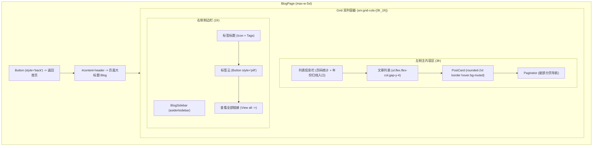
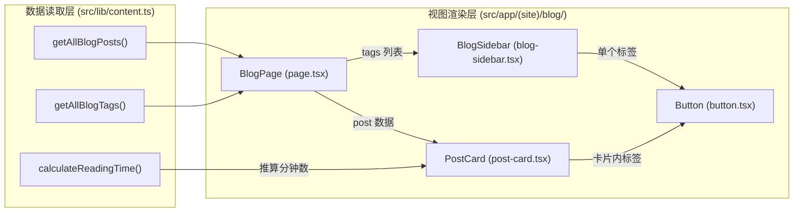

# 技术设计：复刻 Joye 博客列表页面样式细节

## 架构边界与组件职责

遵循项目的组件组织原则（组件统一位于 `src/app/(site)/_components/blog/`，数据读取在 `src/lib/content.ts`），改动仅局限在博客列表视图层及相关的纯函数扩展。

### 文件变动清单

| 文件路径 | 类型 | 职责 |
| --- | --- | --- |
| `src/app/(site)/_components/blog/button.tsx` | 新增 (Server) | 封装 Joye 风格的通用按钮，支持 `back`（带向左动态箭头）、`pill`（胶囊标签）、`ahead`（带向右动态箭头）与普通 `button` 样式 |
| `src/app/(site)/_components/blog/post-card.tsx` | 重构 (Server) | 完整复刻 Joye `PostPreview` 的卡片边框、背景、日期、标题、动态重定向箭头、摘要、阅读时间与底部标签列表 |
| `src/app/(site)/_components/blog/blog-sidebar.tsx` | 新增 (Server) | 封装右侧标签侧边栏，包含标签标题、Pill 标签云以及查看全部链接 |
| `src/app/(site)/_components/blog/paginator.tsx` | 新增 (Server) | 列表底部分页导航器，支持上一页与下一页链接与快捷展示 |
| `src/lib/content.ts` | 扩展 | 增加 `calculateReadingTime(content: string): string` 估算正文字符阅读分钟数 |
| `src/app/(site)/blog/page.tsx` | 重构 (Server) | 调整页面容器宽度为 `max-w-5xl`，实现返回按钮、大标题、列表信息条、双列非对称网格（3fr:1fr）的完整拼装 |

## 页面结构与布局



## 数据流设计



## 核心组件详细实现契约

### 1. `Button` 组件 (`button.tsx`)

支持作为 `<a>`（通过 `href`）或 `<span>` / `<button>` 渲染。
样式规格：
- 基础类名：`group inline-flex items-center gap-x-1 rounded-lg bg-muted border border-border px-2 py-1 text-sm text-muted-foreground transition-all hover:bg-primary-foreground hover:text-primary no-underline`。
- `style="pill"`：覆盖圆角为 `rounded-xl`。
- `style="back"`：
  前置向左展开箭头 SVG：
  - 箭杆 (`line`)：`x1="19" y1="12" x2="5" y2="12"`，类名 `translate-x-3 scale-x-0 transition-all duration-300 ease-in-out group-hover:translate-x-0 group-hover:scale-x-100`。
  - 箭头折线 (`polyline`)：`points="12 19 5 12 12 5"`，类名 `translate-x-1 transition-all duration-300 ease-in-out group-hover:translate-x-0`。
  - 描边：`stroke-muted-foreground group-hover:stroke-primary`。
- `style="ahead"`：
  后置向右展开箭头 SVG：
  - 箭杆 (`line`)：`x1="5" y1="12" x2="19" y2="12"`，类名 `translate-x-4 scale-x-0 transition-all duration-300 ease-in-out group-hover:translate-x-1 group-hover:scale-x-100`。
  - 箭头折线 (`polyline`)：`points="12 5 19 12 12 19"`，类名 `translate-x-0 transition-all duration-300 ease-in-out group-hover:translate-x-1`。

### 2. 文章卡片组件 (`PostCard`)

结构规范：
- 根容器：`<li className="post-preview group/card relative flex flex-col rounded-2xl border border-border bg-background px-5 py-2.5 transition-colors ease-in-out hover:bg-muted max-sm:px-4 sm:py-5">`
- 主链接：`<Link href={`/blog/${post.slug}`} className="group/link flex w-full flex-col transition-all hover:text-primary">`
- 日期行：`<span className="min-w-[95px] py-1 text-xs font-mono text-muted-foreground"><time dateTime={post.date}>{formatDate(post.date)}</time></span>`
- 标题行：
  ```tsx
  <div className="flex justify-between items-center">
    <div className="font-medium text-foreground group-hover/link:text-primary transition-colors">
      {post.title}
    </div>
    <svg ... className="preview-redirect my-1 stroke-muted-foreground group-hover/link:stroke-primary" ...>
      <line x1="5" y1="12" x2="19" y2="12" className="translate-x-4 scale-x-0 transition-all duration-300 ease-in-out group-hover/link:translate-x-1 group-hover/link:scale-x-100" />
      <polyline points="12 5 19 12 12 19" className="translate-x-0 transition-all duration-300 ease-in-out group-hover/link:translate-x-1" />
    </svg>
  </div>
  ```
- 描述：`<p className="line-clamp-2 pt-1 text-sm text-muted-foreground sm:line-clamp-3">{post.description}</p>`
- 阅读时间：
  ```tsx
  <div className="flex items-center gap-2 py-1.5 text-sm italic leading-4 text-muted-foreground sm:py-3">
    <span className="flex items-center gap-1">
      <ClockIcon className="size-4" />
      {readingTime}
    </span>
  </div>
  ```
- 卡片内部底部标签组：
  ```tsx
  {post.tags.length > 0 && (
    <ul className="tag-list mt-1 flex flex-wrap gap-2">
      {post.tags.map((tag) => (
        <li key={tag}>
          <Button title={tag} href={`/blog/tags/${tag}`} style="pill" />
        </li>
      ))}
    </ul>
  )}
  ```

### 3. 阅读时间计算算法

在 `src/lib/content.ts` 中实现：
- 统计中文字符数与英文单词数。
- 按照中文 350 字/分钟、英文 160 词/分钟估算耗时。
- 向上取整，最少为 1 分钟，输出格式如 `1 min read` 或 `2 min read`，贴合 Joye 样式。
