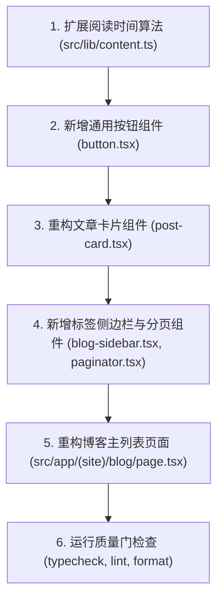

# 执行计划：复刻 Joye 博客列表页面样式细节

## 执行流程概览



## 详细实施步骤

### 阶段一：底层数据与辅助能力扩展
- [x] 在 `src/lib/content.ts` 中实现 `calculateReadingTime(content: string): string` 纯函数。
- [x] 确保函数对于中英混排、空文本、短文本等场景均有健壮的估算返回值，格式规范为 `X min read`。

### 阶段二：核心 UI 组件构建
- [x] 创建 `src/app/(site)/_components/blog/button.tsx`：
  - 实现通用 `Button` 组件，支持 `back`（向左展开箭头）、`pill`（胶囊按钮）、`ahead`（向右展开箭头）与普通样式。
  - 精确还原 SVG 箭头的 `translate` 与 `scale` 关键过渡类。
- [x] 重构 `src/app/(site)/_components/blog/post-card.tsx`：
  - 改为 `<li>` 容器并配备 `rounded-2xl border bg-background hover:bg-muted`。
  - 内嵌等宽字体日期行。
  - 标题行集成重定向箭头及其 `group-hover/link` 展开动效。
  - 展示文章摘要（带 line-clamp 截断）。
  - 展示带时钟图标的阅读时间。
  - 底部集成与文章链接隔离的 `ul.tag-list`，内含 Pill 样式的标签按钮。
- [x] 创建 `src/app/(site)/_components/blog/blog-sidebar.tsx`：
  - 渲染右侧 Aside，包含标签小图标、标题 `Tags`。
  - 循环渲染标签列表（使用 `Button` style='pill'）。
  - 底部提供 `View all →` 跳转全部标签页链接。
- [x] 创建 `src/app/(site)/_components/blog/paginator.tsx`：
  - 渲染双端分页导航，支持上一页与下一页按钮及语义化标签。

### 阶段三：主页面重构与组装
- [x] 重构 `src/app/(site)/blog/page.tsx`：
  - 将外层容器宽度调整为 `max-w-5xl`，并保持适当的内边距。
  - 页面顶部添加 `<Button title="Back" href="/" style="back" />` 返回按钮。
  - 渲染页面大标题 `Blog`（或配置项名称）。
  - 搭建双列非对称网格：`grid gap-y-16 sm:grid-cols-[3fr_1fr] sm:gap-x-8`。
  - 左侧展示列表统计头（`Page 1 · Showing X of Y posts` 与 `View all posts by years →`）。
  - 渲染文章卡片列表与底部分页组件。
  - 右侧嵌入 `BlogSidebar` 侧边栏。

### 阶段四：验证与质量门
- [x] 运行 TypeScript 类型检查：`pnpm typecheck`
- [x] 运行 ESLint 校验：`pnpm lint`
- [x] 运行 Prettier 格式校验：`pnpm format:check`
- [x] 启动开发服务器 `pnpm dev` 校验页面显示与动效交互细节。

## 验证命令清单

```bash
# 1. 类型检查
pnpm typecheck

# 2. 代码风格检查
pnpm lint

# 3. 格式规范检查
pnpm format:check

# 4. 生产构建验证
pnpm build
```

## 风险与回滚方案

- 若修改引起已有组件引用破损，立即使用 `git checkout -- <文件>` 恢复。
- 新增组件均位于 `src/app/(site)/_components/blog/` 下，若出现异常可完全隔离在博客模块内部，不影响全站其他页面。
