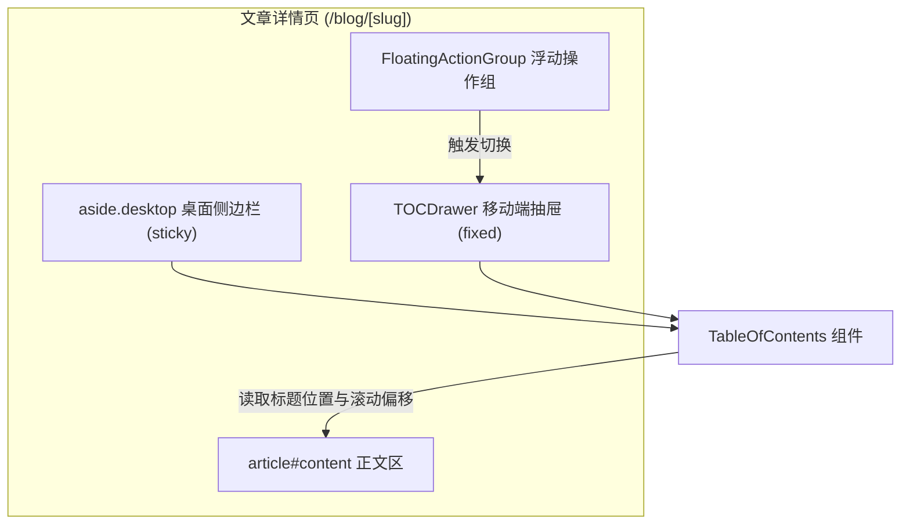
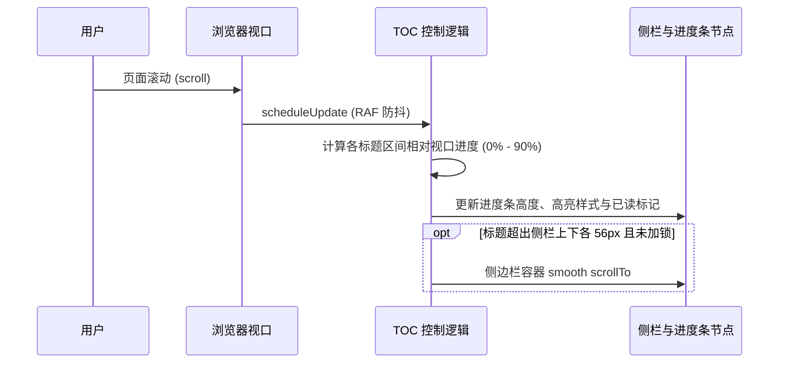
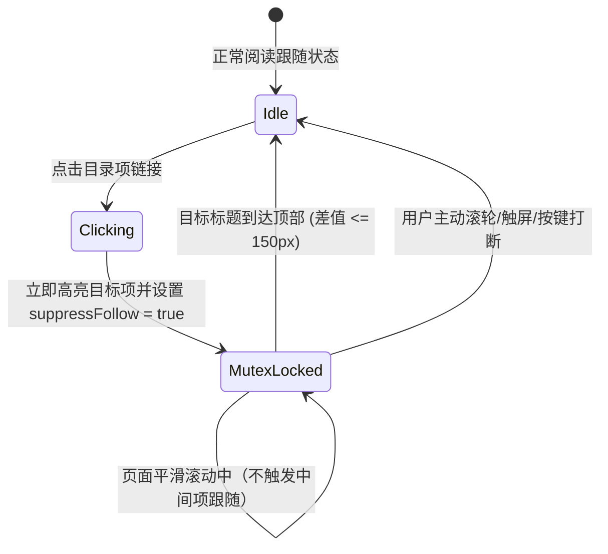

# TOC 阅读进度与交互技术方案

## 架构与组件划分

目录功能由三个组件协同完成：

1. `TableOfContents`（客户端组件）：挂载在文章详情页，包含滚动帧监听、进度计算、互斥锁、侧栏定位和抽屉展示。
2. `TableOfContentsItem`：递归渲染目录项，包含左侧阅读进度条容器与动态高度节点。
3. `FloatingActionGroup`（客户端组件）：页面右下角浮动按钮组，包含移动端目录唤出按钮和返回顶部按钮。

## 数据流与事件驱动

使用 `requestAnimationFrame` 驱动滚动监听，避免原生 `scroll` 事件高频阻塞主线程。

## 点击平滑跳转与互斥保护状态机

用户点击目录项时，通过互斥锁 `suppressFollow` 抑制滚动中间状态对 TOC 侧栏的干扰。

## 阅读进度计算公式

对于标题序列中下标为 $i$ 的标题 $H_i$，其下一个标题为 $H_{i+1}$（若为最后章节，则取文章底部偏移）：

1. 基准偏移：`pageOffset = window.scrollY - contentElement.offsetTop`
2. 章节顶部相对视口：`sectionTop = H_i.offsetTop - pageOffset`
3. 章节底部相对视口：`sectionBottom = H_{i+1}.offsetTop - pageOffset - H_i.offsetHeight`
4. 进度比例：`progress = (windowHeight - sectionTop) / (sectionBottom - sectionTop)`，截取区间 $[0, 1]$
5. 可视判定：`inView = sectionTop < windowHeight && sectionBottom > 0`
6. 进度条高度：`height = progress * 90%`
7. 已读判定：`!inView && progress === 1`
