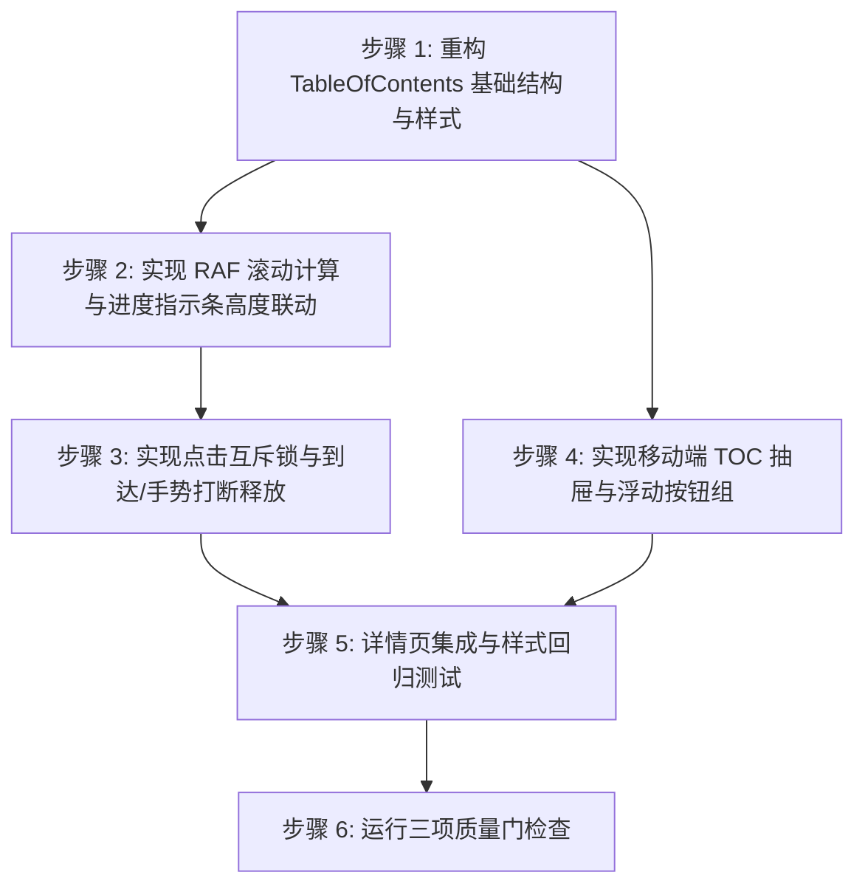

# TOC 阅读进度与交互实施计划

## 实施阶段与依赖关系

## 执行步骤清单

### 步骤 1: 重构 TableOfContents 基础结构与样式
- 改造 `src/app/(site)/_components/blog/toc.tsx`。
- 将简单平铺的目录列表改为包含左侧指示条容器与进度指示器节点的布局。
- 增加折叠展开 `
` 状态支持与旋转小图标。
- 引入进度条样式：`w-[2px]` 绝对定位，正在阅读为 `bg-primary`，已读为 `bg-border` / `bg-input`。

### 步骤 2: 实现 RAF 滚动计算与进度指示条高度联动
- 监听 `scroll` 与 `resize` 事件，使用 `requestAnimationFrame` 驱动调度。
- 根据各标题区间位置计算当前阅读进度比例 `progress`（0% 到 90%）。
- 实时给当前项设置高亮字体及半透明背景，更新指示条动态高度。

### 步骤 3: 实现点击互斥锁与到达/手势打断释放
- 点击目录项时执行 `scrollIntoView({ behavior: 'smooth' })`。
- 锁定状态 `suppressFollow = true`，记录 `pendingClickSlug`。
- 增加滚动到达距离判断（目标标题顶部偏移 <= 150px 自动解锁）。
- 监听 `wheel`、`touchstart`、`keydown` 手势主动解除互斥。

### 步骤 4: 实现移动端 TOC 抽屉与浮动按钮组
- 新增 `src/app/(site)/_components/blog/floating-action-group.tsx` 客户端组件。
- 当页面滚动超出文章头部时展示右下角浮动按钮。
- 包含回到顶部按钮和移动端目录呼出按钮。
- 移动端呼出抽屉面板，带遮罩层与从右向左滑入动效。

### 步骤 5: 详情页集成与样式回归测试
- 调整 `src/app/(site)/blog/[slug]/page.tsx`。
- 挂载桌面端侧栏与移动端浮动操作区。
- 保证移动端与桌面端断点切换平滑无溢出。

### 步骤 6: 运行三项质量门检查
- `pnpm typecheck`
- `pnpm lint`
- `pnpm format:check`
