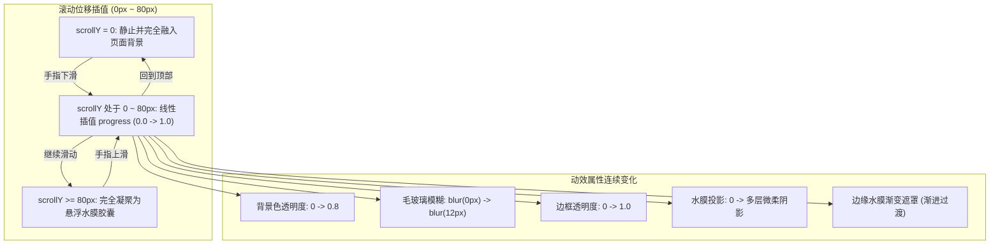

# 顶栏滚动液体融合动效 (PRD)

## 目标

将 SiteHeader 顶栏的滚动过渡效果，由离散的二元布尔开关（scrollY > 20 阶跃）改造为连续无级的液体水膜融合动效。用户在滑动页面时，顶栏与页面背景的融合呈现出如液体倒入液体般的自然物理渐变。

## 背景与现状

当前 [src/app/(site)/_components/site/site-header.tsx](file:///Users/wuwanzhu/Code/xdd/blog/src/app/%28site%29/_components/site/site-header.tsx) 的问题：
1. 滚动高度在 20px 处做二元状态判断，触发 300ms 补间过渡，动画速度与手指滑动脱节；
2. 状态切换时变动 `mx-[8%]`，触发布局重排与宽度硬变；
3. 边缘没有渐进式遮罩，缺少水膜交融的柔和层级。

## 动效流转模型

## 需求范围

### 包含在内 (In Scope)
1. **连续插值进度**：计算 `progress = clamp(scrollY / 80, 0, 1)`，使用 CSS 变量或内联样式驱动透明度、模糊度与阴影。
2. **水膜质感呈现**：
   - 背景色透明度在 0 ~ 0.8 之间连续渐进。
   - `backdrop-filter: blur(...)` 随进度平滑增加。
   - 边框颜色与透明度随进度渐显，避免突兀显现。
   - 底部加入轻微的水膜消融渐变（Progressive Mask），使正文滚入时产生潜入液体的折射视觉。
3. **性能保证**：
   - 滚动监听使用 `requestAnimationFrame` 节流，避免高频滚动丢帧。
   - 缩进或宽度变化避免引起大面积重排，优先利用 GPU 合成。
4. **既有行为兼容**：
   - 保留向下快速滚动（> 350px）自动隐藏、向上滚动立即滑出的现有吸顶交互。
   - 保留移动端导航菜单展开与主题切换。

### 不包含在内 (Out of Scope)
1. 侵入式修改整体布局架构或替换其他页面组件。
2. 引入额外重量级动画第三方库（如大型物理引擎或复杂 WebGL 渲染）。
3. 变更移动端抽屉菜单的基本交互逻辑。

## 验收标准

- [ ] 慢速向下滚动页面时，顶栏背景与毛玻璃效果随手指位移连续淡入，无任何突兀跳变。
- [ ] 慢速向上滚动回顶部时，顶栏背景与毛玻璃平滑无级消融回页面背景，到达顶部时完全无边框与背景。
- [ ] 下滚超过 350px 时依然能够正常滑出隐藏，上滚时平滑滑回。
- [ ] 项目通过质量门：`pnpm typecheck`、`pnpm lint`、`pnpm format:check` 零错误。
