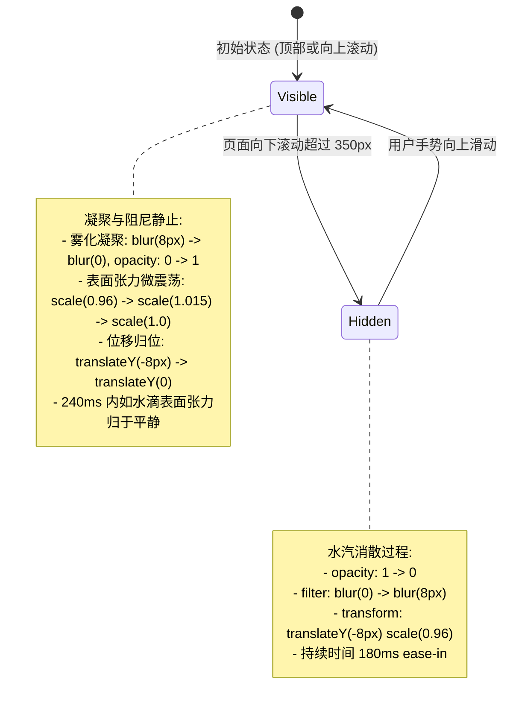

# 顶栏显隐水滴凝聚与阻尼静止动效 (PRD)

## 目标

将 SiteHeader 在上下滑动过程中的显示与隐藏机制，由原本粗糙的机械平移出屏幕（`-translate-y-24`）改造为水滴雾化凝聚与表面张力阻尼静止动效。向下滚动隐藏时呈现如水汽轻盈蒸发消隐，向上滚动呼出时如同魔法由雾化迅速聚显并伴随微小水面张力回弹，最终迅速平伏静止。

## 背景与现状

当前 [src/app/(site)/_components/site/site-header.tsx](file:///Users/wuwanzhu/Code/xdd/blog/src/app/%28site%29/_components/site/site-header.tsx#L106-L108) 的显隐逻辑：
1. 隐藏时直接通过 `data-[visible=false]:-translate-y-24` 沿 Y 轴向上位移 96px 硬性移出视口；
2. 呼出时使用固定的 `transition-transform duration-300` 匀速滑回；
3. 动画类型单一机械，与顶部液体融合水膜的轻盈质感缺乏统一的物理世界观。

## 动效流转状态机

## 需求范围

### 包含在内 (In Scope)
1. **隐藏动效改造（向下滚动）**：
   - 移除生硬的 `-translate-y-24` 大幅度跳跃。
   - 切换为微位移向上浮动 8px + 整体轻微收拢 `scale(0.96)` + 柔和高斯模糊 `blur(8px)` + 透明度淡出。
   - 隐藏时添加 `pointer-events: none` 防止误触。
2. **呼出动效改造（向上滚动）**：
   - 从虚化迅速聚显（`blur(8px) -> blur(0px)`，`opacity: 0 -> 1`）。
   - 配合带阻尼的弹性曲线（或关键帧/spring 模拟），尺寸产生极其细微的水体张力微弹动（`scale(0.96) -> scale(1.015) -> scale(1.0)`），在 240ms 内平伏静止。
3. **无障碍与硬件加速**：
   - 保留 `motion-reduce` 媒体查询支持，减少动效偏好下回退为纯透明度淡入淡出。
   - 动画纯粹基于 `transform`、`opacity` 与 `filter`，完全在 GPU 合成层完成，无主线程布局重排。
4. **既有逻辑兼容**：
   - 兼容上一个任务已实现的 `0 ~ 80px` 连续水膜滚动融合。
   - 兼容移动端折叠菜单展开与主题切换。

### 不包含在内 (Out of Scope)
1. 改变 350px 触发隐藏的高度判定逻辑。
2. 引入额外重量级外部动画库。

## 验收标准

- [ ] 向下滑动页面超过 350px 时，顶栏微浮、雾化并轻盈消散，不再机械下落滑出屏幕。
- [ ] 向上滑动时，顶栏迅速从雾化中凝聚清晰，伴随微弱的表面张力弹性迅速归于静止，视觉自然平伏。
- [ ] 动效在移动端和桌面端平滑流畅，帧率稳定。
- [ ] 通过质量门检查：`pnpm typecheck`、`pnpm lint`、`pnpm format:check` 零错误。
